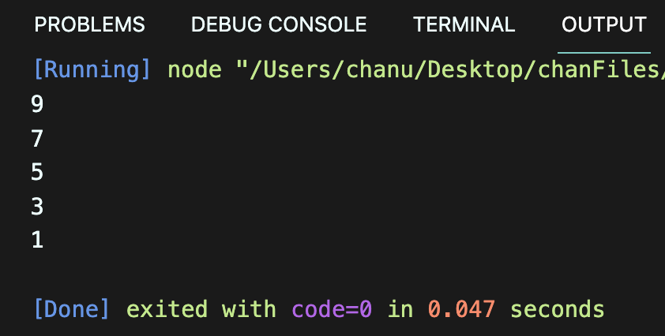
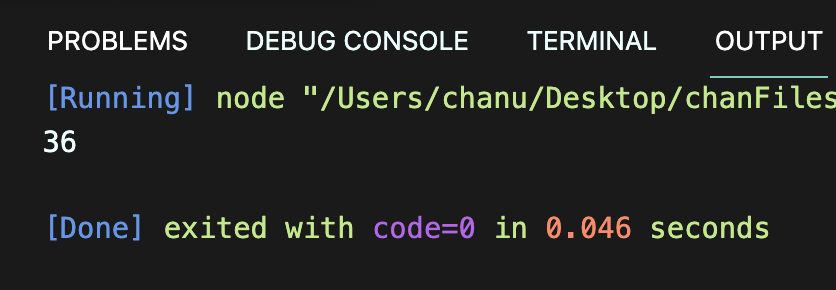
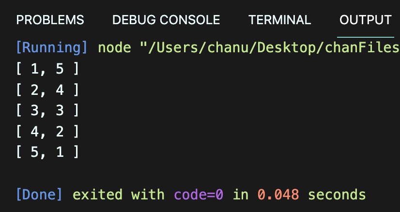
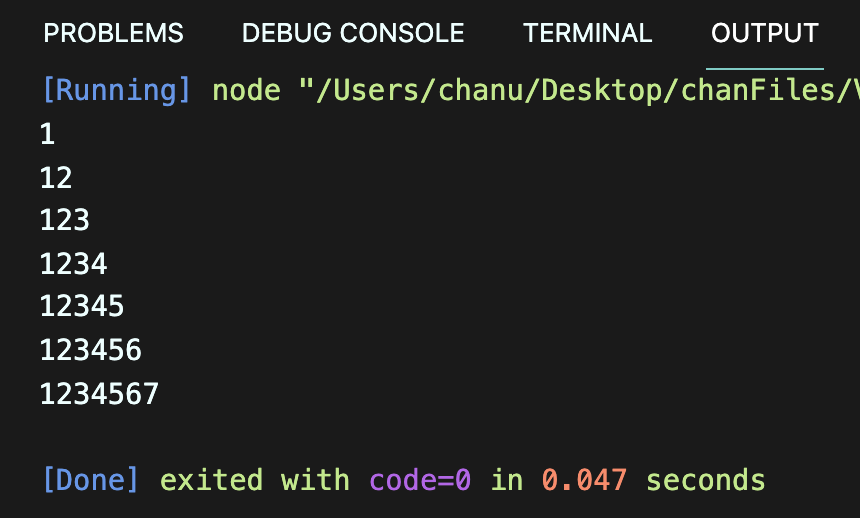
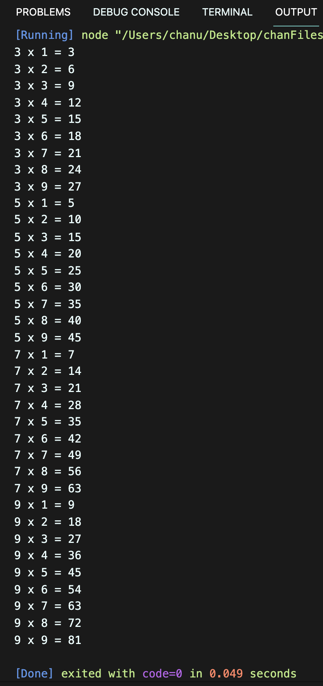
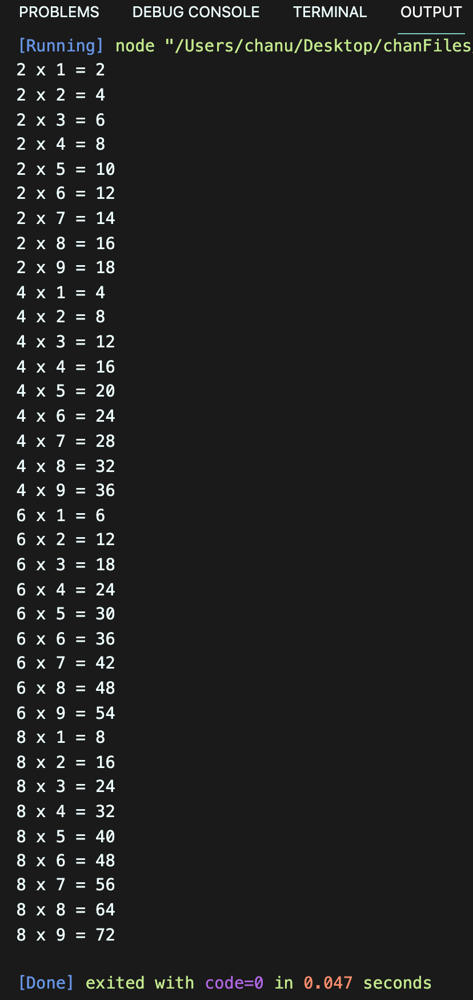

# 박찬우 기본문법활용하기 연습문제

> 2022-01-27

## 문제 1

for문을 사용하여 0부터 10미만의 정수 중에서 홀수만을 큰수부터 출력하시오.

```javascript
for(let i = 9; i > 0; i--) {
  if(i % 2 !== 0) {
    console.log(i);
  }
}
```

>실행결과

</img>

---

## 문제 2

while문을 사용하여 0 부터 10 미만의 정수 중에서 홀수만을 큰수부터 출력하시오.

```javascript
let i = 9;
while(i > 0) {
  if(i % 2 !== 0) {
    console.log(i);
  }
  i--;
}
```

>실행결과

</img>

---

## 문제 3

1부터 20 미만의 정수 중에서 2 또는 3의 배수인 수의 총합을 구하시오.

```javascript
let sum = 0;
for(let i = 1; i < 20; i++) {
  if(i % (2 * 3) === 0) {
    sum += i;
  }
}
console.log(sum);
```

>실행결과

</img>

---

## 문제 4

두 개의 주사위를 던졌을 때, 눈의 합이 6이 되는 모든 경우의 수를 출력하고 경우의 수는 총 몇가지 인지를 아래와 같이 출력하는 코드를 작성하시오.

```
[ 1, 5 ]
[ 2, 4 ]
[ 3, 3 ]
[ 4, 2 ]
[ 5, 1 ]
경우의 수는 5개 입니다.

```

```javascript
for(let i = 1; i < 7; i++) {
  for(let j = 1; j < 7; j++) {
    if(i + j === 6) {
      console.log([i, j]);
    }
  }
}
```

>실행결과

</img>

---

## 문제 5

for문을 중첩하여 실행하여 아래와 같은 출력 결과를 만드시오.

```
0 1 2 3 
1 2 3 4 
2 3 4 5 
3 4 5 6 
```

```javascript

```

>실행결과

</img>

---

## 문제 6

아래와 같은 출력 결과가 나타나도록 중첩 반복문을 for 문 형식으로 구현하시오.

```
1
12
123
1234
12345
123456
1234567
```

```javascript
for(let i = 0; i < 7; i++) {
  let num = "";
  for(let j = 1; j < i + 2; j++) {
    num += j;
  }
  console.log(num);
}
```

>실행결과

</img>

---

## 문제 7

number라는 변수를 정의하고 1 혹은 2의 값을 임의로 할당하시오. 이 변수에는 1이나 2밖에 저장될 수 없습니다.

구구단 프로그램을 만들고자 한다.

전체를 출력하는 구구단이 아니라 number가 1일 때는 홀수 단(3, 5, 7, 9), number가 2일 때는 입력하면 짝수 단(2, 4, 6, 8)을 출력하는 프로그램을 완성하시오.

> **number = 1 일 경우**

```javascript
let number = 1;

for(let i = 2; i < 10; i++) {
  if(number === 1 && i % 2 !== 0) {
    for(let j = 1; j < 10; j++) {
      console.log(`${i} x ${j} = ${i*j}`);
    }
  } else if(number === 2 && i % 2 === 0){
    for(let j = 1; j < 10; j++) {
      console.log(`${i} x ${j} = ${i*j}`);
    }
  }
}
```

>실행결과

</img>

> **number = 2 일 경우 (number 변수만 변경)**

```javascript
let number = 2;

for(let i = 2; i < 10; i++) {
  if(number === 1 && i % 2 !== 0) {
    for(let j = 1; j < 10; j++) {
      console.log(`${i} x ${j} = ${i*j}`);
    }
  } else if(number === 2 && i % 2 === 0){
    for(let j = 1; j < 10; j++) {
      console.log(`${i} x ${j} = ${i*j}`);
    }
  }
}
```

>실행결과

</img>

---