# 박찬우 배열 연습문제

> 2022-02-03

## 문제 1

다음의 소스코드는 boolean 데이터를 저장하고 있는 배열에 대한 어떤 처리를 보여준다.

실행 결과에서 제시하는 것과 같이 배열에 저장되어 있는 값들을 반전(true는 false로, false는 true로)

변환하는 처리를 완성하시오.

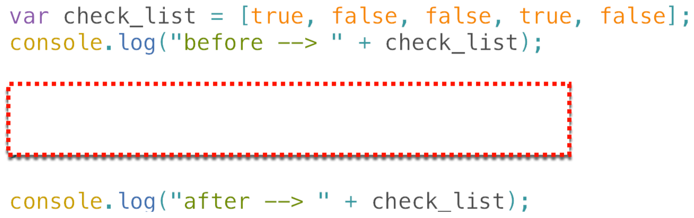</img>

```javascript
var check_list = [true, false, false, true, false];
console.log("before -->" + check_list);

for(let i = 0; i < check_list.length; i++) {
  check_list[i] = !check_list[i];
}
console.log("after -->" + check_list);
```

>실행결과

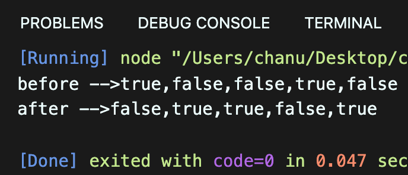</img>

---

## 문제 2

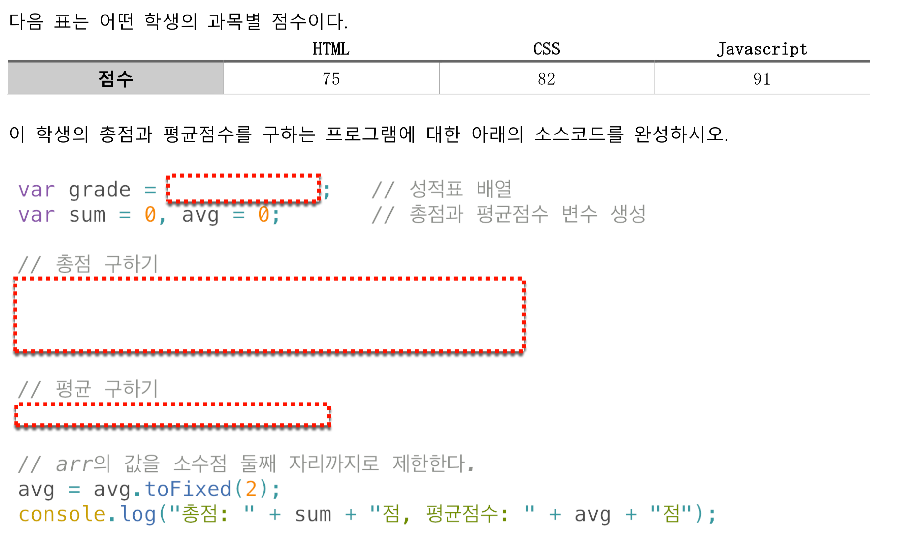</img>

```javascript
var grade = [75, 82, 91];  // 성적표 배열
var sum = 0, avg = 0;  // 총점과 평균점수 변수 생성

// 총점 구하기
for(let i = 0; i < grade.length; i++) {
  sum += grade[i];
}

// 평균 구하기
avg = sum / grade.length;

// avg의 값을 소수점 둘째 자리까지로 한다.
avg = avg.toFixed(2);
console.log("총점: " + sum + "점, 평균점수 : " + avg + "점");
```

>실행결과

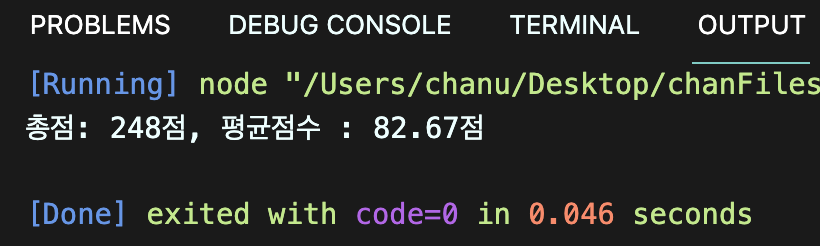</img>

---

## 문제 3

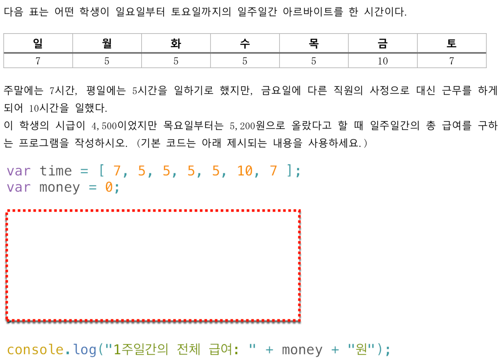</img>

```javascript
var time = [7,5,5,5,5,10,7];
var money = 0;

for(let i = 0; i < time.length; i++) {
  if(i < time.length - 3) {
    money += time[i] * 4500
  } else {
    money += time[i] * 5200
  }
}
console.log("1주일간의 전체 급여 : " + money + "원");
```

>실행결과

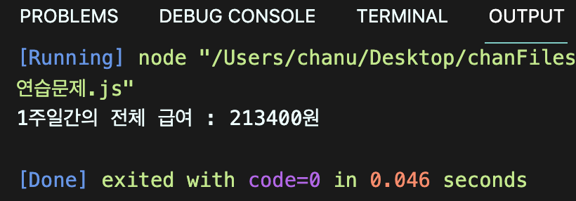</img>

---

## 문제 4

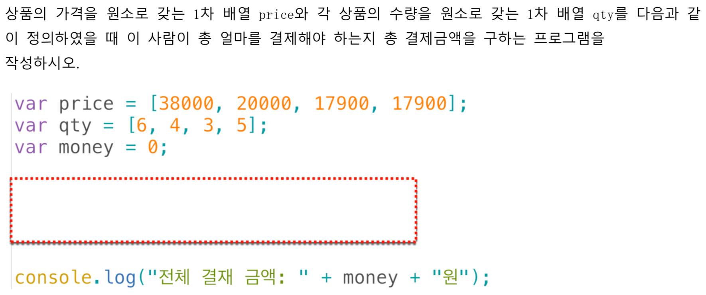</img>

```javascript
var price = [38000, 20000, 17900, 17900];
var qty = [6,4,3,5];
var money = 0;

for(let i = 0; i < price.length; i++) {
  money += price[i] * qty[i]
}
console.log("전체 결제 급액 : " + money + "원");
```

>실행결과

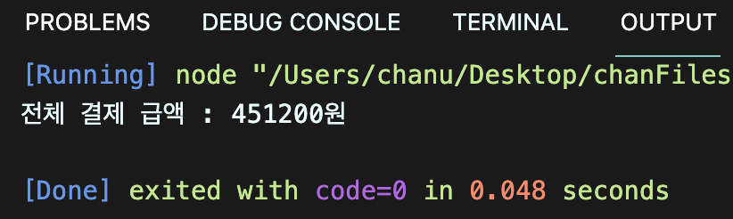</img>

---

## 문제 5

문제 4번의 장바구니 내역에서 상품금액(판매가*수량)이 가장 비싼 항목은 얼마인지 출력하시오.

```javascript
var price = [38000, 20000, 17900, 17900];
var qty = [6,4,3,5];
var money = [];

for(let i = 0; i < price.length; i++) {
  money[i] = price[i] * qty[i]
}

let max = money[0];

for(let i = 0; i < money.length; i++) {
  if(max < money[i]) {
    max = money[i]
  }
}
console.log("가장 높은 금액: " + max + "원");
```

>실행결과

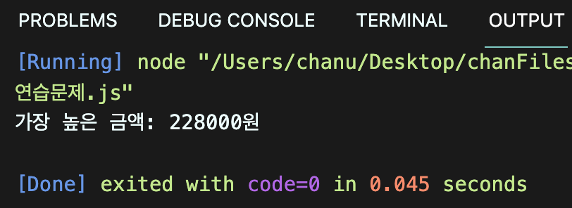</img>

---

## 문제 6

문제4번의 장바구니 내역에서는 모든 장바구니 상품이 개별 배송이라고 한다. 상품금액(판매가*수량)이 8만원 이상인 경우 무료로 배송이 된다고 할 때 무료로 배송되는 항목은 모두 몇 개 인지 구하는 프로그램을 구현하시오.

```javascript
var price = [38000, 20000, 17900, 17900];
var qty = [6,4,3,5];
var money = [];
let count = 0;

for(let i = 0; i < price.length; i++) {
  money[i] = price[i] * qty[i]
  if(money[i] >= 80000) {
    count++;
  }
}
console.log("무료배송 항목: " + count + "건");
```

>실행결과

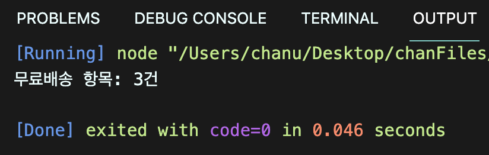</img>

---

## 문제 7

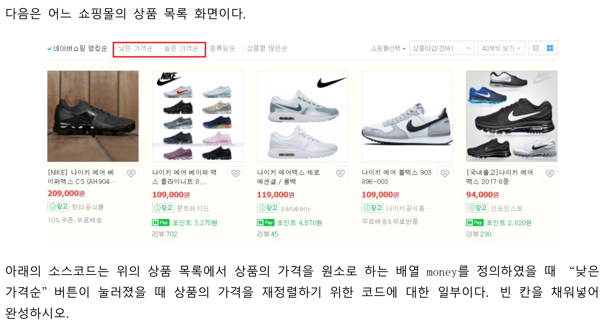</img>
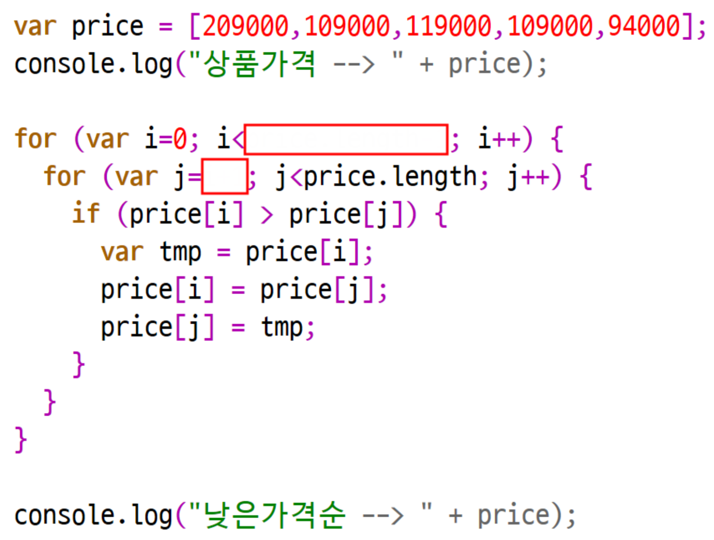</img>

```javascript
var price = [209000, 109000, 119000, 109000, 94000];
console.log("상품가격 --> " + price);

for(var i = 0; i < price.length -1 ; i++) {
  for(var j = i + 1; j < price.length; j++) {
    if(price[i] > price[j]) {
      var tmp = price[i];
      price[i] = price[j];
      price[j] = tmp;
    }
  }
}
console.log("낮은가격순 --> " + price);
```

>실행결과

</img>

---

## 문제 8

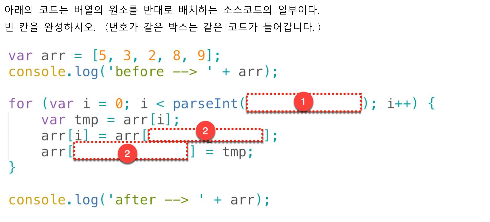</img>

```javascript
var arr = [5, 3, 2, 8, 9];
console.log("before --> " + arr);

for(var i = 0; i < parseInt(arr.length / 2); i++) {
  var tmp = arr[i];
  arr[i] = arr[arr.length - i - 1];
  arr[arr.length - i - 1] = tmp;
}

console.log("after --> " + arr);
```

>실행결과

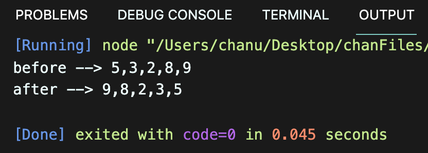</img>

---

## 문제 9

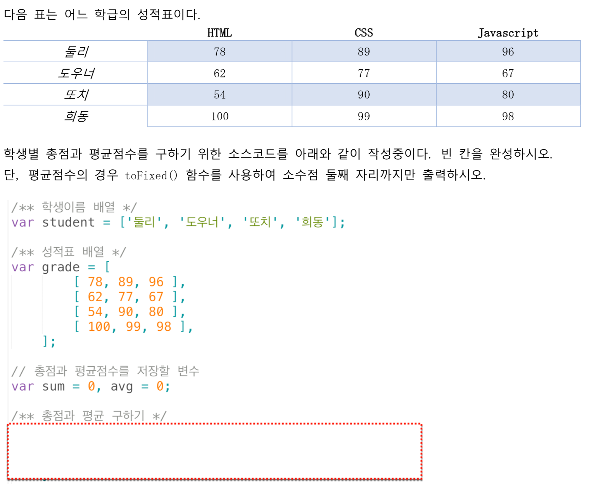</img>

```javascript
var student = ["둘리", "도우너", "또치", "희동"];

// 성적표 배열
var grade = [
  [78, 89, 96,],
  [62, 77, 67],
  [54, 90, 80],
  [100, 99, 98],
];

// 총점과 평균점수를 저장할 변수
var sum = 0, avg = 0;

// 총점과 평균 구하기
for(let i = 0; i < grade.length; i++) {
  let personalSum = 0;
  for(let j = 0; j < grade[i].length; j++) {
    personalSum += grade[i][j];
  }
  avg = (personalSum / grade[i].length).toFixed(2);
  console.log("%s 총점: %d점, 평균: %s점", student[i], personalSum, avg)
};
```

>실행결과

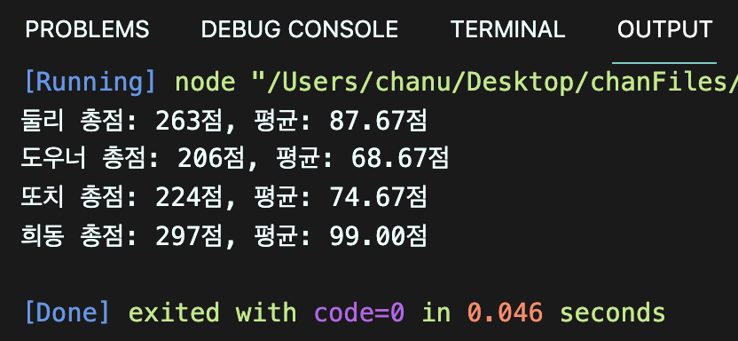</img>

---

## 문제 10

위의 문제에서 반 평균을 출력하시오. 반 평균은 학생의 평균점수 총 합/학생수로 구합니다

[주의] toFixed() 함수로 가공된 값은 문자열 형태이기 때문에 숫자 연산이 불가능합니다. 이를 감안하여 반 점수를 구하세요.

```javascript
var student = ["둘리", "도우너", "또치", "희동"];

var grade = [
  [78, 89, 96,],
  [62, 77, 67],
  [54, 90, 80],
  [100, 99, 98],
];

var sum = 0, avg = 0, classAvg = 0;

for(let i = 0; i < grade.length; i++) {
  let personalSum = 0;
  for(let j = 0; j < grade[i].length; j++) {
    personalSum += grade[i][j];
  }

  avg = personalSum / grade[i].length;

  personalAvg = avg.toFixed(2);
  classAvg += avg / student.length;
  console.log("%s 총점: %d점, 평균: %s점", student[i], personalSum, personalAvg);
};
console.log("반평균 = " + classAvg + "점");
```

>실행결과

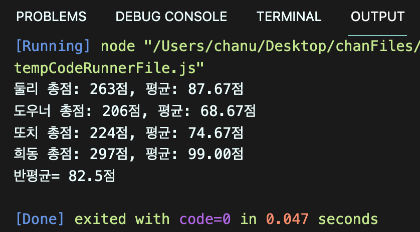</img>

---

## 문제 11

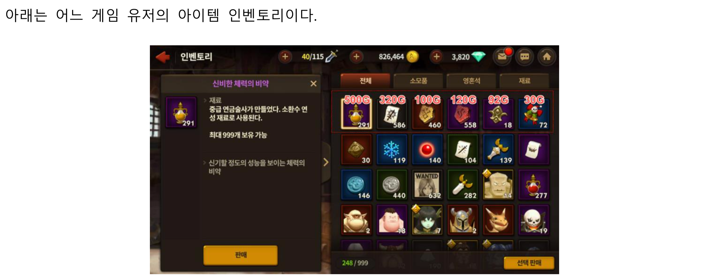</img>
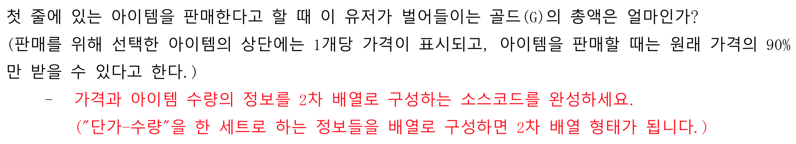</img>

```javascript
const item = [
  [500, 291],
  [320, 586],
  [100, 460],
  [120, 558],
  [92, 18],
  [30, 72]
];

let totalMoney = 0;

for(let i = 0; i < item.length; i++) {
  let money = 1;
  for(let j = 0; j < item[i].length; j++) {
    money *= item[i][j];
  }
  totalMoney += money;
}
const changeMoney = totalMoney * 0.9;
console.log(`아이템 총 판매가격: ${changeMoney}G`);
```

>실행결과

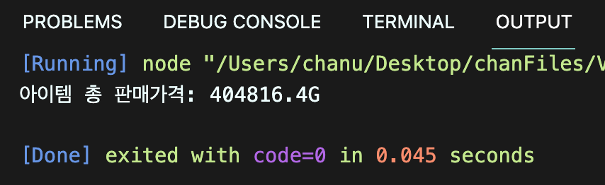</img>

---

## 문제 12

자신의 주민번호 한 글자씩 모든 숫자를 원소로 갖는 배열 jumin을 아래와 같이 정의하시오.

```js
ssn = [0,1,1,2,1,3,1,0,0,0,1,2,3]
```

정의된 배열을 활용하여 유요한 주민등록번호인지 아닌지를 판별하는 코드를 구현해보자. 판별 방법은 아래와 같다.

- 기본 주민등록코드에는 각 숫자에 대응하는 가중치가 있다. 가중치는 주민등록번호의 순서에 따라 `2 3 4 5 6 7 8 9 2 3 4 5` 이다.
- 먼저 마지막 숫자는 제외하고, 기본코드의 각 12자리와 가중치를 모두 곱하여 합한다.
- 합한 값을 11로 나눈 나머지 값을 구한다.
- 11에서 그 나머지 값을 뺀 후, 이를 10을 나눈 나머지를 구한다.
- 나머지의 1의 자리 값과 주민등록번호 마지막 자리 값이 맞아야 유효한 주민등록번호이다.

```javascript
const jumin = [0,1,1,2,1,3,1,0,0,0,1,2,3];
const checkJumin = [2,3,4,5,6,7,8,9,2,3,4,5];

let multiply = 0;
let result = 0;

for(let i = 0; i < jumin.length - 1; i++) {
  multiply += jumin[i] * checkJumin[i]
}

result = (11 - (multiply % 11)) % 10;

if(result == jumin[jumin.length - 1]) {
  console.log("유효한 주민번호");
} else {
  console.log("유효하지 않은 주민번호");
}
```

>실행결과

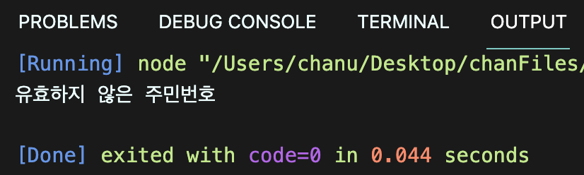</img>

---