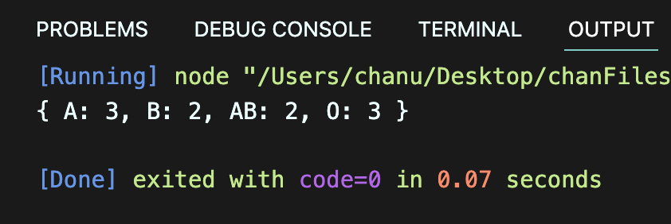
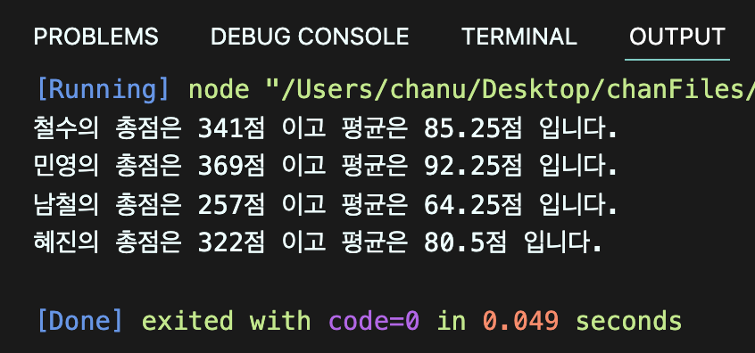
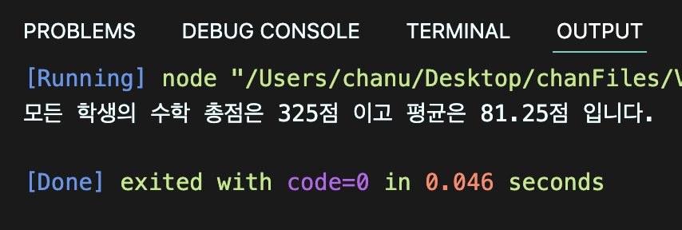
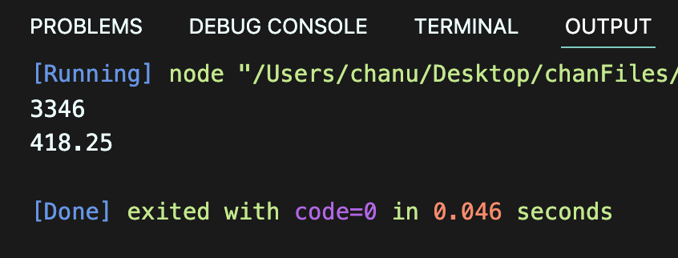
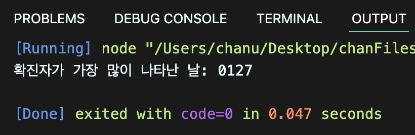

# 박찬우 JSON 연습문제

> 2022-02-07

## 문제 1

다음은 10명의 학생들에 대한 혈액형 데이터이다.

```
['A', 'A', 'A', 'O', 'B', 'B', 'O', 'AB', 'AB', 'O']
```

아래와 같은 JSON을 정의하고, 각 혈액형별 학생수를 아래의 json의 각 key에 대한 value에 저장하시오. (혈액형별 학생 수를 for문을 활용하여 산출해야 합니다.)

```js
const result = {"A" : 0, "B" : 0, "AB" : 0, "O" : 0};
```

> 풀이

```javascript
const studentBlood = ['A', 'A', 'A', 'O', 'B', 'B', 'O', 'AB', 'AB', 'O'];

const result = {
  "A": 0,
  "B": 0,
  "AB": 0,
  "O": 0
};

for(const i of studentBlood) {
  result[i]++;
};
console.log(result);
```

>실행결과

</img>

---

## 문제 2-1

다음의 JSON은 어느 학급의 중간고사 성적을 나타낸다.

```js
const exam = {
    "철수": [89, 82, 79, 91],
    "민영": [91, 95, 94, 89],
    "남철": [65, 57, 71, 64],
    "혜진": [82, 76, 81, 83]
}
```

위 데이터에서 학생별 총점과 평균을 구하시오.

> 풀이

```javascript
const exam = {
  "철수": [89, 82, 79, 91],
  "민영": [91, 95, 94, 89],
  "남철": [65, 57, 71, 64],
  "혜진": [82, 76, 81, 83]
};

for(const key in exam) {
  let sum = 0;

  for(const p of exam[key]) {
    sum += p;
  }

  let avg = sum / exam[key].length;
  console.log("%s의 총점은 %d점 이고 평균은 %d점 입니다.", key, sum, avg);
}
```

>실행결과

</img>

---

## 문제 2-2

위 문제의 점수가 순서대로 국어, 영어, 수학, 과학일 경우 수학에 대한 모든 학생의 총점과 평균을 구하시오.

> 풀이

```javascript
const exam = {
  "철수": [89, 82, 79, 91],
  "민영": [91, 95, 94, 89],
  "남철": [65, 57, 71, 64],
  "혜진": [82, 76, 81, 83]
};

let sum = 0;

let studentCount = 0;

for(const key in exam) {
  sum += exam[key][2];
  studentCount++;
}

let avg = sum / studentCount;
console.log("모든 학생의 수학 총점은 %d점 이고 평균은 %d점 입니다.", sum, avg);
```

>실행결과

</img>

---

## 문제 3-1

아래의 데이터는 2021년 01월 25일부터 02월 01일까지의 Covid19 일별 확진자 수를 표현한 자료구조다.

```javascript
covid19 = [
    {date: '0125', active: 426}, 
    {date: '0126', active: 343}, 
    {date: '0127', active: 547}, 
    {date: '0128', active: 490}, 
    {date: '0129', active: 460}, 
    {date: '0130', active: 443}, 
    {date: '0131', active: 338}, 
    {date: '0201', active: 299}
]
```

1월 25일부터 2월 1일까지의 누적 확진자 수와 일 평균 확진자 수를 구하시오.

> 풀이

```javascript
covid19 = [
  {date: '0125', active: 426}, 
  {date: '0126', active: 343}, 
  {date: '0127', active: 547}, 
  {date: '0128', active: 490}, 
  {date: '0129', active: 460}, 
  {date: '0130', active: 443}, 
  {date: '0131', active: 338}, 
  {date: '0201', active: 299}
]

// 전체 확인자 수를 위한 합계 변수
let sum = 0;

for(const j of covid19) {
  sum += j.active;
}
console.log(("누적 확진자 수: %d", sum));
console.log(("평균 확진자 수: %d", sum / covid19.length));
```

>실행결과

</img>

---

## 문제 3-2

1월 25일부터 2월 1일까지 중에서 확진자가 가장 많이 나타난 날짜는 언제인가?

> 풀이

```javascript
covid19 = [
  {date: '0125', active: 426}, 
  {date: '0126', active: 343}, 
  {date: '0127', active: 547}, 
  {date: '0128', active: 490}, 
  {date: '0129', active: 460}, 
  {date: '0130', active: 443}, 
  {date: '0131', active: 338}, 
  {date: '0201', active: 299}
]

let maxActive = covid19[0].active;
let maxDate = covid19[0].date;

for(const j of covid19) {
  if(maxActive < j.active) {
    maxActive = j.active;
    maxDate = j.date;
  }
}
console.log("확진자가 가장 많이 나타난 날: %s", maxDate);
```

>실행결과

</img>

---