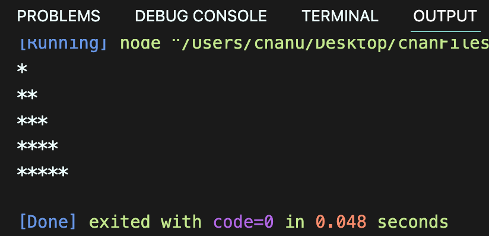
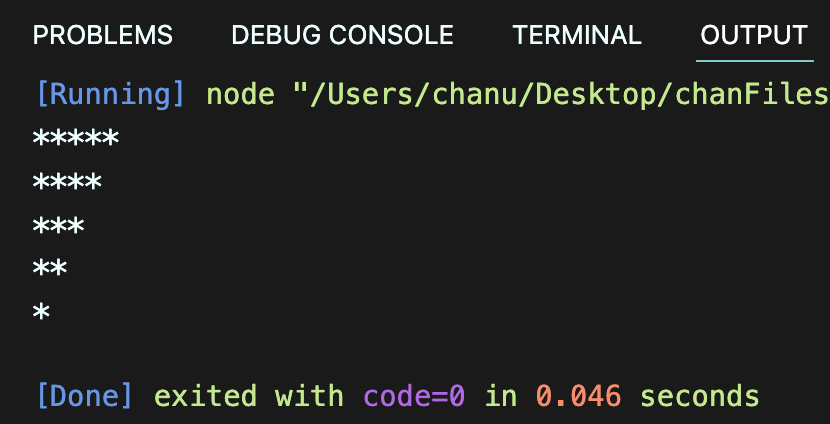
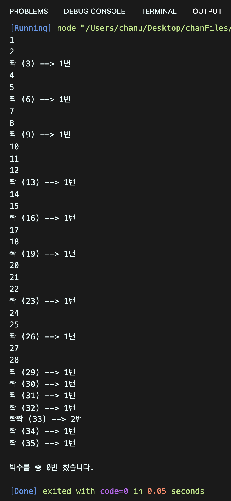

# 박찬우 함수 연습문제

> 2022-02-07

## 문제 1

아래의 형태로 출력하는 함수를 구현하시오.

```js
// max는 출력해야 할 최대 라인 수
function printStar(max) {
    ... 구현하세요 ...
}

printStar(5)
```

> 풀이

```javascript
function printRevStar(max) {
  for(let i = 0; i < max; i++) {
    let star = "";
    for(let j = 0; j < max - i; j++) {
      star += "*";
    }
    console.log(star);
  }
}
printRevStar(5);
```

>실행결과

</img>

---

## 문제 2

1번 문제를 응용하여 같은 파라미터를 받았을 때 별을 역으로 출력하는 `printRevStar(max)` 을 구현하시오.

> 풀이

```javascript
function printStar(max) {
  for(let i = 0; i < max; i++) {
    let star = "";
    for(let j = 0; j < i + 1; j++) {
      star += "*";
    }
    console.log(star);
  }
}
printStar(5);
```

>실행결과

</img>

---

## 문제 3

369게임은 숫자를 순서대로 말하면서 3,6,9가 포함된 횟수만큼 박수를 치는 게임이다.

1부터 파라미터로 전달된 숫자까지 반복하면서 박수를 칠 조건이 충족되면 3,6,9 게임 규칙에 따라 박수를 의미하는 "짝"을 출력하고 그렇지 않은 경우에는 숫자를 출력하고, 박수를 총 몇번 쳤는지를 리턴하는 함수 `myGame(n)`을 작성하시오.

힌트: 문자열은 그 자체가 배열로 인식됩니다.

> 풀이

```javascript
function myGame(n) {
  // 박수를 총 몇번 쳣는지에 대한 합계 값
  let count = 0;

  // 현재 숫자(i)를 문자열로 변환함. 33 -> "33"
  // 문자열은 그 자체가 배열이므로 각 자리의 숫자를 의미하는 글자를 원소로 갖는 배열이 된다고 볼 수 있다.
  for(let i = 1; i <= n; i++) {
    const str = i + ""; // 숫자열을 문자열로 바꿀 떄 쓰는 꼼수

    // 출력할 문자열(숫자 or 박수)
    let say = "";
    // 박수를 몇번 치는지 카운트하눈 변수
    let clap = 0;

    for(let j of str) {

      // 각 글자가 3,6,9 중의 하나라면?
      if(j == "3" || j == "6" | j == "9") {
        say += "짝";
        clap++;
      }
    }
    if(clap == 0) {
      console.log(i);
    } else {
      console.log("%s (%d) --> %d번", say, i , clap);
    }
  }
  console.log();
  console.log("박수를 총 %d번 쳤습니다.", count);
}
myGame(35);
```

>실행결과

</img>

---

