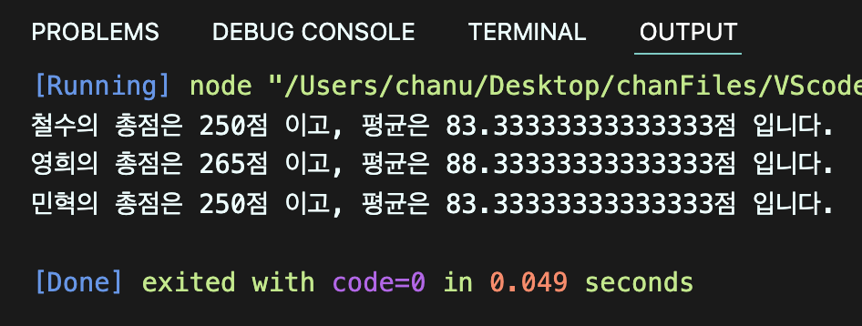
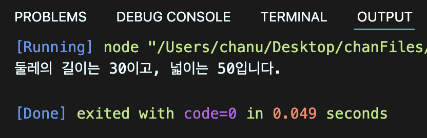
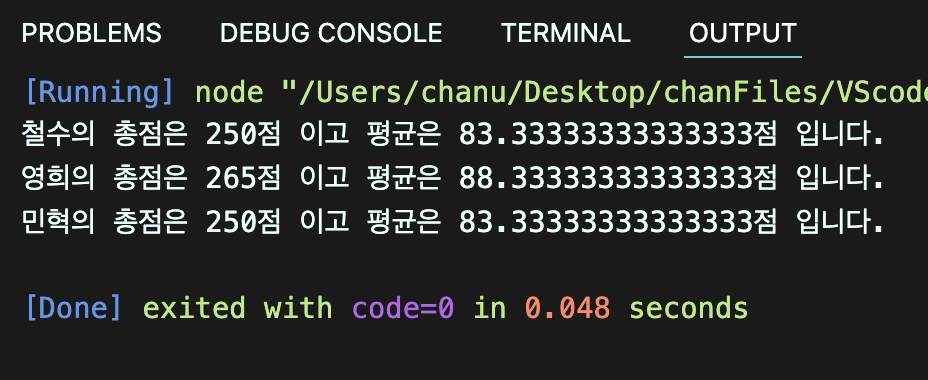

# 박찬우 연습문제

> 2022-02-09

## 문제 1

국어, 영어, 수학 점수를 생성자 파라미터로 입력받아서 합계와 평균을 구하는 클래스 Student를 작성하시오.

이 때 Stuent 클래스는 합계를 리턴하는 메서드인 `sum()`과 평균을 리턴하는 `avg()`를 제공합니다.

작성된 클래스를 활용하여 아래 표에 대한 학생별 합계 점수와 평균점수를 출력하시오.

클래스는 JSON 형식으로 작성되어야 합니다.

| 이름 | 국어 | 영어 | 수학 |
|---|---|---|---|
| 철수 | 92 | 81 | 77 |
| 영희 | 72 | 95 | 98 |
| 민혁 | 80 | 86 | 84 |

> 풀이

```javascript
function Student(name, kor, eng, math) {
  this._name = name;
  this._kor = kor;
  this._eng = eng;
  this._math = math;
};

Student.prototype = {
  get name() {
    return this._name;
  },
  set name(para) {
    this.name = para;
  },
  get sum() {
    return this._kor + this._eng + this._math;
  },
  set sum(para) {
    this.sum = para;
  },
  get avg() {
    return this.sum / 3;
  },
  set avg(para) {
    this.avg = para;
  },
  out: function() {
    console.log(`${this.name}의 총점은 ${this.sum}점 이고, 평균은 ${this.avg}점 입니다.`);
  }
};

const student1 = new Student("철수", 92, 81, 77);
const student2 = new Student("영희", 72, 95, 98);
const student3 = new Student("민혁", 80, 86, 84);

student1.out();
student2.out();
student3.out();
```

>실행결과

</img>

---

## 문제 2

가로(`width`), 세로(`height`)정보를 getter, setter로 관리하는 Rectangle 클래스를 정의하시오.

이 클래스는 생성자의 파라미터가 없으며 둘레의 길이를 구해 리턴하는 getAround() 메서드와 넓이를 구해 리턴하는 gerArea() 메서드를 제공합니다.

클래스는 JSON 형식으로 작성되어야 합니다.

> 풀이

```javascript
function Rectangle() {
  this._width = null;
  this._height = null;
};

Rectangle.prototype = {
  get width() {
    return this._width;
  },
  set width(para) {
    this._width = para;
  },
  get height() {
    return this._height;
  },
  set height(para) {
    this._height = para;
  },
  getAround: function() {
    return (this.width + this.height) * 2;
  },
  getArea: function() {
    return this.width * this.height;
  }
};

const result = new Rectangle();
result.width = 10;
result.height = 5;

console.log(`둘레의 길이는 ${result.getAround()}이고, 넓이는 ${result.getArea()}입니다.`);
```

>실행결과

</img>

---

## 문제 3

앞 단원에서 수행한 연습문제 1,2번을 Class 기반의 객체지행으로 재구성하시오.

> 풀이

```javascript
class Student {

  constructor(kor, eng, math) {
    this.kor = kor;
    this.eng = eng;
    this.math = math;
  }

  sum() {
    return this.kor + this.eng + this.math;
  }

  avg() {
    return this.sum / 3;
  }

}

const s1 = new Student(92, 81, 77);
const s2 = new Student(72, 95, 98);
const s3 = new Student(80, 86, 84);

console.log(`철수의 총점은 ${s1.sum()}점 이고 평균은 ${s1.avg()}점 입니다.`);
console.log(`영희의 총점은 ${s2.sum()}점 이고 평균은 ${s2.avg()}점 입니다.`);
console.log(`민혁의 총점은 ${s3.sum()}점 이고 평균은 ${s3.avg()}점 입니다.`);
```

>실행결과

</img>

```javascript
class Rectangle {
  constructor() {
    this._width = null;
    this._height = null;
  }

  get width() {
    return this._width;
  }

  set width(para) {
    this._width = para;
  }

  get height() {
    return this._height;
  }
  set height(para) {
    this._height = para;
  }
  getAround() {
    return (this.width + this.height) * 2;
  }
  getArea() {
    return this.width * this.height;
  }
}

const result = new Rectangle();
result.width = 10;
result.height = 5;

console.log(`둘레의 길이는 ${result.getAround()}이고, 넓이는 ${result.getArea()}입니다.`);
```

>실행결과

</img>

---


