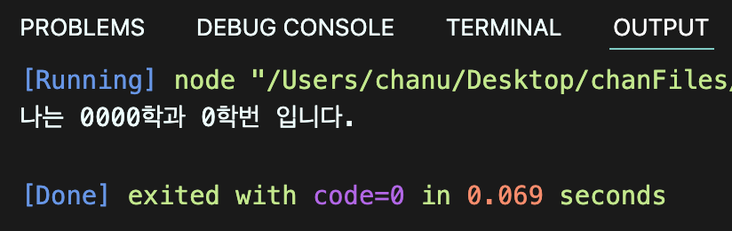
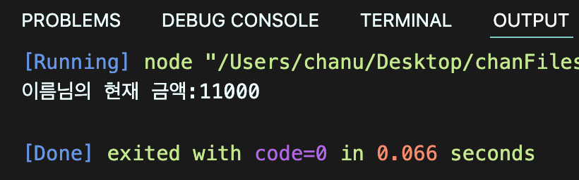

# 박찬우 연습문제

> 2022-02-10

## 문제 1

다음을 만족하는 Student 클래스를 작성하시오.

1) String형의 학과와 정수형의 학번을 프로퍼티로로 선언후 생성자를 통해 주입
2) getter, setter를 정의
3) sayHello() 메서드를 통해 "나는 OOOO학과 OO학번 입니다." 를 출력하는 기능을 구현

> 풀이

```javascript
class Student {
  constructor(department, classNum) {
    this._department = department;
    this._classNum = classNum;
  }

  get department() {
    return this._department;
  }
  set department(value) {
    this._department = value;
  }

  get classNum() {
    return this._classNum;
  }
  set classNum(value) {
    this._classNum = value;
  }

  sayHello() {
    console.log("나는 %s학과 %d학번 입니다.", this.department, this.classNum);
  }
};

const me = new Student("0000", 00);
me.sayHello();
```

>실행결과

</img>

---

## 문제 2

다음을 만족하는 클래스 Account를 작성하시오.

1) 다음의 2 개의 필드를 선언
    문자열 owner; (이름)
    숫자형 balance; (금액)
2) 위 모든 필드에 대한 getter와 setter의 구현
3) 위 모든 필드를 사용하는 가능한 모든 생성자의 구현
3) 메소드 deposit()의 헤드는 다음과 같으며 인자인 금액을 저축하는 메소드
    deposit(amount)
4) 메소드 withdraw()의 헤드는 다음과 같으며 인자인 금액을 인출(리턴)하는 메소드
    withdraw(long amount)
    인출 상한 금액은 잔액까지로 하며, 이 경우 이러한 상황을 출력

> 풀이

```javascript
class Account {
  constructor(owner, balance) {
    this._owner = owner;
    this._balance = balance;
  }

  get owner() {
    return this._owner;
  }
  set owner(value) {
    this._owner = value;
  }

  get balance() {
    return this._balance;
  }
  set balance(value) {
    this._balance = value;
  }

  deposit(amount) {
    return this._balance += amount;
  }

  withdraw(amount) {
    if(this.balance > amount) {
      return this.balance -= amount;
    } else {
      console.log("인출할수없음");
    }
  }

  Output() {
    console.log(`${this._owner}님의 현재 금액:${this._balance}`);
  }
};

const money = new Account("이름", 10000);

money.deposit(5000);  // 이름님의 현재 금액:15000
// money.withdraw(99999999);  // 인출할 수 없음
money.withdraw(4000);  //이름님의 현재 금액:11000
money.Output();
```

>실행결과

</img>

---