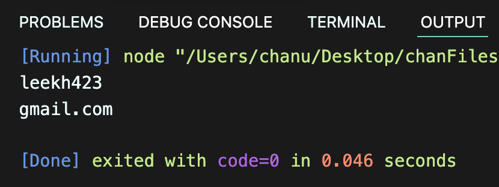

# 박찬우 연습문제

> 2022-02-15

## 문제 1

자신의 이메일 주소를 `email` 이라는 변수에 저장하고 `@`를 기준으로 아이디와 도메인 부분을 분리하여 출력하시오.

> 풀이

```javascript
const email = "leekh4232@gmail.com";
const msg1 = email.substring(0,8);
const msg2 = email.substring(10);

console.log(msg1);
console.log(msg2);
```

>실행결과

</img>

---

## 문제 2

임의의 주민번호를 다음과 같이 `*`을 포함하여 변수에 저장하시오.

```
ssn = '020517-3******'
```

또한 현재 년도를 now_year라는 변수로 저장하시오.

이 값을 사용하여 생년월일, 나이, 성별을 출력하시오.

> 풀이

```javascript

```

>실행결과

</img>

---

## 문제 3

아래의 문장에서 "수업시간"이라는 단어가 총 몇 번 등장하는지 카운트 하는 프로그램을 구현하시오.

```
str = "수업시간에 배운것은 수업시간에 다 이해하고 넘어가야지 수업시간에 놓치면 따라오기 힘들다."
```

> 풀이

```javascript

```

>실행결과

</img>

---

## 문제 4

주어진 범위 안에서 랜덤한 숫자를 추출하는 함수는 아래와 같다.

```javascript
function random(n1, n2) {
    return parseInt(Math.random() * (n2 - n1 + 1)) + n1;
}
```

0개의 원소를 갖는 배열 `lotto`를 생성하고 6회의 반복을 수행하는 for문을 사용하여 배열의 각 원소를 `1~45` 사이의 범위를 갖는 임의의 숫자로 채워 넣으시오.

반복이 종료되었을 때 `lotto`의 원소는 6개의 숫자가 채워져 있어야 하고 각 숫자는 중복되지 않아야 합니다.

중복되지 않는 숫자를 생성하기 위해 for문 안에서 무한반복을 위한 while문을 수행해야 합니다.

> 풀이

```javascript

```

>실행결과

</img>

---

## 문제 5

`1~45`사이의 범위의 1씩 증가 하는 원소가 저장되어 있는 배열 `balls`을 생성하고 6개의 빈 칸을 갖는 배열 `lotto`를 생성하시오.

`lotto` 배열을 탐색하는 반복을 수행하면서 `balls` 배열에서 임의의 원소 하나를 추출하여 `lotto` 배열에 채워 넣으시오.

추출된 숫자는 `balls` 배열에서는 삭제되어야 합니다.

> 풀이

```javascript

```

>실행결과

</img>

---

## 문제 6


> 풀이

```javascript

```

>실행결과

</img>

---