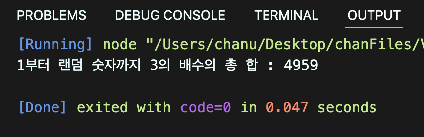

# 박찬우 자바스크립트 시험

> 2022-02-22

## 문제 1

> 풀이

```javascript
const ssn = "9203211";

const date = new Date();
const nowYear = date.getFullYear();

let bornYear = parseInt(ssn.substring(0,2));
let gender = parseInt(ssn.substring(6));

bornYear = gender > 2 ? bornYear + 2000 : bornYear + 1900;

const age = nowYear - bornYear + 1;
const sex = gender % 2 == 0 ? "여자" : "남자";

console.log(`당신은 ${age}세 ${sex}입니다.`);
```

>실행결과

</img>

---

## 문제 2

> 풀이

```javascript
function random(min, max) {
  return parseInt(Math.random() * (max - min + 1)) + min;
};

let number = random(100,200);
let sum = 0;

for(let i = 1; i < number; i++) {
  if(i % 3 === 0) {
    sum += i
  }
}
console.log("1부터 랜덤 숫자까지 3의 배수의 총 합 : " + sum);
```

>실행결과

</img>

---

## 문제 3

> 풀이

```javascript
function solution(x) {
  let str = x + "";
  let arr = str.split("");

  let sum = 0;
  for(let i = 0; i < arr.length; i++) {
    sum += parseInt(arr[i]);
  }

  const result = x % sum == 0 ? true : false;
  return result;
}
console.log(solution(10));
console.log(solution(12));
console.log(solution(11));
console.log(solution(13));
```

>실행결과

</img>

---

## 문제 4

> 풀이

```javascript
function solution(k, n, m) {
  let bread = k * n;
  let change = bread - m;

  const result = change < 0 ? 0 : change
  
  return console.log(`동수가 부모님께 받아야하는 돈은 ${result}원 입니다.`);
}
solution(30, 4, 100);
solution(250, 2, 140);
solution(20, 6, 120);
solution(20, 10, 320);
```

>실행결과

</img>

---

## 문제 5

> 풀이

```javascript
class Student {
  constructor() {
    this._grade = [];
  };
  set grade(score) {
    this._grade = score;
  };

  getSumAvg() {
    let sum = 0
    
    for(let i = 0; i < this._grade.length; i++) {
      sum += this._grade[i]
    }
    let avg = sum / this._grade.length;
    return [sum, avg];
  };

  getMinMax() {
    let min = this._grade[0];
    let max = this._grade[0];

    for(let i = 0; i < this._grade.length; i++) {
      if(min > this._grade[i]) {
        min = this._grade[i];
      } else {
        max = this._grade[i]
      }
    }
    return {min, max}
  };

  getVar() {
    let a = 0;
    for(let i = 0; i < this._grade.length; i++) {
      a = this._grade[i] - this.getSumAvg()[1];
      
    }
    return a;
  }

  getStd() {

  }

  output() {
    console.log(this.getSumAvg());
    console.log(this.getMinMax());
    // console.log(this.getVar());
  }
}
const a = new Student();
a.grade = [82, 76, 91, 98, 64];

console.log(a);
a.output();
```

>실행결과

</img>

---