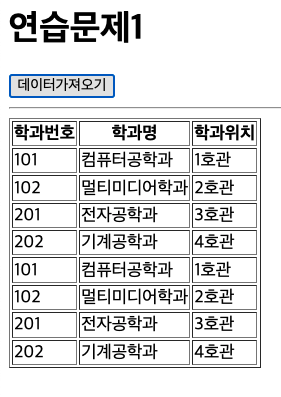
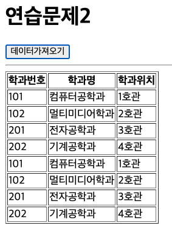

# 박찬우 연습문제

> 2022-04-04

```html
<!-- CSS -->
<style>
  #loading {
    width: 100px;
    height: 100px;
    background-image: url(./img/loading.gif);
    background-size: cover;
    background-repeat: no-repeat;
    background-position: center center;
    display: block;
    position: absolute;
    left: 50%;
    top: 50%;
    transform: translate(-50%, -50%);
    z-index: 9;
    display: none;
    }

  #loading.active {
    display: block;
  }
</style>

<!-- HTML -->
<div id="loading"></div>
<h1>연습문제1</h1>

<button type="button" id="btn">데이터가져오기</button>
<hr />

<table border="1">
  <thead>
    <tr>
      <th>학과번호</th>
      <th>학과명</th>
      <th>학과위치</th>
    </tr>
  </thead>
  <tbody id="list-body"></tbody>
</table>

<script src="https://cdn.jsdelivr.net/npm/axios/dist/axios.min.js"></script>
```

## 문제 1

> 풀이

```js
document.querySelector("#btn").addEventListener("click", e => {

  // 로딩바 표시하기
  const loading = document.querySelector("#loading");
  loading.classList.add("active");

  const listBody = document.querySelector("#list-body");

  axios
    .get("http://localhost:3000/department")
    .then(({data}) => {
      data.map((v) => {
        const tr = document.createElement("tr");

        const td1 = document.createElement("td");
        td1.innerHTML = v.id;

        const td2 = document.createElement("td");
        td2.innerHTML = v.dname;

        const td3 = document.createElement("td");
        td3.innerHTML = v.loc;

        tr.appendChild(td1);
        tr.appendChild(td2);
        tr.appendChild(td3);

        listBody.appendChild(tr);
      });
    })
    .catch((e) => {
        console.error(e);
        console.error(e.response.status);
        console.error(e.response.statusText);
        alert(e.response.statusText);
    })
    .finally(() => {
      loading.classList.remove("active");
    });
});
```

>실행결과

</img>

---

## 문제 2

> 풀이

```js
document.querySelector("#btn").addEventListener("click", async e => {

  // 로딩바 표시하기
  const loading = document.querySelector("#loading");
  loading.classList.add("active");

  const listBody = document.querySelector("#list-body");

  let json = null;

  try {
    json = await axios.get(`http://localhost:3000/department/`);

  } catch(e) {
    console.error(e);
    console.error(e.response.status);
    console.error(e.response.statusText);
    alert(e.response.statusText);
  } finally {
    loading.classList.remove("active");
  };

  if(json != null) {
    json.data.map((v) => {
      const tr = document.createElement("tr");

      const td1 = document.createElement("td");
      td1.innerHTML = v.id;

      const td2 = document.createElement("td");
      td2.innerHTML = v.dname;

      const td3 = document.createElement("td");
      td3.innerHTML = v.loc;

      tr.appendChild(td1);
      tr.appendChild(td2);
      tr.appendChild(td3);

      listBody.appendChild(tr);
    });
  };
});
```

>실행결과

</img>

---