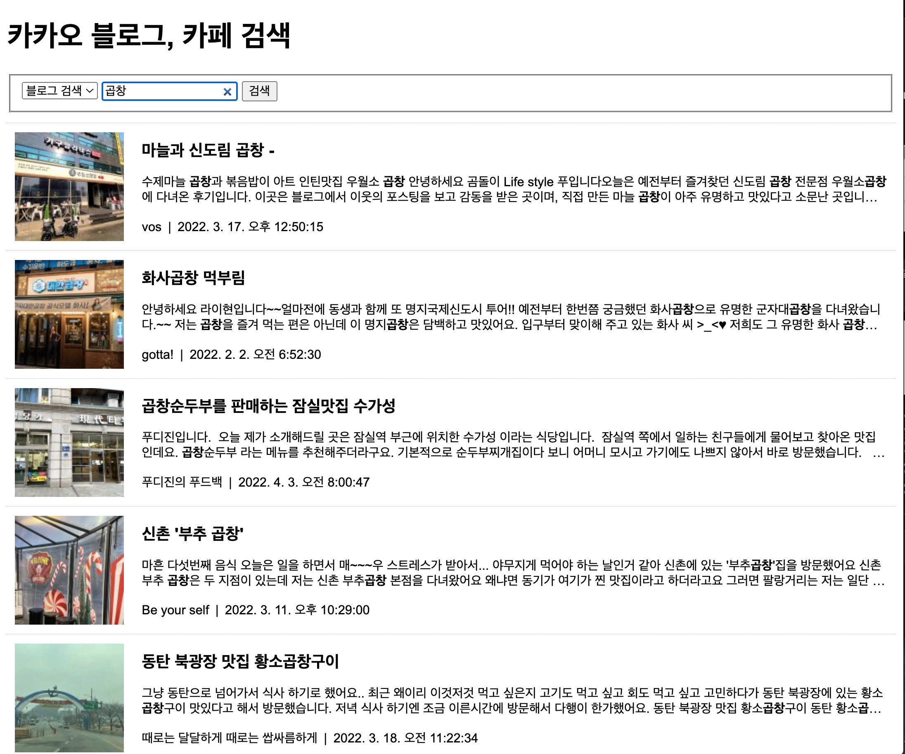
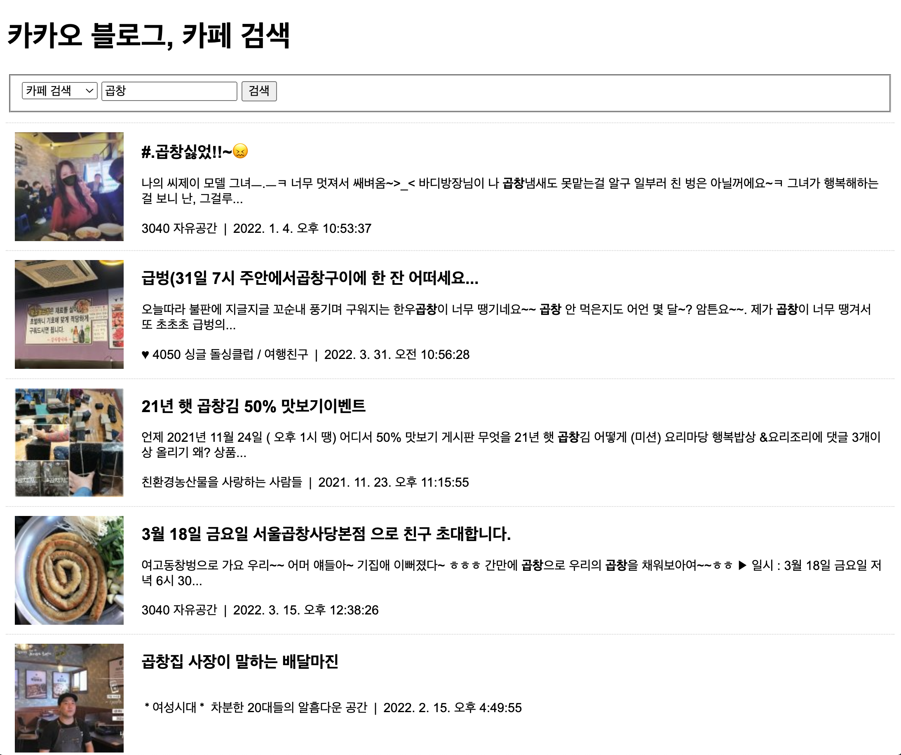

# 박찬우 카카오 연습문제

> 2022-04-05

## 문제1

> 풀이

```js
// ---KAKAO REST KEY --- //
const KAKAO_REST_KEY = "bb10b2a5cc7da58fb075c6b428ff9ed1";

// --- 페이지 번호 --- //
let currentPage = 1;

// --- 검색어 --- //
let queryKeyword = null;

// --- 마지막 페이지인지 검사 --- //
let isEnd = false;

// --- 검색 폼의 submit 이벤트 - 신규검색 --- //
document.querySelector("#searchForm").addEventListener("submit", e => {
  e.preventDefault();

  // 입력된 검색어를 가져온다.
  const queryField = document.querySelector("#query");
  queryKeyword = queryField.value.trim();

  // 검색어가 입력되지 않은 경우에 대한 예외처리
  if(!queryKeyword) {
    alert("검색어를 입력하세요.");
    queryField.focus();
    return;  // 함수 종료
  }

  // 신규검색
  currentPage = 1;
  getSearch();
});


// --- 스크롤 이벤트 - 추가검색 --- //
window.addEventListener("scroll", e => {
  // 마지막 페이지이거나 이미 로딩바가 화면에 표시되고 있다면 처리 중단
  if(isEnd || document.querySelector("#loading").classList.contains("active")) {
    return;
  }

  // 스크롤바의 y좌표
  const scrollTop = window.scrollY;
  // 웹 브라우저의 창 높이
  const windowHeight = window.screen.availHeight;
  // HTML 문서의 높이
  const documentHeight = document.body.scrollHeight;

  // 스크롤바의 반동 효과를 고려해서 scrollTop + windowHeight가 실제 화면 크기보다 커 질 수도 있다.
  if(scrollTop + windowHeight >= documentHeight) {
    // 2페이지 이후는 추가 검색
    currentPage++;
    getSearch();
  }
});


// --- Ajax 요청 후 결과를 화면에 HTML로 출력하는 함수 --- //
async function getSearch() {
  // 로딩바 객체
  const loading = document.querySelector("#loading");

  // 로딩바 화면에 표시하기
  loading.classList.add("active");

  // 검색 결과가 표시될 영역
  const list = document.querySelector("#list");

  // 1페이지에 대한 요청일 경우 기존에 표시되고 있던 검색결과가 있다면 삭제한다.
  if(currentPage == 1) {
    Array.from(list.getElementsByTagName("li")).forEach((v,i) => {
      list.removeChild(v);
    });
  };

  // select 값 가져오기
  const searchName = document.querySelector("#source");
  const searchNameChoose = searchName[searchName.selectedIndex].value;

  // 검색 결과를 저장할 빈 변수
  let json = null;

  try {
    // select 값에 따라 가져올 url 주소 변경
    if(searchNameChoose == "blog") {
      json = await axios.get("https://dapi.kakao.com/v2/search/blog", {
        params: {
          query: queryKeyword,
          page: currentPage,
        },
        headers: {
          Authorization: `KakaoAK ${KAKAO_REST_KEY}`,
        }
      });
    } else if(searchNameChoose == "cafe") {
      json = await axios.get("https://dapi.kakao.com/v2/search/cafe", {
        params: {
          query: queryKeyword,
          page: currentPage,
        },
        headers: {
          Authorization: `KakaoAK ${KAKAO_REST_KEY}`,
        }
      });
    }
    // 응답결과 확인
    console.log(json);

  } catch(e) {
    console.error(e);
    alert("요청을 처리하는데 실패했습니다.");
    return;

  } finally {
    //로딩바 닫기
    loading.classList.remove("active");
  }

  if(json != null) {
    const {data} = json;

    // 다음 페이지를 요청할 수 있는지를 판단하기 위한 값
    isEnd = data.meta.is_end;

    data.documents.map((v,i) => {
      const li = document.createElement("li");

      const a = document.createElement("a");
      a.setAttribute("href", v.url);
      a.setAttribute("target", "_blank");

      const img = document.createElement("img");
      img.setAttribute("src", v.thumbnail);
      // thumbnail 사진이 없는 경우
      if(!v.thumbnail) img.setAttribute("src", "./img/noimage.jpg");

      const h2 = document.createElement("h2");
      h2.innerHTML = v.title

      const p = document.createElement("p");
      p.innerHTML = v.contents;

      const spanName = document.createElement("span");
      spanName.classList.add("info");

      if(searchNameChoose == "blog") spanName.innerHTML = v.blogname;
      else if(searchNameChoose == "cafe") spanName.innerHTML = v.cafename;

      const spanDate = document.createElement("span");
      spanDate.classList.add("info");
      spanDate.innerHTML = new Date(v.datetime).toLocaleString();

      a.appendChild(img);
      a.appendChild(h2);
      a.appendChild(p);
      a.appendChild(spanName);
      a.appendChild(spanDate);

      li.appendChild(a);
      list.appendChild(li);
    });
  }
};

```

>실행결과

</img>
</img>

---