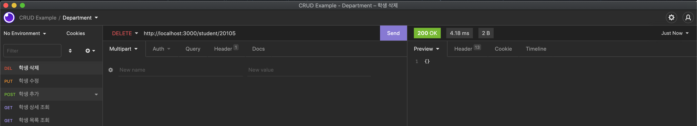

# 박찬우 CRUD 연습문제

> 2022-04-07

# 교수에 대한 CRUD restful 테스트 화면

### 교수 목록 조회

</img>

### 교수 상세 조회

</img>

### 교수 추가

</img>

### 교수 수정

</img>

### 교수 삭제

</img>

# 교수에 대한 CRUD 구현 웹 페이지

### 교수 메인페이지

</img>

### 교수 추가 화면

</img>

### 메인화면에 추가된 모습

</img>

### 추가된 내용 상세보기

</img>

### 메인페이지에서 삭제

</img>

### 수정화면

</img>

### 수정된 내용

</img>

### 삭제

</img>

---

# 학생에 대한 CRUD restful 테스트 화면

### 학생 목록 조회

</img>

### 학생 상세 조회

</img>

### 학생 추가

</img>

### 학생 수정

</img>

### 학생 삭제

</img>

# 학생에 대한 CRUD 구현 웹 페이지

### 학생 메인페이지

</img>

### 학생 추가 화면

</img>

### 메인화면에 추가된 모습

</img>

### 추가된 내용 상세보기

</img>

### 메인페이지에서 삭제

</img>

### 수정화면

</img>

### 수정된 내용

</img>

### 삭제

</img>