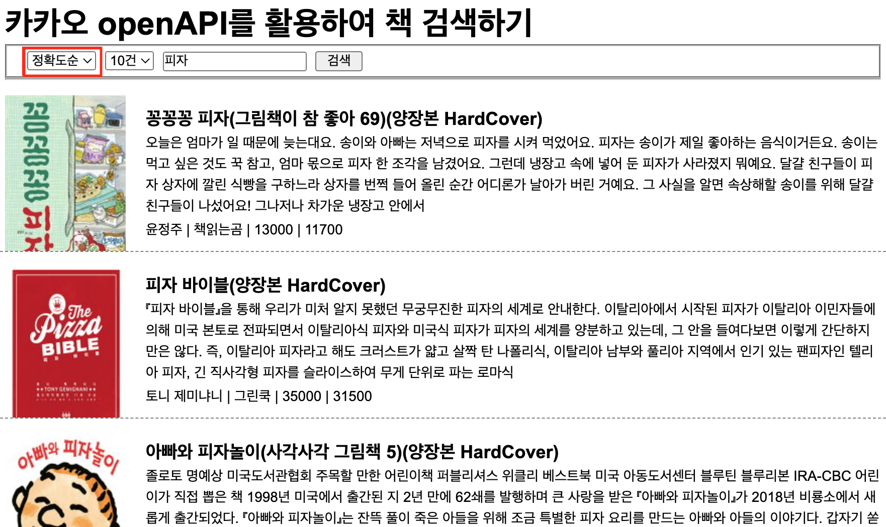
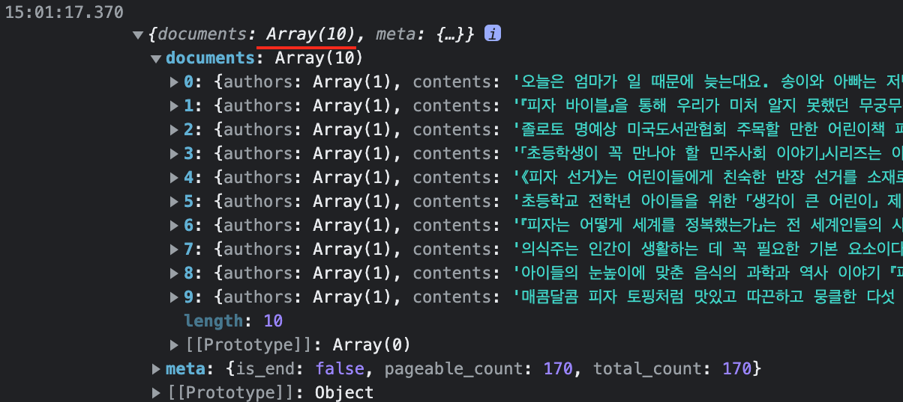
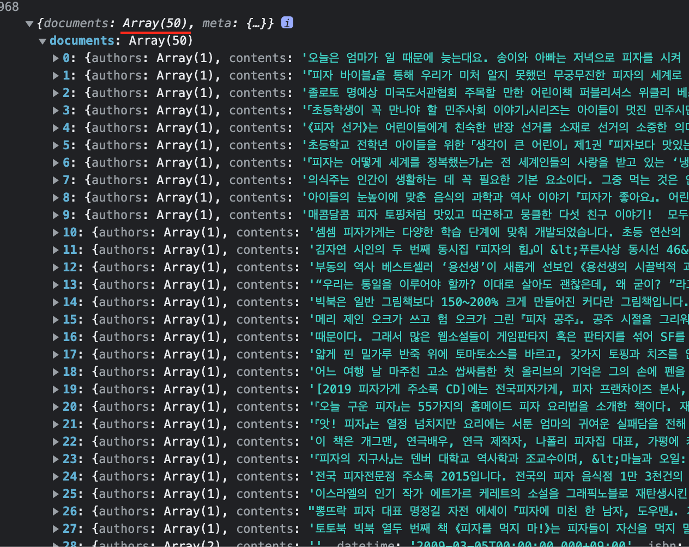
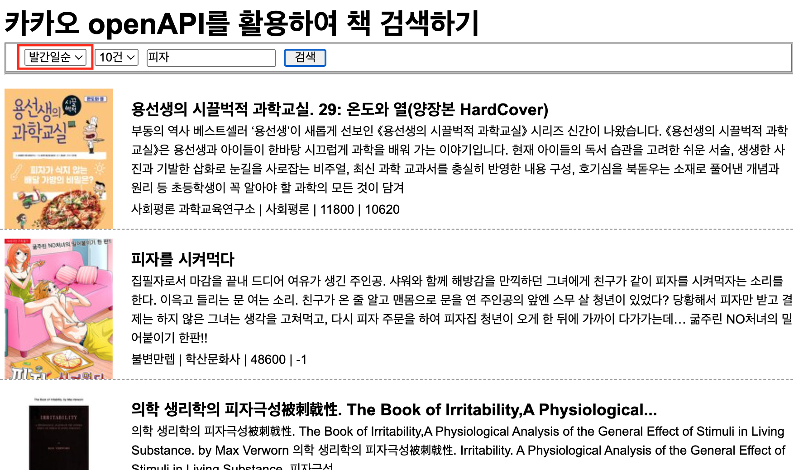
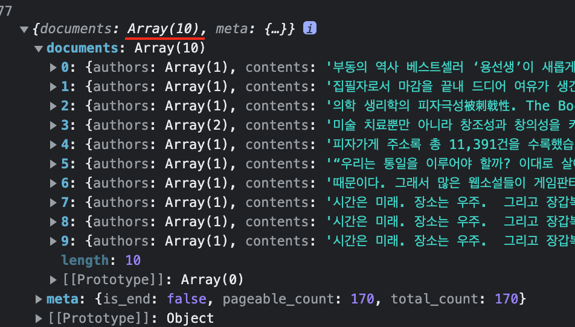
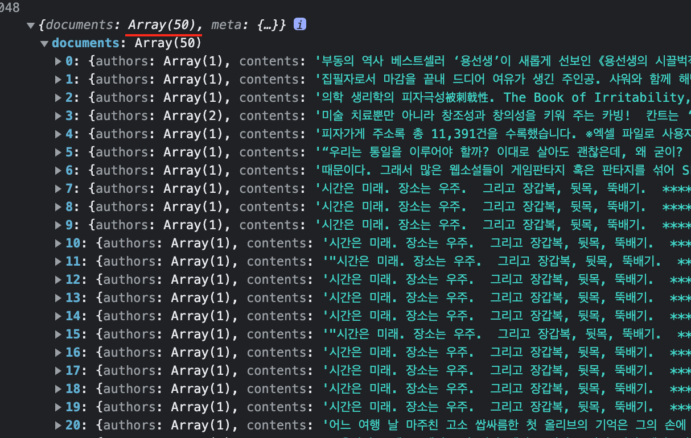
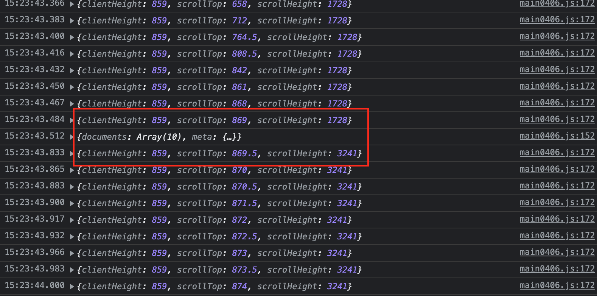
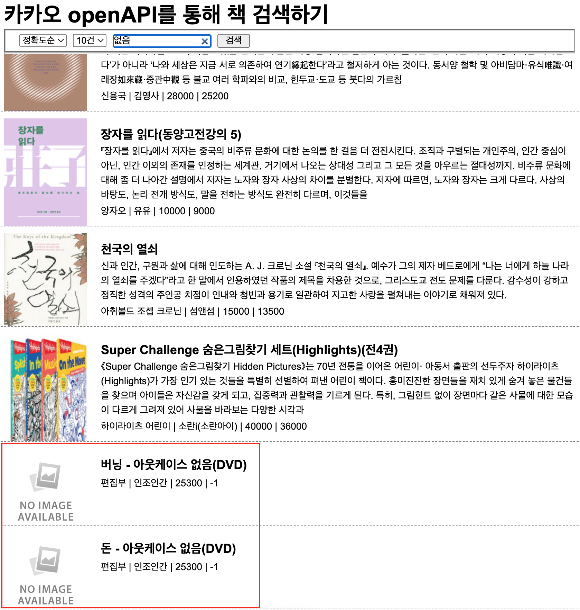

# 박찬우 openAPI 시험

> 2022-04-06

## 문제1

### DOM구조
```
-h1
  -form
    -fieldset
      -select
        -option
        -option
      -select
        -option
        -option
        -option
        -option
        -option
      -input
      -button

-div

-ul
  -li
    -a
      -img
      -h2
      -p
      -span
      -span
      -span
      -sapn
```

>### HTML

```html
<!--
  @fileName    : index0406.html
  @author      : 박찬우
  @description : HTML 구조 작성
-->

<!DOCTYPE html>
<html lang="ko">
<head>
  <meta charset="UTF-8">
  <meta name="viewport" content="width=device-width, initial-scale=1.0">
  <title>Document</title>
  <!-- CCS 참조 -->
  <link rel="stylesheet" href="./style0406.css">
</head>
<body>
  <!-- header -->
  <h1 id="header">
    카카오 openAPI를 통해 책 검색하기
    <!-- 검색 -->
    <form id="search_form" >
      <fieldset>
        <select name="select_sort" id="select_sort" class="select">
          <option value="accuracy">정확도순</option>
          <option value="latest">발간일순</option>
        </select>
        <select name="select_size" id="select_size" class="select">
          <option value="10">10건</option>
          <option value="20">20건</option>
          <option value="30">30건</option>
          <option value="40">40건</option>
          <option value="50">50건</option>
        </select>
        <input type="search" id="search" placeholder="검색"/>
        <button type="submit">검색</button>
      </fieldset>
    </form>
    <hr />
  </h1>

  <!-- 로딩이미지 -->
  <div id="loading"></div>

  <!-- 검색한 값을 불러올 영역 -->
  <ul id="list">
    <li class="list_value" id="list_value">
      <a href="#" target="_blank">
        
        <h2>글제목</h2>
        <p>본문내용</p>
        <span class="info">저자이름</span>
        <span class="info">출판사이름</span>
        <span class="info">원가</span>
        <span class="info">판매가</span>
      </a>
    </li>
  </ul>
  
  <!-- Axios -->
  <script src="https://cdn.jsdelivr.net/npm/axios/dist/axios.min.js"></script>

  <!-- 자바스크립트 참조 -->
  <script src="./main0406.js"></script>

</body>
</html>
```

>### CSS

```css
/**
 * @fileName    : style0406.css
 * @author      : 박찬우
 * @description : 작성된 HTML 구조를 바탕으로 디자인 요소 정의
 */

* {
  margin: 0;
  padding: 0;
  box-sizing: border-box;
}

body {
  font-family: Arial, Helvetica, sans-serif;
  padding-top: 90px;
}

#loading {
  position: absolute;
  width: 150px;
  height: 150px;
  background-image: url(./img/loading.gif);
  background-size: cover;
  background-repeat: no-repeat;
  background-position: center center;
  top: 50%;
  left: 50%;
  transform: translate(-50%, -50%);
  z-index: 9;
  display: none;
}

#loading.active {
  display: block;
}

#header {
  position: fixed;
  top: 0;
  left: 0;
  width: 100%;
  padding: 10px 10px 0;
  background-color: #fff;
  z-index: 9;
}

#header fieldset {
  padding: 5px 20px;
  line-height: 4px;
}

#header fieldset button {
  padding: 0 10px;
  cursor: pointer;
}

#list {
  list-style: none;
}

#list li:not(:last-child) {
  border-bottom: 1px dashed gray;
}

#list a {
  display: block;
  width: auto;
  min-height: 120px;
  padding: 10px;
  position: relative;
  color: #000;
  text-decoration: none;
  padding-left: 150px;
  line-height: 1.5;
  overflow: hidden;
}

#list a img {
  display: flex;
  width: 120px;
  object-fit: cover;
  position: absolute;
  left: 10px;
  top: 10px;
}

#list a h2 {
  font-size: 18px;
  margin-top: 10px;
  overflow: hidden;
  text-overflow: ellipsis;
}

#list a span,
#list a p {
  font-size: 14px;
}

#list a p {
  overflow: hidden;
  text-overflow: ellipsis;
}

#list span.info:not(:last-child)::after {
  content: " | ";
}
```

>### Javascript

```js
/**
 * @fileName    : main0406.js
 * @author      : 박찬우
 * @description : 사용자의 검색 결과를 비동기 처리 하여 HTML에 요소 추가
 */

// 카카오에서 받은 인증키
const key = "bb10b2a5cc7da58fb075c6b428ff9ed1";

// 선택한 옵션
let selectSort = null;
let selectSize = null;

// 검색어 값
let searchValue = null;

// 검색 결과 
let searchResult = null;

// 페이지 번호
let pageNumber = 0;

// 페이지 검사
let pageEnd = false;


// --- 사용자가 검색했을 때 발생하는 이벤트 --- //
document.querySelector("#search_form").addEventListener("submit", e => {
  e.preventDefault();

  // 선택한 옵션값 가져오기
  const selectOption1 = document.querySelector("#select_sort");
  selectSort = selectOption1[selectOption1.selectedIndex].value;
  
  const selectOption2 = document.querySelector("#select_size");
  selectSize =  selectOption2[selectOption2.selectedIndex].value;

  // 입력값 가져오기
  const searchArea = document.querySelector("#search");
  searchValue = searchArea.value.trim();

  // 검색어가 입력되지 않았을 경우
  if(!searchValue) {
    alert("검색어를 입력하세요.");
    searchArea.focus();
    return;
  }

  // 페이지 번호
  pageNumber = 1;
  // 함수호출
  search();
});


// --- 비동기처리 후 HTML에 요소 추가 --- //
async function search() {
  // 로딩이미지 객체 생성
  const loading = document.querySelector("#loading");
  loading.classList.add("active");

  // 기존의 검색 결과를 삭제
  const list = document.querySelector("#list");
  if(pageNumber === 1) {
    Array.from(list.getElementsByTagName("li")).forEach(v => {
      list.removeChild(v);
    });
  };

  // 비동기 처리
  try {
    // 요청 성공시 가져올 값
    searchResult = await axios.get("https://dapi.kakao.com/v3/search/book", {
      params: {
        query: searchValue, // 검색어
        page: pageNumber,   // 페이지 번호
        sort: selectSort,   // 문서 정렬 방식
        size: selectSize,   // 한 페이지에 보여지는 목록
      },
      headers: {
        Authorization: `KakaoAK ${key}`,
      },
    });
    // 요청 실패시 예외처리
  } catch(e) {
    console.error(e);
    alert("요청에 실패 하였습니다.");
    return;
    // 성공 여부에 상관없이 실행
  } finally {
    // 로딩이미지 숨기기
    loading.classList.remove("active");
  };
  
  // 데이터를 성공적으로 가져왔을 경우 처리될 코드
  if(searchResult !== null) {
    // 비구조문법으로 data 객체에 대입
    const {data} = searchResult;
    
    // 가져온 객체를 통해 마지막 페이지인지 확인
    pageEnd = data.meta.is_end;
    
    // 가져온 data 객체를 map을 통해 변경
    data.documents.map(v => {
      // 요소생성 및 documents 값 대입
      const li = document.createElement("li");
      li.classList.add("list_value");

      const a = document.createElement("a");
      a.setAttribute("href", v.url);
      a.setAttribute("target", "_blank");

      const img = document.createElement("img");
      img.setAttribute("src", v.thumbnail || "./img/noimage.jpg");

      const h2 = document.createElement("h2");
      h2.innerHTML = v.title;

      const p = document.createElement("p");
      p.innerHTML = v.contents;

      const Author = document.createElement("span");
      Author.classList.add("info");
      Author.innerHTML = v.authors;

      const Publisher = document.createElement("span");
      Publisher.classList.add("info");
      Publisher.innerHTML = v.publisher;

      const Price = document.createElement("span");
      Price.classList.add("info");
      Price.innerHTML = v.price;

      const SalePrice = document.createElement("span");
      SalePrice.classList.add("info");
      SalePrice.innerHTML = v.sale_price;
      
      // HTML 요소 추가
      list.appendChild(li);
      li.appendChild(a);
      a.appendChild(img);
      a.appendChild(h2);
      a.appendChild(p);
      a.appendChild(Author);
      a.appendChild(Publisher);
      a.appendChild(Price);
      a.appendChild(SalePrice);  
    });
    // 출력 확인
    console.log(data);
  };
};


// --- 스크롤 이벤트 --- //
window.addEventListener("scroll", e => {
  // 마지막페이지 또는 로딩 이미지가 활성화 중이라면 스크롤 이벤트 중지
  if(pageEnd || document.querySelector("#loading").classList.contains("active")) {
    return;
  };

  // target 객체의 scrollingElement 속성을 활용하여 비구조문법으로 대입
  const {clientHeight, scrollTop, scrollHeight} = e.target.scrollingElement;
    if(clientHeight + scrollTop >= scrollHeight) {
      pageNumber++;
      search();
    }
});
```

>실행결과

> 정확도순으로 검색

</img>

> 정확도순 10건으로 검색

</img>

> 정확도순 50건으로 검색

</img>

> 발간일순으로 검색

</img>

> 발간일순 10건으로 검색

</img>

> 발간일순 50건으로 검색

</img>

> 스크롤 이벤트

</img>

> 이미지가 없을 경우

</img>


---