# 박찬우 리액트 클론코딩 - 배스킨라빈스

> 2022-05-14

## 1. 전체 레이아웃 구조 확인

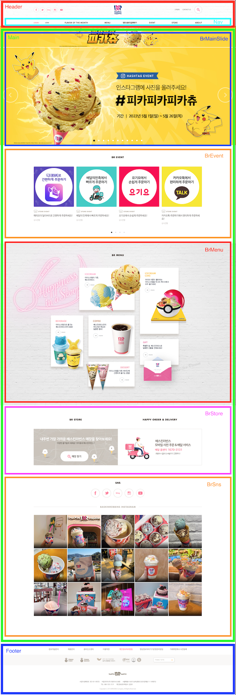</img>

<br />

## 2. 레이아웃 구조

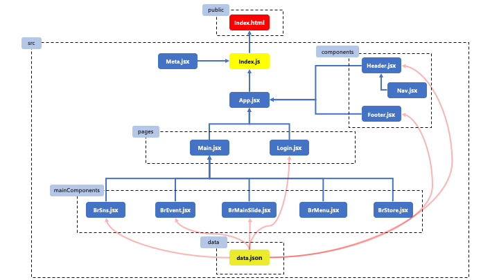</img>
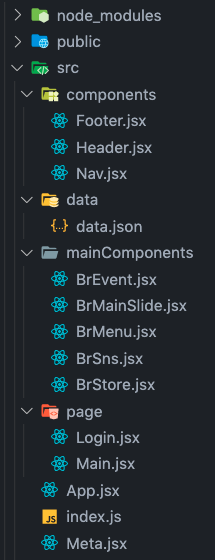</img>

<br />

## 3. 구현 및 상세 내용

### 1) src 디렉터리

### `- src/index.js`
```js
/**
 * @filename : index.js
 * @author : 박찬우
 * @description : index.html의 root에 랜더링할 컴포넌트 정의
 */

// 패키지 참조
import React from 'react';
import ReactDOM from 'react-dom/client';
import { BrowserRouter } from 'react-router-dom';
import { createGlobalStyle } from "styled-components";

// 컴포넌트 참조
import App from './App';
import Meta from './Meta';


// 전역 스타일 정의
const GlobalStyle = createGlobalStyle`
  * {
    margin: 0;
    padding: 0;
    box-sizing: border-box;
    font-family: 'Nanum Gothic', sans-serif;
    list-style: none;
    text-decoration: none;
    outline: none;
  }
`;

const root = ReactDOM.createRoot(document.getElementById('root'));
root.render(
  <>
    <Meta />
    <GlobalStyle />
    <BrowserRouter>
      <App />
    </BrowserRouter>
  </>
);
```

### `- src/App.jsx`
```js
/**
 * @filename : App.jsx
 * @author : chanCo
 * @description : 화면에 보여질 컴포넌트 참조 및 배치
 */

// 패키지 참조
import React, { memo } from 'react';
import { Routes, Route } from 'react-router-dom';

// 컴포넌트 참조
import Header from './components/Header';
import Main from './pages/Main';
import Login from './pages/Login';
import Footer from './components/Footer';

// TODO: 화면을 구성할 컴포넌트들을 배치한다.
function App() {
  return (
    <>
      <Header />

      <Routes>
        <Route path='/' exact={true} element={<Main />} />
        <Route path='/login' element={<Login />} />
      </Routes>

      <Footer />
    </>
  );
}

export default memo(App);
```

### `- src/Meta.jsx`
```js
/**
 * @filename : Meta.jsx
 * @author : 박찬우
 * @description : SEO처리 및 기본 참조 리소스 명시
 */

// 패키지 참조 
import React from 'react';
import { Helmet, HelmetProvider } from 'react-helmet-async';

const Meta = (props) => {
  return (
    <HelmetProvider>
      <Helmet>
        <title>{props.title}</title>
        <meta charset="utf-8" />
        <meta name="description" content={props.description} />
        <meta name="keywords" content={props.keywords} />
        <meta name="author" content={props.author} />
        <meta property="og:type" content="website" />
        <meta property="og:title" content={props.title} />
        <meta property="og:description" content={props.description} />
        <meta property="og:url" content={props.url} />
        <meta property="og:image" content={props.image} />

        {/* favicon 설정 */}
        <link rel="shortcut icon" href={props.image} type="image/png" />
        <link ref="icon" href={props.image} type="image/png" />

        {/* 웹폰트 적용 */}
        <link rel="preconnect" href="https://fonts.googleapis.com" />
        <link rel="preconnect" href="https://fonts.gstatic.com" crossorigin />
        <link href="https://fonts.googleapis.com/css2?family=Nanum+Gothic:wght@400;700;800&display=swap" rel="stylesheet" />
      </Helmet>
    </HelmetProvider>
  );
};

// TODO: props에 대한 기본값 설정
Meta.defaultProps = {
  title: '배스킨라빈스 :: 클론코딩',
  description: 'React.js로 구현한 배스킨라빈스 클론코딩 연습 페이지 입니다.',
  keywords: 'React, layout, demo, cloncoding',
  author: 'chanCo',
  url: 'http://www.baskinrobbins.co.kr',
  image: 'https://www.baskinrobbins.co.kr/assets/images/common/favicon.ico',
};

export default Meta;
```

<br />

### 2) components 디렉터리

### `- src/components/Header.jsx`
```js
/**
 * @filename : Header.jsx
 * @author : 박찬우
 * @description : 헤더 영역 정의
 */

import React, { useCallback, useState, useEffect, memo } from "react";
import axios from "axios";
import styled from "styled-components";
import { NavLink } from 'react-router-dom';

import Nav from "./Nav";

// TODO: Header 스타일 정의
const HeaderContainer = styled.div`
  & {
    position: relative;
    width: 100%;
    border-top: 3px solid #ff7c98;
    border-bottom: 1px solid #e1e1e1;
    background: url(./img/bg_header.gif) center center;

    .header {
      position: relative;
      display: flex;
      width: 1200px;
      margin: auto;
      padding: 20px 0;
      justify-content: space-between;

      .headerSocial {
        position: relative;
        display: flex;
        justify-content: center;
        align-items: center;

        ul {
          display: flex;

          li {
            padding: 0 5px;
          }
        }
      }

      .help {
        position: relative;
        display: flex;

        ul {
          position: relative;
          display: flex;
          justify-content: center;
          align-items: center;

          li {
            padding-left: 20px;

            a {
              font-size: 10px;
              color: #222;
            }
          }

          .search {
            button {
              background-color: transparent;
              border: none;
              cursor: pointer;
            }
          }
        }
      }
    }
  }
`;

// TODO: search 버튼 클릭시 나오는 이벤트 영역
const SearchArea = styled.div`
  & {
    position: absolute;
    top: 0;
    margin-top: 186px;
    width: 100%;
    max-height: 0;
    z-index: 99;
    transition: 0.4s ease-out;
    overflow: hidden;
    background-color: #fff;

    .searchMenu {
      position: relative;
      width: 1200px;
      margin: auto;
      padding: 25px 0;

      .searchIfon {
        display: flex;
        justify-content: space-between;
        flex-wrap: wrap;

        h4 {
          padding-top: 8px;
          width: 89px;
          font-weight: normal;
          font-size: 13px;
        }

        input {
          padding: 8px 0 8px 10px;
          height: 32px;
          background-color: #efefef;
          border: none;
        }

        .productNameWrap {
          display: flex;
          width: 570px;
          flex-direction: row;

          select {
            width: 128px;
            height: 32px;
            border: 1px solid #e1e1e1;
            border-radius: 5px;
            padding-left: 10px;
            margin-right: 14px;
            color: #555;
          }

          input {
            width: 260px;
          }
        }

        .hashTagWrap {
          display: flex;
          width: 630px;
          flex-wrap: wrap;
          justify-content: space-between;

          input {
            width: 540px;
            color: #ff7c98;
          }

          .hashTag {
            width: 526px;
            margin: 10px 0 8px auto;

            p {
              color: #9c9c9c;
              font-size: 13px;
            }

            a {
              color: #ff7c98;
              padding-right: 5px;
              font-size: 12px;
            }
          }
        }

        .allergyWrap {
          display: flex;
          width: 100%;

          .check {
            display: flex;
            width: 280px;
            flex-wrap: wrap;

            span {
              display: flex;
              width: 70px;
              height: 30px;
              align-items: center;

              input {
                margin-right: 5px;
                cursor: pointer;
              }

              label {
                font-size: 13px;
                cursor: pointer;
              }
            }
          }
        }
      }

      .searchBtn {
        padding-top: 25px;
        text-align: center;

        button {
          border: none;
          padding: 10px 60px;
          border-radius: 20px;
          background-color: #ff7c98;
          color: #fff;
          font-size: 15px;
          cursor: pointer;
        }
      }
    }
  }
`;

const Header = () => {
  // TODO: 화면에 표시할 상태값(headerSocial) -> ajax 연동 결과로 받아올 json
  const [headerSocial, setHeaderSocial] = useState([]);

  // TODO: 화면에 표시할 상태값(checkList) -> ajax 연동 결과로 받아올 json
  const [checkList, setCheckList] = useState([]);

  // TODO: 검색 버튼 클릭시 이미지 변경
  const [button, setButton] = useState(false);

  // TODO: 높이를 넣을 값
  const [searchHeight, setSearchHeight] = useState({
    maxHeight: 0,
    opacity: 0,
  });

  // 버튼 토글 구현
  const onButtonChange = useCallback(() => {
    setButton(!button);
    setSearchHeight(button === false ? { maxHeight: "100vh", opacity: 1 } : { maxHeight: 0, opacity: 0 });
  }, [button]);

  // headerSocial 데이터 불러오기
  useEffect(() => {
    (async () => {
      try {
        const response = await axios.get("http://localhost:3001/headerSocial");
        setHeaderSocial((headerSocial) => response.data);
      } catch (e) {
        console.error(e);
        alert("데이터를 불러오지 못했습니다.");
      }
    })();
  }, []);

  // checkList 데이터 불러오기
  useEffect(() => {
    (async () => {
      try {
        const response = await axios.get("http://localhost:3001/checkList");
        setCheckList((checkList) => response.data);
      } catch (e) {
        console.error(e);
        alert("데이터를 불러오지 못했습니다.");
      }
    })();
  }, []);

  return (
    <>
      <HeaderContainer>
        <div className="header">
          <nav className="headerSocial">
            <ul>
              {/* TODO: JSON으로 받아온 데이터로 구현 */}
              {headerSocial.map((v, i) => {
                return (
                  <li key={v.id}>
                    <a href={v.url} target="_blank" rel="noreferrer">
                      
                    </a>
                  </li>
                );
              })}
            </ul>
          </nav>
          <div className="logo">
            <NavLink to='/'>
              
            </NavLink>
          </div>
          <nav className="help">
            <ul>
              <li>
                <a href="#!">고객센터</a>
              </li>
              <li>
                <a href="#!">CONTACT US</a>
              </li>
              <li className="search">
                {/* TODO: 버튼 이미지 변경 */}
                <button type="button" onClick={onButtonChange}>
                  {button === false ?  : }
                </button>
              </li>
            </ul>
          </nav>
        </div>
      </HeaderContainer>

      {/* Nav 영역, 버튼 클릭시 변하는 값을 props로 전달 */}
      <Nav buttonState={button} />

      {/* 검색 버튼 활성화 영역 */}
      <SearchArea style={searchHeight}>
        <div className="searchMenu">
          <div className="searchIfon">
            <div className="productNameWrap">
              <h4>제품명</h4>
              <select>
                <option value="whole">전체</option>
                <option value="icecream">아이스크림</option>
                <option value="cake">아이스크림케이크</option>
                <option value="beverage">음료</option>
                <option value="coffee">커피</option>
                <option value="dessert">디저트</option>
                <option value="blockPack">block pack</option>
                <option value="readyPack">ready pack</option>
              </select>
              <input type="text" />
            </div>
            <div className="hashTagWrap">
              <h4>해시태그</h4>
              <input type="text" />
              <div className="hashTag">
                <p>· 자주 찾는 해시태그</p>
                <a href="#!">#피카피카피카츄</a>
                <a href="#!">#피카츄초코바나나블라스트</a>
                <a href="#!">#쿨쿨잠만보밀키소다블라스트</a>
                <a href="#!">#고라파덕아이스크림콘</a>
                <a href="#!">#푸린아이스크림콘</a>
                <a href="#!">#포켓몬스터</a>
              </div>
            </div>
            <div className="allergyWrap">
              <h4>알레르기 성분</h4>
              <div className="check">
                {/* 데이터를 받아 map을 활용해서 작성 */}
                {checkList.map((v, i) => {
                  return (
                    <span key={v.id}>
                      <input type="checkbox" id={v.name} />
                      <label htmlFor={v.name}>{v.label}</label>
                    </span>
                  );
                })}
              </div>
            </div>
          </div>
          <div className="searchBtn">
            <button type="submit">검색</button>
          </div>
        </div>
      </SearchArea>
    </>
  );
};

export default memo(Header);
```

### `+ data.json`
```json
  "headerSocial": [
    {
      "id": 1,
      "url": "https://www.facebook.com/baskinrobbins.kr",
      "img": "http://www.baskinrobbins.co.kr/assets/images/common/icon_facebook.png",
      "alt": "facebook"
    },
    {
      "id": 2,
      "url": "https://twitter.com/BaskinrobbinsKR",
      "img": "http://www.baskinrobbins.co.kr/assets/images/common/icon_twitter.png",
      "alt": "twitter"
    },
    {
      "id": 3,
      "url": "http://blog.naver.com/brgirl31",
      "img": "http://www.baskinrobbins.co.kr/assets/images/common/icon_blog.png",
      "alt": "blog"
    },
    {
      "id": 4,
      "url": "https://www.instagram.com/baskinrobbinskorea",
      "img": "http://www.baskinrobbins.co.kr/assets/images/common/icon_instgram.png",
      "alt": "instagram"
    },
    {
      "id": 5,
      "url": "https://www.youtube.com/user/baskinrobbinskorea",
      "img": "http://www.baskinrobbins.co.kr/assets/images/common/icon_youtube.png",
      "alt": "youtube"
    }
  ],

  "checkList": [
    { "id": 1, "name": "egg", "label": "계란" },
    { "id": 2, "name": "bean", "label": "대두" },
    { "id": 3, "name": "pork", "label": "돼지고기" },
    { "id": 4, "name": "peanut", "label": "땅콩" },
    { "id": 5, "name": "wheat", "label": "밀" },
    { "id": 6, "name": "peach", "label": "복숭아" },
    { "id": 7, "name": "milk", "label": "우유" },
    { "id": 8, "name": "none", "label": "없음" }
  ],
```

### `- src/components/Nav.jsx`
```js
/**
 * @filename : Nav.jsx
 * @author : 박찬우
 * @description : 헤더 영역의 Nav 영역 컴포넌트 작성
 */

import React, { useCallback, useState, memo } from "react";
import styled from "styled-components";
import { NavLink } from 'react-router-dom';

const NavContainer = styled.div`
  & {
    position: relative;
    width: 100%;
    background-color: #fff;

    .navWrap {
      position: relative;
      width: 1200px;
      margin: auto;
      display: flex;
      justify-content: space-between;

      .loginWrap {
        display: flex;
        width: 110px;
        justify-content: space-between;

        a {
          font-size: 11px;
          font-weight: 800;
          color: #747474;
          padding: 15px 0;

          span {
            color: #ff99ae;
          }
        }
      }

      .navLinkWrap {
        display: flex;
        width: 980px;
        justify-content: space-between;
        align-items: center;

        &:hover {
          cursor: pointer;
        }

        .text {
          color: #4f3b35;
          font-size: 13px;
          font-weight: 800;
          padding: 15px 0;

          span {
            font-size: 12px;
          }
        }
      }
    }
  }
`;

const SubMenu = styled.div`
  position: absolute;
  width: 100%;
  overflow: hidden;
  z-index: 9;
  transition: 1s ease-out;
  border-top: 0.5px solid #000;
  border-bottom: 0.5px solid #000;
  background-color: #fff;

  .subMenuWrap {
    background-color: #fff;
    position: relative;
    width: 1240px;
    margin: auto;
    display: flex;

    .happyPointImg {
      display: flex;
      align-items: center;
      margin-left: 15px;
    }

    .icecreamImg {
      margin-right: 55px;
      opacity: 0;
      transition: 1.5s ease-in;
    }

    .menuList {
      display: flex;
      width: 800px;
      justify-content: space-between;
      padding-top: 40px;

      .menuList1 {
        margin-right: 15px;
      }

      .menuList2 {
        margin-right: 35px;
      }

      li {
        padding-bottom: 20px;
        text-align: center;

        a {
          font-size: 13px;
          color: #afa6a0;
  
          &:hover {
            color: #ff7c98;
          }
        }
      }
    }
  }
`;

const Nav = ({ buttonState }) => {
  // TODO: 서브메뉴 상태 정의
  const [subMenu, setSubMenu] = useState({ maxHeight: 0 });
  const [icecreamImg, setIcecreamImg] = useState({ opacity: 0 });

  // 마우스 올리면 나오는 서브메뉴 정의
  const onMouseOver = useCallback(() => {
    // 검색 버튼의 상태가 false 일때 서브메뉴 높이 값 지정, true면 0
    setSubMenu(buttonState === false ? { maxHeight: "100vh" } : { maxHeight: 0 });
    setIcecreamImg({ opacity: 1 });
  }, [buttonState]);

  // 마우스가 빠져나가면 서브메뉴 사라짐
  const onMouseOut = useCallback(() => {
    setSubMenu({ maxHeight: 0 });
    setIcecreamImg({ opacity: 0 });
  }, []);

  const menuList1 = ["아이스크림", "아이스크림케이크", "음료", "커피", " 디저트"];
  const menuList2 = ["아이스크림", "음료", "커피"];
  const menuList3 = ["진행중이벤트", "당첨자발표"];
  const menuList4 = ["매장찾기", "고객센터", "단체주문"];
  const menuList5 = ["공지사항", "보도자료", "채용정보", "점포개설문의", " CONTACT US"];

  return (
    <>
      <NavContainer>
        <div className="navWrap">
          <div className="loginWrap">
            <NavLink to='/login'>
              <span>LOGIN</span>
            </NavLink>
            <NavLink to='/join'>JOIN</NavLink>
          </div>
          <div className="navLinkWrap" onMouseOver={onMouseOver} onMouseOut={onMouseOut}>
            <NavLink to='/flavor' className="text noLeft">
              FLAVOR OF THE MONTH
            </NavLink>
            <NavLink to='/menu' className="text">
              MENU
            </NavLink>
            <NavLink to='/allergy' className="text">
              <span>영양 성분 및 알레르기</span>
            </NavLink>
            <NavLink to='/evnt' className="text">
              EVENT
            </NavLink>
            <NavLink to='/store' className="text">
              STORE
            </NavLink>
            <NavLink to='/about' className="text noRight">
              ABOUT
            </NavLink>
          </div>
        </div>

        {/* TODO: 서브메뉴 구현 */}
        <SubMenu style={subMenu} onMouseOver={onMouseOver} onMouseOut={onMouseOut}>
          <div className="subMenuWrap">
            <div className="happyPointImg">
              
            </div>
            <div className="icecreamImg" style={icecreamImg}>
              <a href="#!">
                
              </a>
            </div>
            <div className="menuList">
              <ul className="menuList1">
                {menuList1.map((v, i) => <li key={i}> <NavLink to='/'>{v}</NavLink> </li>)}
              </ul>
              <ul className="menuList2">
                {menuList2.map((v, i) => <li key={i}> <NavLink to='/'>{v}</NavLink> </li>)}
              </ul>
              <ul className="menuList3">
                {menuList3.map((v, i) => <li key={i}> <NavLink to='/'>{v}</NavLink> </li>)}
              </ul>
              <ul className="menuList4">
                {menuList4.map((v, i) => <li key={i}> <NavLink to='/'>{v}</NavLink> </li>)}
              </ul>
              <ul className="menuList5">
                {menuList5.map((v, i) => <li key={i}> <NavLink to='/'>{v}</NavLink> </li>)}
              </ul>
            </div>
          </div>
        </SubMenu>
      </NavContainer>
    </>
  );
};

export default memo(Nav);
```

>> Header 구현결과

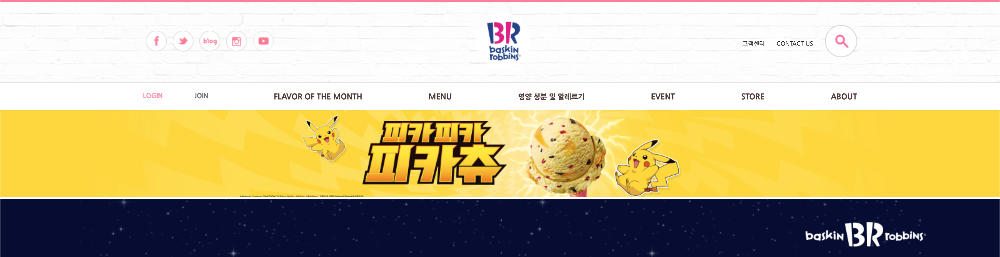</img>
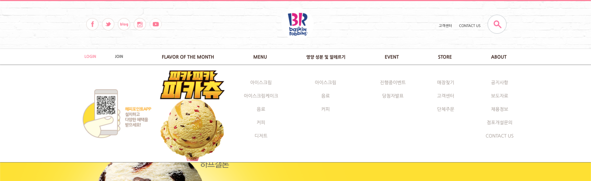</img>
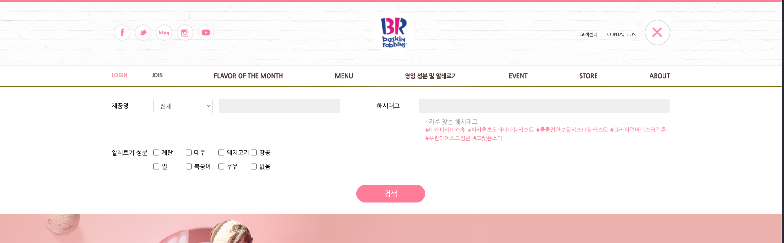</img>

### `- src/components/Footer.jsx`
```js
/**
 * @filename : Footer.jsx
 * @author : 박찬우
 * @description : footer 영역 정의
 */

import React, { memo, useState, useEffect, useCallback } from 'react';
import styled from 'styled-components';
import axios from 'axios';

const FooterContainer = styled.div `
  & {
    position: relative;
    width: 100%;
    padding-bottom: 60px;
    border-top: 2px solid #fed69a;

    .policy {
      width: 1200px;
      margin: auto;
      
      ul {
        position: relative;
        padding: 0 80px;
        display: flex;
        justify-content: space-between;
        
        li {
          display: flex;
          align-items: center;
          height: 77.5px;

          a {
            font-size: 14px;
            color: #726454;
            
            span {
              color: #ff7c98;
              font-weight: 600;
            }
          }
        }
      }
    }

    .brFamily {
      width: 100%;
      height: 75px;
      background-color: #f9f8f7;

      .brFamilyWrap {
        position: relative;
        width: 1200px;
        margin: auto;
        padding: 22px 0 0 222px;
        display: flex;
        align-items: center;


        .brFamilyImg {
          margin-right: 50px;

          &:nth-child(4) {
            margin-right: 10px;
          }

          &:nth-child(5) {
            width: 31px;
            margin-right: 10px;

            img {
              width: 100%;
            }
          }

          &:nth-child(6) {
            margin-right: 110px;
          }
        }

        button {
          display: flex;
          align-items: center;
          justify-content: space-between;
          padding-left: 11px;
          border: 1px solid #afafaf;
          border-radius: 5px;
          background-color: #fff;
          width: 150px;
          height: 32px;
          color: #afafaf;
          font-size: 12px;
          box-shadow: 2px 2px 10px rgba(0,0,0,.1);
          cursor: pointer;
        }

        .faimlySubMenu {
          position: absolute;
          border: 1px solid #afafaf;
          width: 150px;
          background-color: #fff;
          border-radius: 10px 10px 0 0;
          padding: 10px 0 10px;
          z-index: 1;
          right: 175px;
          bottom: 30px;

          li {
            margin-right: 0;
            padding-bottom: 5px;

            &:hover {
              background-color: #eeeeee;
            }

            a {
              font-size: 13px;
              color: #726454;
              padding-left: 15px;
            }
          }
        }
      }
    }

    .brInfo {
      position: relative;
      width: 1200px;
      margin: auto;
      text-align: center;
      padding-top: 48px;

      h1 { padding-bottom: 35px; }

      .info1 {
        display: flex;
        justify-content: center;
        padding-bottom: 10px;
      }

      .info2 {
        display: flex;
        justify-content: center;
      }

      li {
          margin: 0 10px;
          font-size: 11px;
          color: #6d6661;
          letter-spacing: -0.5px;
        }

      p {
        padding-top: 20px;
        color: #bebbb9;
        font-size: 11px;
      }
    }
  }
`;

const Footer = () => {
  // TODO: family 영역의 이미지 상태값 정의
  const [brFamily, setBrFamily] = useState([]);

  useEffect(() => {
    (async () => {
      try {
        const response = await axios.get('http://localhost:3001/brFamilyImg');
        setBrFamily(brFamily => response.data);
      } catch(e) {
        console.error(e)
        alert('데이터 요청 실패')
      }
    })();
  }, []);

  // TODO: FAMILY SITE 버튼의 상태값 정의
  const [familyBtn, setFamilyBtn] = useState(false);

  // 버튼 토글 구현
  const onToggle = useCallback(() => {
    setFamilyBtn(!familyBtn)
  }, [familyBtn]);
  
  return (
    <FooterContainer>
      <div className='footerWrap'>
        <div className='policy'>
          <ul>
            <li><a href="#!">점포개설문의</a></li>
            <li><a href="#!">채용문의</a></li>
            <li><a href="#!">윤리신고센터</a></li>
            <li><a href="#!">이용약관</a></li>
            <li><a href="#!"><span>개인정보처리방침</span></a></li>
            <li><a href="#!">영상정보처리기기운영관리방침</a></li>
            <li><a href="#!">거래희망회사 사전등록</a></li>
          </ul>
        </div>
        <div className='brFamily'>
          <ul className='brFamilyWrap'>
            {brFamily.map((v,i) => {
              return (
                <li key={v.id} className='brFamilyImg'>
                  <a href={v.url} target='_blank' rel='noreferrer'>
                    
                  </a>
                </li>
              );
            })}
            <button type='button' onClick={onToggle}>FAMILY SITE
              {familyBtn === false ? 
                 :
                }
            </button>
            {familyBtn && 
              <ul className='faimlySubMenu'>
                <li><a href="#!">배스킨 스쿨</a></li>
                <li><a href="#!">SPC그룹사이트</a></li>
                <li><a href="#!">SPC MAGAZINE</a></li>
                <li><a href="#!">BR코리아</a></li>
                <li><a href="#!">해피포인트카드</a></li>
                <li><a href="#!">파스쿠찌</a></li>
                <li><a href="#!">삼립</a></li>
                <li><a href="#!">파리바게트</a></li>
                <li><a href="#!">던킨도너츠</a></li>
              </ul>}
          </ul>
        </div>
        <div className='brInfo'>
          <h1>
            
          </h1>
          <ul className='info1'>
            <li>사업자 등록번호 : 303-81-09535</li>
            <li>비알코리아(주) 대표이사 도세호</li>
            <li>서울특별시 서초구 남부순환로 2620(양재동 11-149번지)</li>
          </ul>
          <ul className='info2'>
            <li>TEL : 080-555-3131</li>
            <li>개인정보관리책임자 : 김경우</li>
          </ul>
          <p>Copyright ⓒ 2016 BRKOREA Company. All Rights Reserved.</p>
        </div>
      </div>
    </FooterContainer>
  );
};

export default memo(Footer);
```

### `+ data.json`
```json
"brFamilyImg" : [
    {
      "id": 1,
      "url": "http://www.happypointcard.com",
      "img": "http://www.baskinrobbins.co.kr/assets/images/common/btn_happypoint.png",
      "alt": "HAPPY POINT"
    },
    {
      "id": 2,
      "url": "http://m.celectory.com",
      "img": "http://www.baskinrobbins.co.kr/assets/images/common/btn_happymarket.png",
      "alt": "HAPPY MARKET"
    },
    {
      "id": 3,
      "url": "http://www.spc.co.kr/contributionAll",
      "img": "http://www.baskinrobbins.co.kr/assets/images/common/btn_spc_story.png",
      "alt": "SPC그룹 사회공헌활동 SPC 행복한 이야기"
    },
    {
      "id": 4,
      "url": "https://sealinfo.verisign.com/splash?form_file=fdf/splash.fdf&dn=WWW.BASKINROBBINS.CO.KR&lang=ko",
      "img": "http://www.baskinrobbins.co.kr/assets/images/common/btn_norton.gif",
      "alt": "Norton SECURED"
    },
    {
      "id": 5,
      "url": "http://www.kca.go.kr/ccm/",
      "img": "http://www.baskinrobbins.co.kr/assets/images/common/btn_ccm_2.png",
      "alt": "소비자중심경영 인증제도"
    },
    {
      "id": 6,
      "url": "http://knqa.ksa.or.kr/knqa/2276/subview.do",
      "img": "http://www.baskinrobbins.co.kr/assets/images/common/btn_ksa.png",
      "alt": "국가품질상 - KSA 한국표준협회"
    }
  ],
```

>> Footer 구현결과

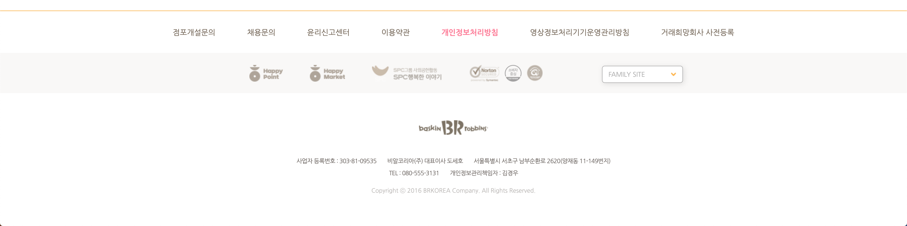</img>
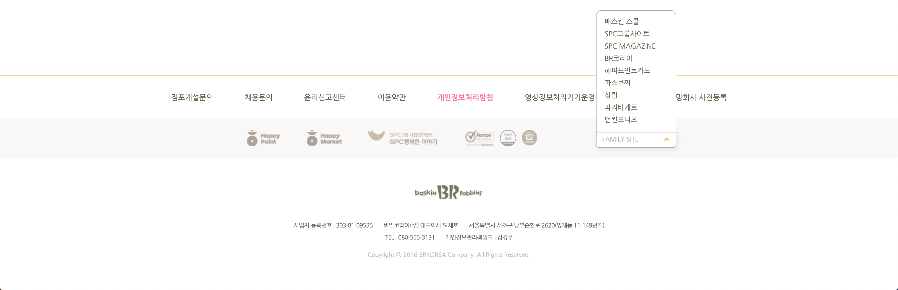</img>

<br />

### 3) pages 디렉터리

### `- src/pages/Main.jsx`
```js
/**
 * @filename : Main.jsx
 * @author : 박찬우
 * @description : 메인 페이지에 쓰이는 모든 컴포넌트 참조
 */

import React, { memo } from 'react';

import BrMainSlide from '../mainComponents/BrMainSlide';
import BrEvent from '../mainComponents/BrEvent';
import BrMenu from '../mainComponents/BrMenu';
import BrStore from '../mainComponents/BrStore';
import BrSns from '../mainComponents/BrSns';

const Main = () => {
  return (
    <>
      <BrMainSlide />
      <BrEvent />
      <BrMenu />
      <BrStore />
      <BrSns />
    </>
  );
};

export default memo(Main);
```

### `- src/pages/Login.jsx`
```js
/**
 * @filename : Login.jsx
 * @author : 박찬우
 * @description : 로그인 페이지 화면 구성
 */

import React, { useEffect, useState } from 'react';
import styled from 'styled-components';
import axios from 'axios';

import Meta from '../Meta';

const LoginContainer = styled.div`
  & {
    position: relative;
    width: 1200px;
    margin: auto;
    padding-bottom: 160px;

    .loginPageTitle {
      padding: 133px 0 35px;
      text-align: center;

      p {
        font-size: 20px;
        font-weight: 500;
        padding-top: 10px;
        color: #483834;
      }
    }

    .loginBox {
      padding: 46px 0 47px;
      width: 916px;
      margin: auto;
      border-top: 2px solid #ff99bf;
      border-bottom: 1px solid #ccc;
      display: flex;

      .subTitle {
        font-size: 17px;
        font-weight: 500;
        color: #2f231c;
        padding-bottom: 10px;
      }

      .loginBoxLeft {
        position: relative;
        width: 50%;

        .loginTitle {
          padding-bottom: 20px;

          p {
            font-size: 18px;
            font-weight: 400;
            color: #ff7c98;
          }
        }

        .inputArea {
          position: relative;

          .input {
            border: none;
            background-color: #efefef;
            padding: 17px 15px;
            width: 284px;
            color: #6e6b68;
            margin-bottom: 9px;
            
            &.inputId::-webkit-input-placeholder { background: url(./img/key.png) left center no-repeat; }
            &.inputPassword::-webkit-input-placeholder { background: url(./img/unlock.png) left center no-repeat; }

            &.inputId::-webkit-input-placeholder,
            &.inputPassword::-webkit-input-placeholder {
              background-size: contain;
              margin-bottom: 9px;
              text-indent: 30px;
              color: #000;
              opacity: .4;
            } 
          }
          
          button {
            position: absolute;
            right: 5%;
            top: -5%;
            width: 118px;
            height: 118px;
            border-radius: 50%;
            border: none;
            background-color: #f56f98;
            color: #fff;
            font-size: 17px;
            font-weight: 600;
            cursor: pointer;
          }
        }

        ul {
          padding-top: 17px;
          display: flex;
          width: 284px;
          justify-content: space-between;

          li {
            a {
              font-size: 13px;
              color: #999;
              border-right: 1px solid #ccc;
              padding-right: 10px;
            }

            .last { 
              border: none; 
              padding-right: 0;
            }
          }
        }
      }

      .loginBoxRight {
        position: relative;
        width: 50%;
        border-left: 1px solid #ccc;
        padding-left: 35px;

        .service {
          padding-bottom: 50px;

          p {
            font-size: 13px;
            color: #999;
            letter-spacing: -1px;
            line-height: 1.5;
          }
        }

        .customer {
          .content {
            display: flex;
            font-size: 13px;

            p {
              color: #999;
              width: 75px;
              padding: 0 0 10px 2px;
            }
          }
        }
      }
    }

    .benefit {
      padding-top: 30px;
      width: 916px;
      margin: auto;
      
      h3 {
        text-align: center;
        padding-bottom: 32px;
        font-size: 16px;
        font-weight: 500;
        color: #483834;
        line-height: 1.5;
      }

      ul {
        display: flex;
        justify-content: space-between;

        li {
          display: flex;
          align-items: center;
          width: 265px;

          &:nth-child(1) { margin-right: 40px; }

          img { margin-right: 20px; }

          h4 {
            color: #2f231c;
            font-size: 17px;
            font-weight: 500;
            padding-bottom: 7px;
          }

          p {
            color: #948780;
            font-size: 13px;
            line-height: 1.5;
          }
        }
      }
    }
  }
`;

const Login = () => {

  // TODO: 로그인페이지 데이터 정보 상태 정의
  const [benefit, setLoginPage] = useState([]);

  // 데이터 가져오기
  useEffect(() => {
    (async () => {
      try {
        const response = await axios.get('http://localhost:3001/benefit');
        setLoginPage(benefit => response.data);
      } catch(e) {
        console.error(e);
      }
    })();
  }, []);

  return (
    <LoginContainer>

      <Meta title='배스킨라빈스 :: 로그인' description='로그인 페이지 클론코딩' />

      <div className='loginPageTitle'>
        
        <p>배스킨 라빈스 홈페이지에 오신 것을 환영합니다.</p>
      </div>
      <div className='loginBox'>
        <div className='loginBoxLeft'>
          <div className='loginTitle'>
            <h4 className='subTitle'>배스킨라빈스 로그인</h4>
            <p>해피포인트 아이디로 간편하게 로그인하세요.</p>
          </div>
          <form className='inputArea'>
            <input className='inputId input' type="text" placeholder='아이디를 입력하세요' required />
            <button type='submit'>로그인</button>
            <input className='inputPassword input' type="password" placeholder='비밀번호를 입력하세요' required />
          </form>
          <ul>
            <li><a href="#!">아이디 찾기</a></li>
            <li><a href="#!">비밀번호 재발급</a></li>
            <li><a href="#!" className='last'>해피포인트 가입</a></li>
          </ul>
        </div>
        <div className='loginBoxRight'>
          <div className='service'>
            <h4 className='subTitle'>SPC 통합회원 서비스</h4>
            <p>
              하나의 ID/Password로 SPC가 운영하는 사이트(배스킨라빈스, 던킨도너츠,<br/> 해피포인트카드, 파리바게뜨, 파리크라상, 파스쿠찌, SPC그룹,우리밀愛)를 한번에!!<br/> 간단한 동의절차만 거치면 하나의 ID/Password로 제휴사이트를<br/> 로그인 하실 수 있습니다.
            </p>
          </div>
          <div className='customer'>
            <h4 className='subTitle'>고객센터</h4>
            <div className='content'>
              <p>운영시간</p>
              <span>월~금 09:00~17:30 토/일요일 휴무</span>
            </div>
            <div className='content'>
              <p>Tel.</p>
              <span>080-555-3131(수신자부담)</span>
            </div>
          </div>
        </div>
      </div>
      <div className='benefit'>
        <h3>해피포인트 회원이 아니시라면 지금 해피포인트에 가입하시고<br /> 다양한 혜택을 경험하세요.</h3>
        <ul>
          {benefit.map((v,i) => {
            return (
              <li key={v.id}>
                
                <div>
                  <h4>{v.title}</h4>
                  <p>{v.desc}</p>
                </div>
              </li>
            );
          })}
        </ul>
      </div>
    </LoginContainer>
  );
};

export default Login;
```

### `+ data.json`
```json
"benefit": [
    {
      "id": 1,
      "img": "./img/ico_benefit_1.png",
      "alt": "benefit image1",
      "title": "혜택 하나",
      "desc": "베스킨라빈스 온라인이벤트 행사에 참여할 수 있습니다."
    },
    {
      "id": 2,
      "img": "./img/ico_benefit_2.png",
      "alt": "benefit image2",
      "title": "혜택 둘",
      "desc": "월별 신제품을 보다 먼저 만날 수 있습니다."
    },
    {
      "id": 3,
      "img": "./img/ico_benefit_3.png",
      "alt": "benefit image3",
      "title": "혜택 셋",
      "desc": "배스킨라빈스 이벤트 정보 메일링을 받아 볼 수 있습니다."
    }
  ]
```

>> 로그인 페이지 구현결과

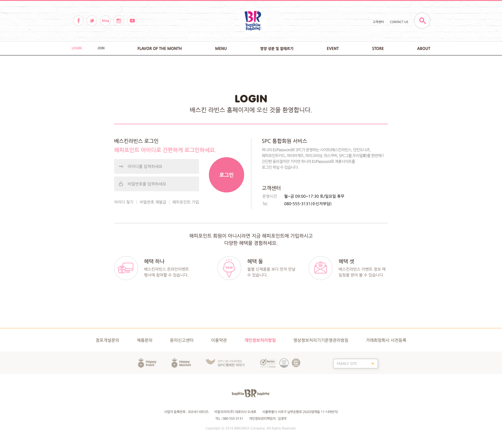</img>

<br />

### 4) mainComponents 디렉터리

### `- src / mainComponents / BrMainSlide.jsx`
```js
/**
 * @filename : BrMainSlide.jsx
 * @author : 박찬우
 * @description : 메인 페이지의 이미지 슬라이드 구현
 */

import React, { useState, useEffect, memo } from 'react';
import { Swiper, SwiperSlide } from 'swiper/react';
import SwiperCore, { Navigation, Pagination, Autoplay } from 'swiper';
import styled from 'styled-components';
import axios from "axios";

import 'swiper/css';
import 'swiper/css/navigation';
import 'swiper/css/pagination';

SwiperCore.use([Navigation, Pagination, Autoplay]);

const PikachuBanner = styled.div`
  width: 100%;
  height: 150px;
  background: url(./img/1714824579.jpg) center center;
  background-size: cover;
  border-bottom: 3px solid #fff;
`;

const SwiperContainer = styled.div`
  position: relative;
  width: 100%;

  .swiperImg {
    position: relative;
    width: 100%;
    height: 697px;
  }

  .swiper-button-prev,
  .swiper-button-next {
    width: 110px;
    height: 110px;
    border-radius: 50%;

    &::after {content: "";}
    &:hover { background-color: #bdb0b079; }
  }

  .swiper-button-prev {background: url(./img/btn_banner_prev.png) center center;}
  .swiper-button-next {background: url(./img/btn_banner_next.png) center center;}


  .swiper-pagination {
    display: flex;
    justify-content: center;
    align-items: center;

    .swiper-pagination-bullet {
      margin: 15px;
      width: 10px;
      height: 10px;
      background-color: #fff;
      opacity: 1;

      &:hover { background-color: #222; }
    }
  
    .swiper-pagination-bullet-active {
      width: 12px;
      height: 12px;
      background-color: #222;
    }
  }
`;

const BrMainSlide = () => {

  // TODO: 이미지 슬라이드 상태값
  const [imgSlide, setImgSlide] = useState([]);

  // TODO: 이미지 슬라이드 값을 가져온다.
  useEffect(() => {
    (async () => {
      try {
        const response = await axios.get('http://localhost:3001/mainImgSlide');
        setImgSlide(imgSlide => response.data);
      } catch(e) {
        console.error(e);
        alert('ajax 연동 실패');
      }
    })();
  }, []);

  return (
    <>
      <PikachuBanner />

      <SwiperContainer>
        <Swiper className='swiper'
        slidesPerView={1}
        navigation={true}
        pagination={{ clickable: true }}
        autoplay={{ delay: 3000, disableOnInteraction: false }}
        loop={true}
        >
          {imgSlide.map((v,i) => {
            return (
            <SwiperSlide key={v.id}>
              <a href={v.url} target='_blank' rel='noreferrer'>
                
              </a>
            </SwiperSlide>
            );
          })}
          
        </Swiper>
      </SwiperContainer>
    </>
  );
};

export default memo(BrMainSlide);
```

### `+ data.json`
```json
"mainImgSlide": [
    {
      "id": 1,
      "url": "http://www.baskinrobbins.co.kr/menu/fom.php#area4",
      "img": "http://www.baskinrobbins.co.kr/upload/main/1714824551.jpg",
      "alt": "이미지 슬라이드1"
    },
    {
      "id": 2,
      "url": "http://www.baskinrobbins.co.kr/event/view.php?flag=&seq=10704",
      "img": "http://www.baskinrobbins.co.kr/upload/main/1649133684.png",
      "alt": "이미지 슬라이드2"
    },
    {
      "id": 3,
      "url": "http://www.baskinrobbins.co.kr/event/view.php?flag=&seq=10684",
      "img": "http://www.baskinrobbins.co.kr/upload/main/1714816944.png",
      "alt": "이미지 슬라이드3"
    },
    {
      "id": 4,
      "url": "http://www.baskinrobbins.co.kr/event/view.php?flag=&seq=10664",
      "img": "http://www.baskinrobbins.co.kr/upload/main/1714808856.png",
      "alt": "이미지 슬라이드4"
    },
    {
      "id": 5,
      "url": "http://www.baskinrobbins.co.kr/event/view.php?flag=&seq=10344",
      "img": "http://www.baskinrobbins.co.kr/upload/main/1667440402.png",
      "alt": "이미지 슬라이드5"
    },
    {
      "id": 6,
      "url": "http://www.baskinrobbins.co.kr/event/view.php?flag=&seq=10104",
      "img": "http://www.baskinrobbins.co.kr/upload/main/1667383155.png",
      "alt": "이미지 슬라이드6"
    },
    {
      "id": 7,
      "url": "http://www.baskinrobbins.co.kr/event/view.php?flag=&seq=8624",
      "img": "http://www.baskinrobbins.co.kr/upload/main/1643869369.png",
      "alt": "이미지 슬라이드7"
    },
    {
      "id": 8,
      "url": "http://www.baskinrobbins.co.kr/event/view.php?flag=&seq=10744",
      "img": "http://www.baskinrobbins.co.kr/upload/main/1664934495.png",
      "alt": "이미지 슬라이드8"
    },
    {
      "id": 9,
      "url": "http://www.baskinrobbins.co.kr/event/view.php?flag=&seq=10724",
      "img": "http://www.baskinrobbins.co.kr/upload/main/1649140992.png",
      "alt": "이미지 슬라이드9"
    },
    {
      "id": 10,
      "url": "http://www.baskinrobbins.co.kr/event/view.php?flag=&seq=10564",
      "img": "http://www.baskinrobbins.co.kr/upload/main/1670146295.png",
      "alt": "이미지 슬라이드10"
    },
    {
      "id": 11,
      "url": "http://www.baskinrobbins.co.kr/event/view.php?flag=&seq=10544",
      "img": "http://www.baskinrobbins.co.kr/upload/main/1667539209.png",
      "alt": "이미지 슬라이드11"
    }
  ],
```

>> BrMainSlide 구현 결과

</img>
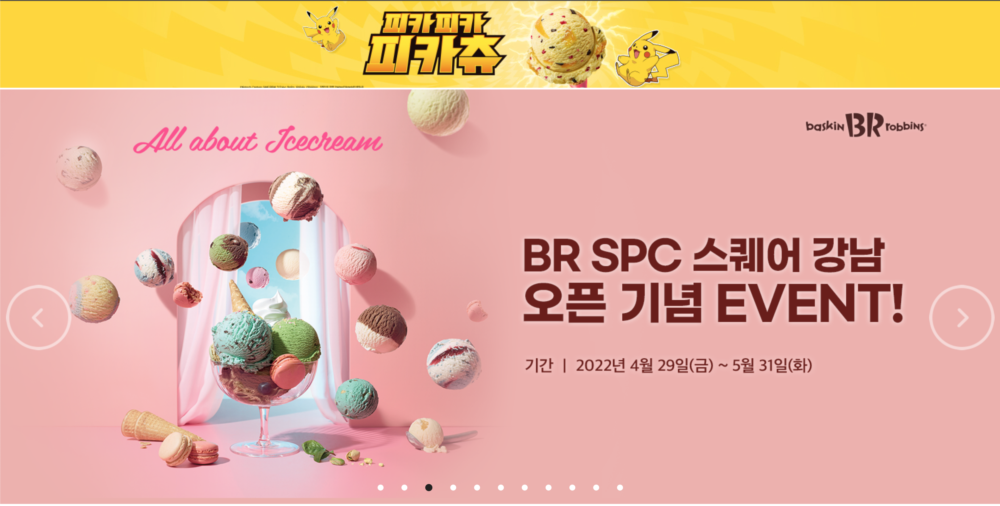</img>

### `- src / mainComponents / BrEvent.jsx`
```js
/**
 * @filename : BrEvent.jsx
 * @author : 박찬우
 * @description : BrEvent 영역의 슬라이드 구현
 */

import React, { memo, useEffect, useState } from 'react';
import styled from 'styled-components';
import axios from "axios";
import { Swiper, SwiperSlide } from 'swiper/react';
import SwiperCore, { Pagination } from 'swiper';

import 'swiper/css';
import 'swiper/css/pagination';

SwiperCore.use(Pagination);

const BrEventContainer = styled.div`
  & {
    position: relative;
    width: 1200px;
    margin: auto;
    margin-bottom: 50px;

    .eventTitle {
      padding: 80px 0 50px;
      text-align: center;
    }

    .swiper-slide {
      height: 520px;

      .eventLink {
        color: #222;
        font-size: 15.5px;

        .typeImg { margin: 22px 0 8px; }
        .eventSubTitle { margin-bottom: 11px; }

        .period {
          color: #afa6a0;
          font-size: 13px;
        }
      }
    }

    .swiper-pagination {
      display: flex;
      justify-content: center;
      align-items: center;

      .swiper-pagination-bullet {
        margin: 15px;
        width: 7px;
        height: 7px;

        &:hover { 
          background-color: #222;
          opacity: 1;
        }
      }
  
      .swiper-pagination-bullet-active {
        width: 10px;
        height: 10px;
        background-color: #222;
      }
    }
  }
`;

const BrEvent = () => {

  // TODO: event 상태값 정의
  const [event, setEvent] = useState([]);

  useEffect(() => {
    (async () => {
      try {
        const response = await axios.get("http://localhost:3001/brEvent");
        setEvent(event => response.data);
      } catch(e) {
        console.error(e);
        alert("데이터 연동 실패");
      }
    })();
  }, []);

  return (
    <BrEventContainer>
      <div className='eventTitle'>
        
      </div>

      <Swiper
        slidesPerView={4}
        spaceBetween={15}
        pagination={{ clickable: true }}
        slidesPerGroup={4}
      >
        {event.map((v,i) => {
          return (
            <SwiperSlide key={v.id}>
              <a href={v.url} target='_blank' rel='noreferrer' className='eventLink'>
                
                
                <p className='eventSubTitle'>{v.title}</p>
                <span className='period'>{v.period}</span>
              </a>
            </SwiperSlide>
          );
        })}
      </Swiper>
    </BrEventContainer>
  );
};

export default memo(BrEvent);
```

### `+ data.json`
```json
"brEvent": [
    {
      "id": 1,
      "img": "http://www.baskinrobbins.co.kr/upload/event/image/banner_delivery.png",
      "url": "http://www.baskinrobbins.co.kr/store/catering.php",
      "eventType": "./img/stit_store.gif",
      "title": "해피오더 딜리버리로 간편하게 주문하세요!",
      "period": "상시진행",
      "alt": "이벤트 이미지1"
    },
    {
      "id": 2,
      "img": "http://www.baskinrobbins.co.kr/upload/event/image/banner_delivery_bm.png",
      "url": "http://www.baskinrobbins.co.kr/store/catering.php",
      "eventType": "./img/stit_store.gif",
      "title": "배달의 민족에서 빠르게 주문하세요!",
      "period": "상시진행",
      "alt": "이벤트 이미지2"
    },
    {
      "id": 3,
      "img": "http://www.baskinrobbins.co.kr/upload/event/image/banner_delivery_ygy.png",
      "url": "http://www.baskinrobbins.co.kr/store/catering.php",
      "eventType": "./img/stit_store.gif",
      "title": "배달의 민족에서 빠르게 주문하세요!",
      "period": "상시진행",
      "alt": "이벤트 이미지3"
    },
    {
      "id": 4,
      "img": "http://www.baskinrobbins.co.kr/upload/event/image/banner_delivery_kakao.png",
      "url": "http://www.baskinrobbins.co.kr/store/catering.php",
      "eventType": "./img/stit_store.gif",
      "title": "배달의 민족에서 빠르게 주문하세요!",
      "period": "상시진행",
      "alt": "이벤트 이미지4"
    },
    {
      "id": 5,
      "img": "http://www.baskinrobbins.co.kr/upload/event/image/1670146074.png",
      "url": "http://www.baskinrobbins.co.kr/event/view.php?flag=B&seq=10564",
      "eventType": "./img/stit_online.gif",
      "title": "기아 멤버스 최대 50% 제휴 혜택",
      "period": "상시진행",
      "alt": "이벤트 이미지5"
    },
    {
      "id": 6,
      "img": "http://www.baskinrobbins.co.kr/upload/event/image/1667538956.png",
      "url": "http://www.baskinrobbins.co.kr/event/view.php?flag=B&seq=10544",
      "eventType": "./img/stit_online.gif",
      "title": "2022 배스킨라빈스 특별한 제휴혜택",
      "period": "상시진행",
      "alt": "이벤트 이미지6"
    },
    {
      "id": 7,
      "img": "http://www.baskinrobbins.co.kr/upload/event/image/1659436130.png",
      "url": "http://www.baskinrobbins.co.kr/event/view.php?flag=A&seq=10285",
      "eventType": "./img/stit_store.gif",
      "title": "고소한 오트밀크와 깔끔한 콜드브루의 만남, 콜드브루 오트라떼 출시!",
      "period": "상시진행",
      "alt": "이벤트 이미지7"
    },
    {
      "id": 8,
      "img": "http://www.baskinrobbins.co.kr/upload/event/image/1643869329.png",
      "url": "http://www.baskinrobbins.co.kr/event/view.php?flag=A&seq=8624",
      "eventType": "./img/stit_store.gif",
      "title": "KT멤버십 고객이라면 누구나 파인트 30% 할인!",
      "period": "상시진행",
      "alt": "이벤트 이미지8"
    },
    {
      "id": 9,
      "img": "http://www.baskinrobbins.co.kr/upload/event/image/1667382917.png",
      "url": "http://www.baskinrobbins.co.kr/event/view.php?flag=A&seq=10104",
      "eventType": "./img/stit_store.gif",
      "title": "현대카드 M포인트 50% 사용",
      "period": "상시진행",
      "alt": "이벤트 이미지9"
    },
    {
      "id": 10,
      "img": "http://www.baskinrobbins.co.kr/upload/event/image/1639297260.png",
      "url": "http://www.baskinrobbins.co.kr/event/view.php?flag=A&seq=4922",
      "eventType": "./img/stit_store.gif",
      "title": "제휴 할인 카드 혜택 안내",
      "period": "상시진행",
      "alt": "이벤트 이미지10"
    },
    {
      "id": 11,
      "img": "http://www.baskinrobbins.co.kr/upload/event/image/1570702843.png",
      "url": "http://www.baskinrobbins.co.kr/event/view.php?flag=B&seq=3722",
      "eventType": "./img/stit_online.gif",
      "title": "2018 한글날 기념 무료 글꼴 공개! 배스킨라빈스체",
      "period": "상시진행",
      "alt": "이벤트 이미지11"
    },
    {
      "id": 12,
      "img": "http://www.baskinrobbins.co.kr/upload/event/image/1578277305.png",
      "url": "http://www.baskinrobbins.co.kr/event/view.php?flag=A&seq=3302",
      "eventType": "./img/stit_store.gif",
      "title": "1회용 컵 사용 줄이기 안내",
      "period": "상시진행",
      "alt": "이벤트 이미지12"
    },
    {
      "id": 13,
      "img": "http://www.baskinrobbins.co.kr/upload/event/images/banner_praise_2022-1.png",
      "url": "http://www.baskinrobbins.co.kr/customer/praise.php",
      "eventType": "./img/stit_store.gif",
      "title": "2022년 1분기 고객 BEST 칭찬점포 안내",
      "alt": "이벤트 이미지13"
    }
  ],
```

>> BrEvent 구현 결과

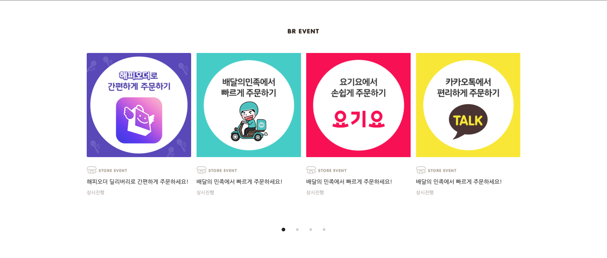</img>
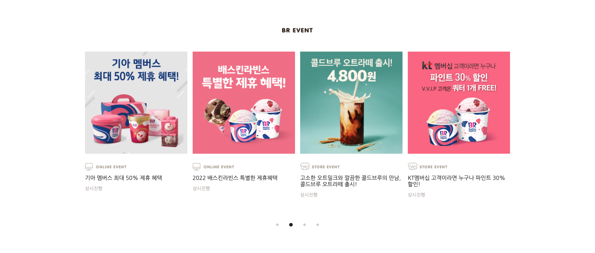</img>

### `- src / mainComponents / BrMenu.jsx`
```js
/**
 * @filename : BrMenu.jsx
 * @author : 박찬우
 * @description : BrMenu 영역 정의
 */

import React, { memo } from 'react';
import styled from 'styled-components';
import { Link } from 'react-router-dom';

const BrMenuContainer = styled.div`
  & {
    position: relative;
    width: 100%;
    height: 1157px;
    background: url(./img/bg_menu.jpg) no-repeat center center;
    overflow: hidden;

    .menuTitle {
      padding: 78px 0 0;
      text-align: center;
    }

    .menuList {
      position: relative;
      width: 981px;
      margin: 50px auto 0;
      text-align: center;

      .icecream {
        position: absolute;
        top: 3%;
        left: 22%;
        width: 400px;
        height: 300px;
        opacity: 0;
      } 

      .icecreamCake {
        position: absolute;
        top: 3%;
        right: 6%;
        width: 276px;
        height: 472px;
        opacity: 0;
      } 

      .beverage {
        position: absolute;
        top: 40%;
        left: 1%;
        width: 230px;
        height: 366px;
        opacity: 0;
      } 

      .coffee {
        position: absolute;
        top: 40%;
        left: 29%;
        width: 329px;
        height: 292px;
        opacity: 0;
      } 

      .gift {
        position: absolute;
        bottom: 21%;
        right: 6%;
        width: 275px;
        height: 183px;
        opacity: 0;
      } 

      .dessert {
        position: absolute;
        bottom: 4%;
        left: 29%;
        width: 329px;
        height: 177px;
        opacity: 0;
      } 
    }
  }
`;

const BrMenu = () => {
  return (
    <BrMenuContainer>
      <div className='menuTitle'>
        
      </div>
      <div className='menuList'>
        
        <Link to="/" className='icecream'><h4>ICECREAM</h4></Link>
        <Link to="/" className='icecreamCake'><h4>ICECREAMCAKE</h4></Link>
        <Link to="/" className='beverage'><h4>BEVERAGE</h4></Link>
        <Link to="/" className='coffee'><h4>COFFEE</h4></Link>
        <Link to="/" className='gift'><h4>GIFT</h4></Link>
        <Link to="/" className='dessert'><h4>DESSERT</h4></Link>
      </div>
    </BrMenuContainer>
  );
};

export default memo(BrMenu);
```

>> BrMenu 구현결과

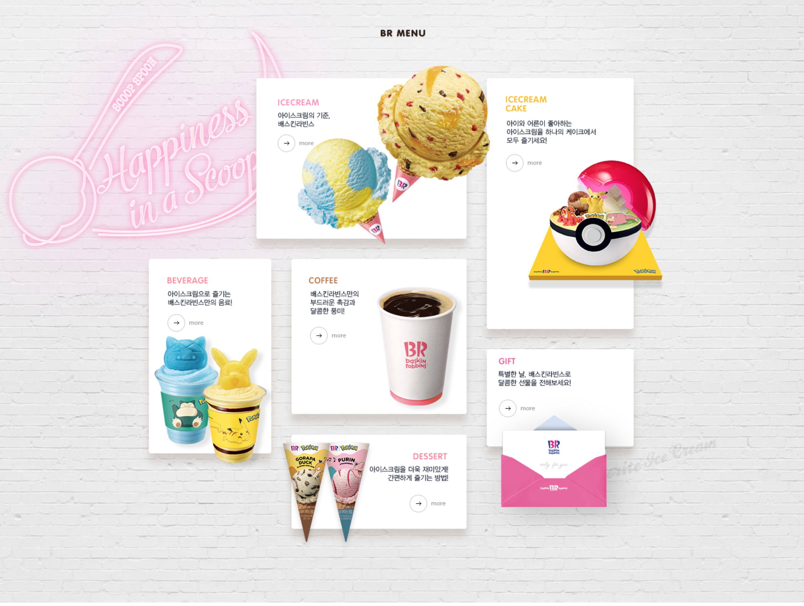</img>

### `- src / mainComponents / BrStore.jsx`
```js
/**
 * @filename : BrStore.jsx
 * @author : chanCo
 * @description : BrStore 영역 정의
 */

import React from 'react';
import styled from 'styled-components';

const BrStoreContainer = styled.div`
  & {
    position: relative;
    width: 1200px;
    margin: auto;
    display: flex;
    padding-bottom: 120px;

    h3 {
      padding: 95px 0 50px;
      text-align: center;
    }

    .storeImg {
      width: 100%;
    }
  }
`;

const BrStore = () => {
  return (
    <BrStoreContainer>
      <div className='brStoreTitle'>
        <h3>
          
        </h3>
        <a href="#!">
          
        </a>
      </div>
      <div className='happyOrderTilte'>
        <h3>
          
        </h3>
        <a href="#!">
          
        </a>
      </div>
    </BrStoreContainer>
  );
};

export default BrStore;
```

>> BrStore 구현 결과

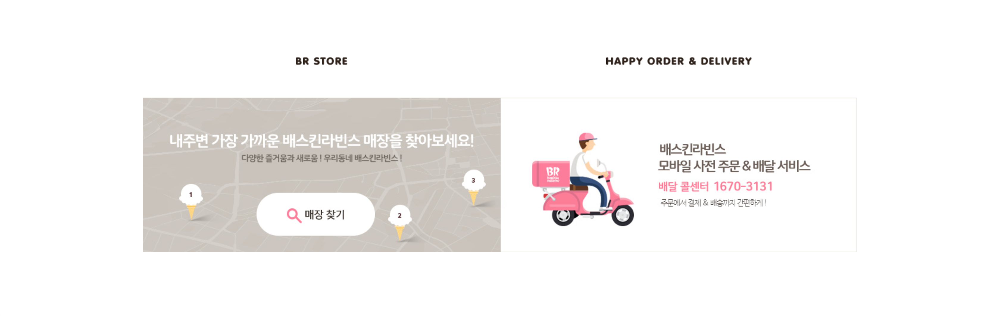</img>

### `- src / mainComponents / BrSns.jsx`
```js
/**
 * @filename : BrSns.jsx
 * @author : 박찬우
 * @description : BrSns 영역 정의
 */

import React, { memo, useEffect, useState } from 'react';
import axios from 'axios';
import styled from 'styled-components';

const BrSnsContainer = styled.div`
  & {
    position: relative;
    width: 100%;

    .brSns {
      position: relative;
      width: 1200px;
      margin: auto;
      overflow: hidden;

      .brSnsTitle {
        position: relative;
        padding-bottom: 26px;
        text-align: center;
      }

      .brSnsLink {
        position: relative;
        display: flex;
        justify-content: center;
        align-items: center;
        padding-bottom: 35px;

        li { 
          padding: 0 10px;
          
          a {
            &:hover { opacity: .7; }
          }
        }
      }

      .instagramTitleWrap {
        margin-bottom: 30px;

        .instagramTitle {
          padding: 26px 0;
          
          img {
            position: absolute;
            left: 50%;
            transform: translate(-50%, -50%);
            z-index: 1;
          }
  
          hr { opacity: .5; }
        }
      }

      .instagramImg {
        position: relative;
        margin-bottom: 190px;
        width: 100%;
        display: flex;
        justify-content: space-between;
        flex-wrap: wrap;

        .imgWrap {
          display: inline-block;
          cursor: pointer;
          
          img {
            width: 237px;
            height: 238.5px;
          }
        }
      }
    }
  }
`;

const BrSns = () => {

  // TODO: sns 로고 이미지 상태값 정의
  const [snsImg, setSnsImg] = useState([]);

  // sns 로고 이미지 데이터 가져오기
  useEffect(() => {
    (async () => {
      try {
        const response = await axios.get('http://localhost:3001/brSns');
        setSnsImg(snsImg => response.data);
      } catch(e) {
        console.error(e);
        alert('데이터 연동 실패');
      }
    })();
  }, []);

  // TODO: 인스타그램 이미지 상태값 정의
  const [instaImg, setInstaImg] = useState([]);

  // 인스타그램 이미지 데이터 가져오기
  useEffect(() => {
    (async () => {
      try {
        const response = await axios.get('http://localhost:3001/instagramImg');
        setInstaImg(instaImg => response.data);
      } catch(e) {
        console.error(e);
        alert('데이터 연동 실패');
      }
    })();
  }, []);
  

  return (
    <BrSnsContainer>
      <div className='brSns'>
        <h3 className='brSnsTitle'>
          
        </h3>
        <ul className='brSnsLink'>
          {snsImg.map((v,i) => {
            return (
              <li key={v.id}>
                <a href={v.url} target='_blank' rel='noreferrer'>
                  
                </a>
              </li>
            );
          })}
        </ul>
        <div className='instagramTitleWrap'>
          <h4 className='instagramTitle'>
            
            <hr />
          </h4>
        </div>
        <div className='instagramImg'>
          {instaImg.map((v,i) => {
            return (
              <div key={v.id} className='imgWrap'>
                
              </div>
            );
          })}
        </div>
      </div>
    </BrSnsContainer>
  );
};

export default memo(BrSns);
```

### `+ data.json`
```json
"brSns": [
    {
      "id": 1,
      "url": "https://www.facebook.com/baskinrobbins.kr",
      "img": "http://www.baskinrobbins.co.kr/assets/images/main/sns_facebook.png",
      "alt": "SNS 이미지 1"
    },
    {
      "id": 2,
      "url": "https://twitter.com/BaskinrobbinsKR",
      "img": "http://www.baskinrobbins.co.kr/assets/images/main/sns_twitter.png",
      "alt": "SNS 이미지 2"
    },
    {
      "id": 3,
      "url": "http://blog.naver.com/brgirl31",
      "img": "http://www.baskinrobbins.co.kr/assets/images/main/sns_blog.png",
      "alt": "SNS 이미지 3"
    },
    {
      "id": 4,
      "url": "https://www.instagram.com/baskinrobbinskorea",
      "img": "http://www.baskinrobbins.co.kr/assets/images/main/sns_instagram.png",
      "alt": "SNS 이미지 4"
    },
    {
      "id": 5,
      "url": "https://www.youtube.com/user/baskinrobbinskorea",
      "img": "http://www.baskinrobbins.co.kr/assets/images/main/sns_youtube.png",
      "alt": "SNS 이미지 5"
    }
  ],

  "instagramImg": [
    {
      "id": 1,
      "img": "https://cdn.attractt.com/contents/2021/04/26/CVmM4uEPLMQ_carousel_01.jpg",
      "alt": "@instaram"
    },
    {
      "id": 2,
      "img": "https://cdn.attractt.com/contents/2021/04/26/CVosOOhBVK0_carousel_01.jpg",
      "alt": "@instaram"
    },
    {
      "id": 3,
      "img": "https://cdn.attractt.com/contents/2021/04/26/CUJgLTmPoXF_image.jpg",
      "alt": "@instaram"
    },
    {
      "id": 4,
      "img": "https://cdn.attractt.com/contents/2021/04/26/CT1by-Ylprm_carousel_01.jpg",
      "alt": "@instaram"
    },
    {
      "id": 5,
      "img": "https://cdn.attractt.com/contents/2021/04/26/Ca8lOpOv731_carousel_01.jpg",
      "alt": "@instaram"
    },
    {
      "id": 6,
      "img": "https://cdn.attractt.com/contents/2021/04/26/Ca1DpO8hr_d_carousel_01.jpg",
      "alt": "@instaram"
    },
    {
      "id": 7,
      "img": "https://cdn.attractt.com/contents/2021/04/26/Ca16fydPnGS_image.jpg",
      "alt": "@instaram"
    },
    {
      "id": 8,
      "img": "https://cdn.attractt.com/contents/2021/04/26/Ca4eFeNvZiu_carousel_01.jpg",
      "alt": "@instaram"
    },
    {
      "id": 9,
      "img": "https://cdn.attractt.com/contents/2021/04/26/Ca4sSPFLZsy_carousel_01.jpg",
      "alt": "@instaram"
    },
    {
      "id": 10,
      "img": "https://cdn.attractt.com/contents/2021/04/26/Ca4w8-EFf2__carousel_01.jpg",
      "alt": "@instaram"
    },
    {
      "id": 11,
      "img": "https://cdn.attractt.com/contents/2021/04/26/CbC7oQnrf7f_image.jpg",
      "alt": "@instaram"
    },
    {
      "id": 12,
      "img": "https://cdn.attractt.com/contents/2021/08/06/232180242_436638067458433_4542285466444366688_n.jpg",
      "alt": "@instaram"
    },
    {
      "id": 13,
      "img": "https://cdn.attractt.com/contents/2021/04/26/CTl319uva3y_carousel_01.jpg",
      "alt": "@instaram"
    },
    {
      "id": 14,
      "img": "https://cdn.attractt.com/contents/2021/04/26/CbWrfCNrzhd_carousel_01.jpg",
      "alt": "@instaram"
    },
    {
      "id": 15,
      "img": "https://cdn.attractt.com/contents/2021/04/26/CaeKcywlF8Z_carousel_01.jpg",
      "alt": "@instaram"
    }
  ],
```

</img>

---

### 5) 소감

#### 1. html 요소가 중복돼서 사용되는 것들은 웬만하면 json에 데이터를 담아 map을 활용해 작성하였습니다.
- html 코드 특성상 길어지는 부분이 많은데 이 부분을 짧게 줄일 수 있어서 매우 좋은 방법인 것 같습니다.

#### 2. 반응형 웹페이지에 대한 준비를 해야할 것 같습니다.
- 지금까지는 반응형 없이 1000px 이상의 크기에서 구현 했지만, 모바일 크기 만큼 작아졌을 때 틀어짐이 없도록 구성하는 방법을 적용해야겠다는 생각이 들었습니다.

#### 3. 추가 페이지를 더 만들어 보도록 하겠습니다.
- route가 적용 된 여러 페이지를 만들고 싶어서 개인적으로 만들어 보던 중 배스킨라빈스 클론코딩을 하게됐고, 메인 페이지 외에 로그인 페이지도 만들어 보았습니다. 한 번 하고 말려고 했는데 다른 페이지들도 만들고 싶어져서 개인적으로 시도해 보겠습니다.
