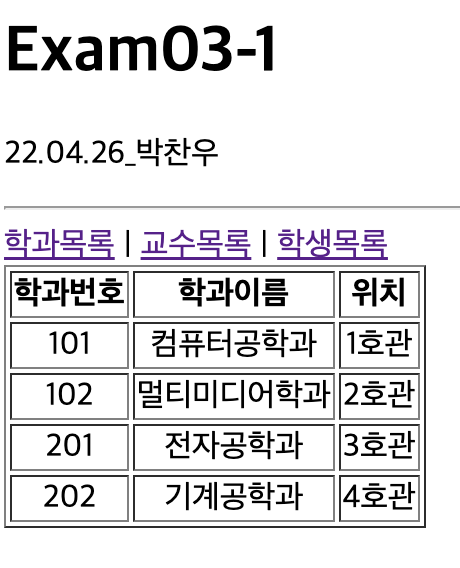
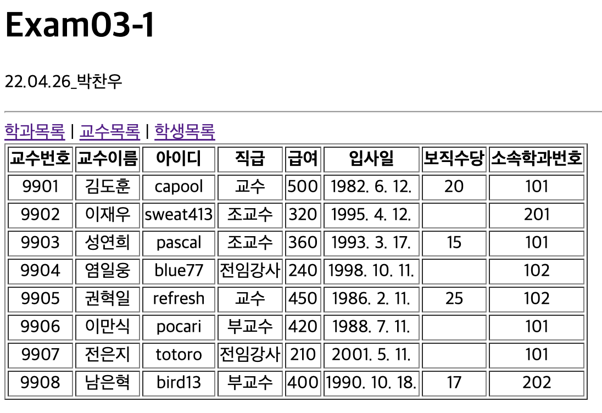
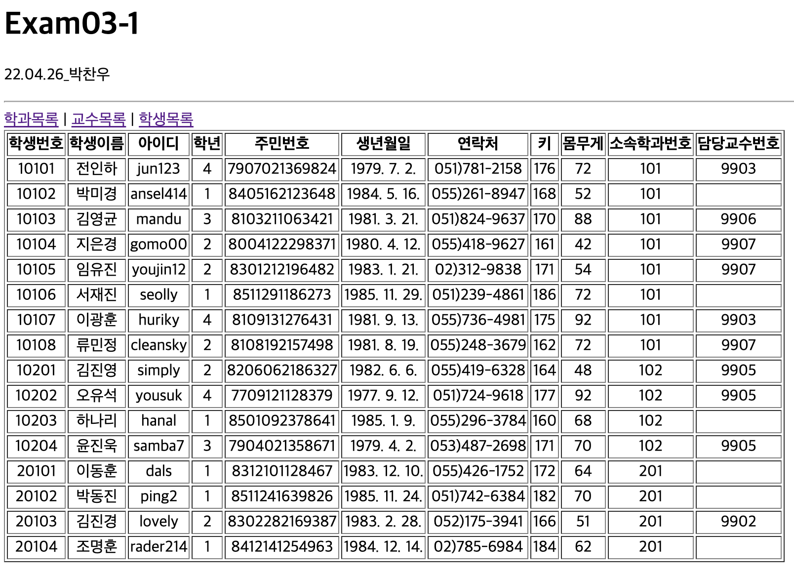

# 박찬우 연습문제

> 2022-04-26

## 문제1

>### App.js

```javascript
import React from "react";
import { Link, Routes, Route } from "react-router-dom";

import Department from "./pages/Department";
import Professor from "./pages/Professor";
import Student from "./pages/Student";

function App() {
  return (
    <div>
      <h1>Exam03-1</h1>
      <hr />

      <nav>
        <Link to="/department">학과목록</Link> |&nbsp;
        <Link to="/professor">교수목록</Link> |&nbsp;
        <Link to="/student">학생목록</Link>
      </nav>

      <Routes>
        <Route path="/department" element={<Department />} />
        <Route path="/professor" element={<Professor />} />
        <Route path="/student" element={<Student />} />
      </Routes>
    </div>
  );
}

export default App;
```

>### Department.js

```javascript
import React from "react";
import MySchool from "../MySchool"
import DepartmentSub from "../components/DepartmentSub";

const Department = () => {
  return (
    <div>
      <table border="1">
        <thead>
          <tr>
            <th>학과번호</th>
            <th>학과이름</th>
            <th>위치</th>
          </tr>
        </thead>
        <tbody align="center">
          {MySchool.department.map((v,i) => {
            return (
              <DepartmentSub key={i}
              id={v.id}
              dname={v.dname}
              loc={v.loc} />
            );
          })}
        </tbody>
      </table>
    </div>
  );
};

export default Department;
```
---

>### DepartmentSub.js

```javascript
import React from "react";

const DepartmentSub = ({id, dname, loc}) => {
  return (
    <tr>
      <td>{id}</td>
      <td>{dname}</td>
      <td>{loc}</td>
    </tr>
  );
};

export default DepartmentSub;
```

>### Professor.js

```javascript
import React from "react";
import MySchool from "../MySchool"
import ProfessorSub from "../components/ProfessorSub";

const Professor = () => {
  return (
    <table border="1">
      <thead>
        <tr>
          <th>교수번호</th>
          <th>교수이름</th>
          <th>아이디</th>
          <th>직급</th>
          <th>급여</th>
          <th>입사일</th>
          <th>보직수당</th>
          <th>소속학과번호</th>
        </tr>
      </thead>
      <tbody align="center">
        {MySchool.professor.map((v,i) => {
          return (
            <ProfessorSub key={i}
            id={v.id}
            name={v.name}
            userid={v.userid}
            position={v.position}
            sal={v.sal}
            hiredate={v.hiredate}
            comm={v.comm}
            deptno={v.deptno} />
          );
        })}
      </tbody>
    </table>
  );
};

export default Professor;
```

>### Student.js

```javascript
import React from "react";
import MySchool from "../MySchool"
import StudentSub from "../components/StudentSub";

const Student = () => {
  return (
    <table border="1">
      <thead>
      <tr>
        <th>학생번호</th>
        <th>학생이름</th>
        <th>아이디</th>
        <th>학년</th>
        <th>주민번호</th>
        <th>생년월일</th>
        <th>연락처</th>
        <th>키</th>
        <th>몸무게</th>
        <th>소속학과번호</th>
        <th>담당교수번호</th>
      </tr>
      </thead>
      <tbody align="center">
        {MySchool.student.map((v,i) => {
          return (
            <StudentSub key={i}
            id={v.id}
            name={v.name}
            userid={v.userid}
            grade={v.grade}
            idnum={v.idnum}
            birthdate={v.birthdate}
            tel={v.tel}
            height={v.height}
            weight={v.weight}
            deptno={v.deptno}
            profno={v.profno} />
          );
        })}
      </tbody>
    </table>
  );
};

export default Student;
```

>### StudentSub.js

```javascript
import React from "react";

const StudentSub = ({id, name, userid, grade, idnum, birthdate, tel, height, weight, deptno, profno}) => {
  return (
    <tr>
      <td>{id}</td>
      <td>{name}</td>
      <td>{userid}</td>
      <td>{grade}</td>
      <td>{idnum}</td>
      <td>{new Date(birthdate).toLocaleDateString()}</td>
      <td>{tel}</td>
      <td>{height}</td>
      <td>{weight}</td>
      <td>{deptno}</td>
      <td>{profno}</td>
    </tr>
  );
};

export default StudentSub;
```

>실행결과


</img>
</img>
</img>


---