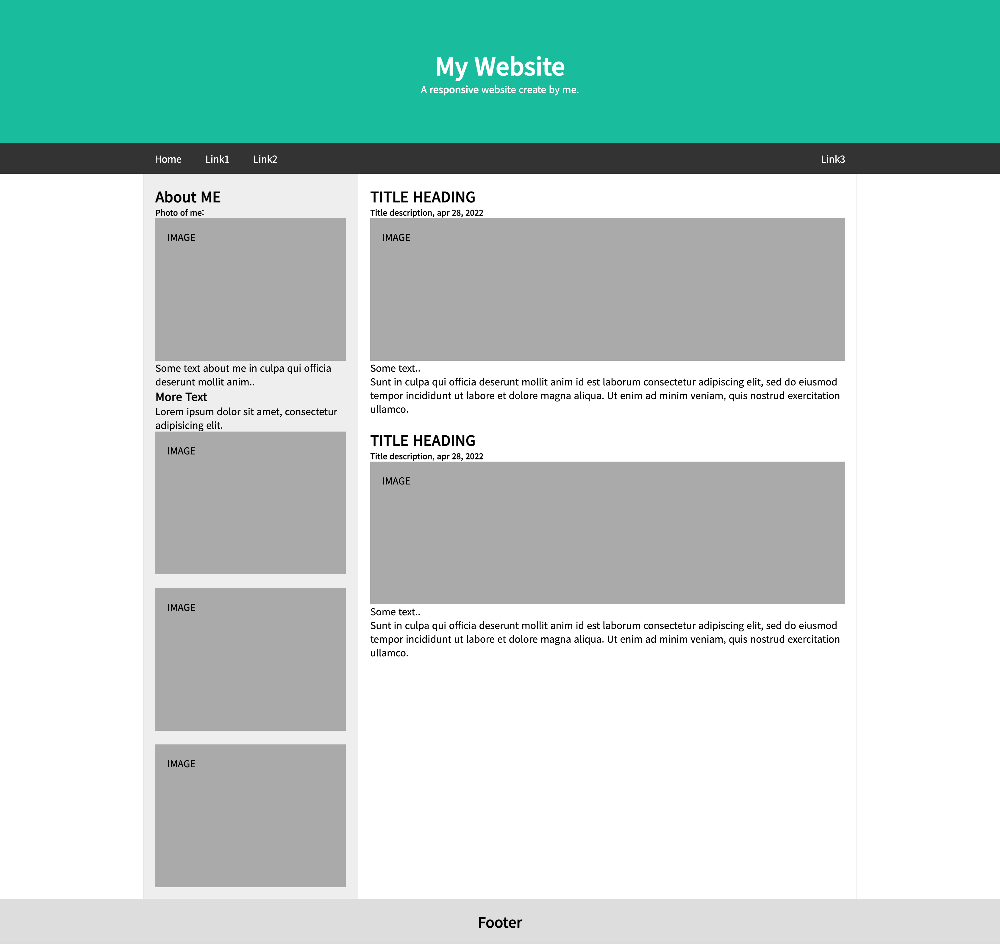

# 박찬우 연습문제

> 2022-04-28

## 문제1

>### src/index.js

```javascript
import React from 'react';
import ReactDOM from 'react-dom/client';
import App from './App';
import { BrowserRouter } from "react-router-dom";

const root = ReactDOM.createRoot(document.getElementById('root'));
root.render(
  <React.StrictMode>
    <BrowserRouter>
      <App />
    </BrowserRouter>
  </React.StrictMode>
);
```

>### src/App.js

```javascript
import React from 'react';
import { Routes, Route } from "react-router-dom";
import { createGlobalStyle } from 'styled-components';
import { Helmet } from 'react-helmet';

import Header from './components/Header';
import Content from './pages/Content';
import Footer from './components/Footer';

// 전역에 적용할 CSS
const GlobalStyle = createGlobalStyle`
  * {
    margin: 0;
    padding: 0;
    font-family: 'Noto Sans KR';
  }

  .container {
    padding: 20px;
  }

  .fakeImg {
    background-color: #aaa;
    width: auto;
    padding: 20px;
    height:200px;
  }
`;

// meta 설정
const Meta = props => {
  return (
    <Helmet>
      <meta charSet='utf-8' />
      <title>{props.title}</title>

      <link rel="preconnect" href="https://fonts.googleapis.com" />
      <link rel="preconnect" href="https://fonts.gstatic.com" crossorigin />
      <link href="https://fonts.googleapis.com/css2?family=Gugi&family=Noto+Sans+KR:wght@100;300;400;500&display=swap" rel="stylesheet"></link>
    </Helmet>
  );
};

function App() {
  return (
    <div>

      <Meta title='연습문제 05'/>
      <GlobalStyle />

      {/* App.js에는 Routes, 각 메뉴는 NavLink로 구현하라는게 맞는지 모르겠습니다. */}
      <Routes>
        <Route path='/*' element={<Header />} exact={true} />
      </Routes>

      <Content />
      <Footer />
    </div>
  );
}

export default App;

```

>### components/Header.js

```javascript
import React from 'react';
import styled from 'styled-components';
import { NavLink } from "react-router-dom";

const HeaderContainer = styled.header`
  & .jumbotron {
    padding: 80px;
    text-align: center;
    background-color: #1abc9c;
    color: #fff;

    h1 {
      font-size: 40px
    }
  }
`;

const NavContainer = styled.nav`

  & {
    overflow: hidden;
    background-color: #333;
    position: sticky;
    top: 0;

    nav {
      display: flex;
      max-width: 1200px;
      margin: auto;
      flex-direction: row;
      flex-wrap: nowrap;
      justify-content: flex-start;

      .link {
        display: block;
        color: #fff;
        text-align: center;
        padding: 14px 20px;
        text-decoration: none;

        &.right {
          margin-left: auto;
        }
  
        &:hover {
          background-color: #ddd;
          color: #222;
        }
      }
    }
  }
`;

const Header = () => {
  return (
    <div>
      <HeaderContainer className='header'>
        <div className='jumbotron'>
          <h1>My Website</h1>
          <p>A <b>responsive</b> website create by me.</p>
        </div>
      </HeaderContainer>

      <NavContainer className='navbar'>
        <nav>
          <NavLink className='link' to='/*'>Home</NavLink>
          <NavLink className='link' to='/*'>Link1</NavLink>
          <NavLink className='link' to='/*'>Link2</NavLink>
          <NavLink className='link right' to='/*'>Link3</NavLink> 
        </nav>
      </NavContainer>
    </div>  
  );
};

export default Header;
```

>### pages/Content.js

```javascript
import React from 'react';
import styled from 'styled-components';

import Side from '../components/Side';
import Main from '../components/Main';

const ContentContainer = styled.section`
  & {
    max-width: 1200px;
    margin: auto;
    background-color: #eee;
    display: flex;
    flex-direction: row;
    flex-wrap: nowrap;
  }
`;

const Content = () => {
  return (
    <ContentContainer className='contents'>
      <Side />
      <Main />
    </ContentContainer>
  );
};

export default Content;
```

>### components/Side.js

```javascript
import React from 'react';
import styled from 'styled-components';

const SideContainer = styled.div`
  & {
    width: 360px;
    flex: none;
    border-left: 1px solid #d5d5d5;
    border-right: 1px solid #d5d5d5;
  }
`;

const Side = () => {
  return (
    <SideContainer className='side'>
      <div className='container'>
        <h2>About ME</h2>
        <h5>Photo of me:</h5>
        <div className="fakeImg">IMAGE</div>
        <p>Some text about me in culpa qui officia deserunt mollit anim..</p>
        <h3>More Text</h3>
        <p>Lorem ipsum dolor sit amet, consectetur adipisicing elit.</p>
        <div className="fakeImg">IMAGE</div>
        <br />
        <div className="fakeImg">IMAGE</div>
        <br />
        <div className="fakeImg">IMAGE</div>
      </div>
    </SideContainer>
  );
};

export default Side;
```

>### components/Main.js

```javascript
import React from 'react';
import styled from 'styled-components';

const MainContainer = styled.div`
  & {
    flex: 0 1 auto;
    background-color: #fff;
    border-right: 1px solid #d5d5d5;
  }
`;

const Main = () => {
  return (
    <MainContainer className='main'>
      <div className="container">
        <h2>TITLE HEADING</h2>
        <h5>Title description, apr 28, 2022</h5>
        <div className="fakeImg">IMAGE</div>
        <p>Some text..</p>
        <p>Sunt in culpa qui officia deserunt mollit anim id est laborum consectetur adipiscing elit, sed do eiusmod tempor incididunt ut labore et dolore magna aliqua. Ut enim ad minim veniam, quis nostrud exercitation ullamco.</p>
        <br />
        <h2>TITLE HEADING</h2>
        <h5>Title description, apr 28, 2022</h5>
        <div className="fakeImg">IMAGE</div>
        <p>Some text..</p>
        <p>Sunt in culpa qui officia deserunt mollit anim id est laborum consectetur adipiscing elit, sed do eiusmod tempor incididunt ut labore et dolore magna aliqua. Ut enim ad minim veniam, quis nostrud exercitation ullamco.</p>
      </div>
    </MainContainer>
  );
};

export default Main;
```

>### components/Footer.js

```javascript
import React from 'react';
import styled from 'styled-components';

const FooterContainer = styled.footer `
  & {
    padding: 20px;
    text-align: center;
    background: #ddd;
  }
`;

const Footer = () => {
  return (
    <FooterContainer className='footer'>
      <h2>Footer</h2>
    </FooterContainer>
  );
};

export default Footer;
```

---

>>실행결과

</img>