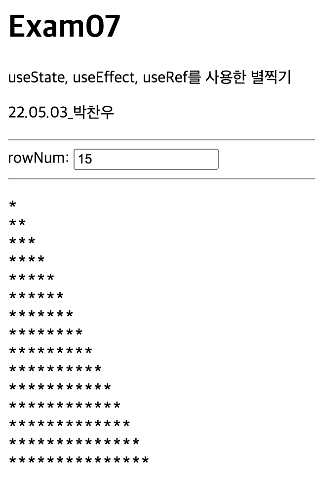

# 박찬우 리액트 연습문제07

> 2022-05-03

```js
// 패키지 참조
import React, { useState, useEffect, useRef } from 'react';

function App() {
  // state값 정의
  const [rowNum, setRowNum] = useState(0);
  // useRef 값 정의
  const console = useRef();

  // 변수에 대한 setter 함수 정의
  const changeNum = (e) => {
    setRowNum(e.currentTarget.value);
  };

  // 별찍기 함수
  const getStar = (number) => {
    let star = '';
    for (let i = 0; i < number; i++) {
      for (let j = 0; j < i + 1; j++) {
        star += '*';
      }
      star += '\n';
    }
    return star;
  };

  // useEffect를 활용해 state값이 변경 될때마다 실행
  useEffect(() => {
    console.current.innerHTML = getStar(rowNum);
  }, [rowNum]);

  return (
    <>
      <h1>Exam07</h1>
      <p>useState, useEffect, useRef를 사용한 별찍기</p>
      <p>22.05.03_박찬우</p>
      <hr />

      <div>
        <label htmlFor="rowNum">rowNum: </label>
        <input id="rowNum" type="text" value={rowNum} onChange={changeNum} />
      </div>

      <hr />

      <pre style={{ fontSize: '16px' }} ref={console} />
    </>
  );
}

export default App;
```

> > 실행결과

</img>

---
