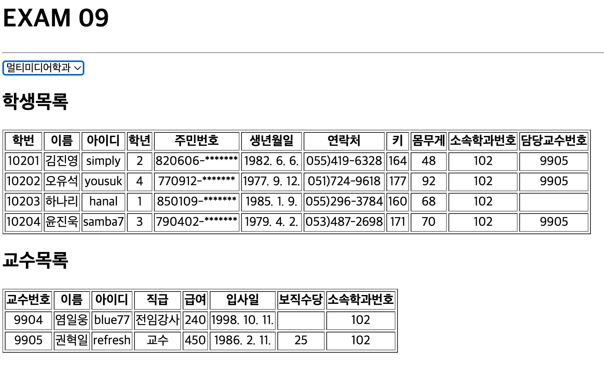

# 박찬우 리액트 연습문제08

> 2022-05-16

`- src/App.jsx`
```js
import React, { memo, useCallback, useReducer, useRef } from 'react';
import Student from './components/Student';
import Professor from './components/Professor';

// TODO: reducer 함수 정의
const reducer = (state, action) => {
  switch (action.select) {
    case '101':
      return 101;
    case '102':
      return 102;
    case '201':
      return 201;
    case '202':
      return 202;
    default:
      return -1;
  };
};

function App() {
  // ------------------------------------------------------hooks 정의 시작
  // TODO: useReducer를 활용해 초기값 지정, 함수를 통해 값을 변경
  const [mySelect, mySetSelect] = useReducer(reducer, '');

  // TODO: 값을 가져올 태그에 useRef 지정
  const select = useRef();
  // ------------------------------------------------------hooks 정의 끝


  // TODO: select 선택값 가져오기
  const resultChange = useCallback(e => {
    mySetSelect({select: select.current.value })
  },[]);

  return (
    <div>
      <h1>EXAM 09</h1>

      <hr />

      <select ref={select} onChange={resultChange}>
        <option value='-1'>학과선택</option>
        <option value='101'>컴퓨터공학과</option>
        <option value='102'>멀티미디어학과</option>
        <option value='201'>전자공학과</option>
        <option value='202'>기계공학과</option>
      </select>

      <Student deptno={mySelect} />
      <Professor deptno={mySelect} />
    </div>
  );
}

export default memo(App);
```

`- src/component/Student.jsx`

```js
import React, { memo, useState, useEffect } from 'react';
import axios from 'axios';
import propType from 'prop-types';
import Spinner from './Spinner';

const Student = ({deptno}) => {
  // ------------------------------------------------------hooks 정의 시작
  // // TODO: 현재 ajax가 데이터를 로딩중인지를 의미하는 상태값
  const [ loading, setLoading ] = useState(false);

  // TODO: 화면에 표시할 student 상태값 정의
  const [ student, setStudent ] = useState([]);
  // ------------------------------------------------------hooks 정의 끝

  useEffect(() => {
    setLoading(true);

    const getStudent = async () => {
      try {
        const response = await axios.get(`http://localhost:3001/student?deptno=${deptno}`);
        setStudent(student => response.data);
      } catch(e) {
        console.error(e);
      } finally {
        setLoading(false);
      }
    };
    getStudent();
  }, [deptno]);

  const head = ['학번', '이름', '아이디', '학년', '주민번호', '생년월일', '연락처', '키', '몸무게', '소속학과번호', '담당교수번호'];

  return (
    <div>
      <Spinner visible={loading} />

      <h2>학생목록</h2>
      
      <table border='1'>
        <thead>
          <tr>
            {head.map((v,i) => <th key={i}>{v}</th>)}
          </tr>
        </thead>
        <tbody align='center'>
          {student.map((v,i) => {
            return (
              <tr key={v.id}>
                <td>{v.id}</td>
                <td>{v.name}</td>
                <td>{v.userid}</td>
                <td>{v.grade}</td>
                <td>{v.idnum.substring(0,6)}-*******</td>
                <td>{new Date(v.birthdate).toLocaleDateString()}</td>
                <td>{v.tel}</td>
                <td>{v.height}</td>
                <td>{v.weight}</td>
                <td>{v.deptno}</td>
                <td>{v.profno}</td>
              </tr>
            );
          })}
        </tbody>
      </table>
    </div>
  );
};

// 속성들에 대한 타입 정의
Student.propType = {
  deptno: propType.number.isRequired,
}

// 속성들에 대한 기본값 정의
Student.defaultProps = {
  deptno: -1,
}

export default memo(Student);
```

`- src/component/Professor.jsx`

```js
import React, { memo, useState, useEffect } from 'react';
import axios from 'axios';
import propType from 'prop-types';
import Spinner from './Spinner';

const Professor = ({deptno}) => {
  // ------------------------------------------------------hooks 정의 시작
  // TODO: 현재 ajax가 데이터를 로딩중인지를 의미하는 상태값
  const [ loading, setLoading ] = useState(false);

  // TODO: 화면에 표시할 student 상태값 정의
  const [ professor, setProfessor ] = useState([]);
  // ------------------------------------------------------hooks 정의 끝

  useEffect(() => {
    setLoading(true);

    const getStudent = async () => {
      try {
        const response = await axios.get(`http://localhost:3001/professor?deptno=${deptno}`);
        setProfessor(professor => response.data);
      } catch(e) {
        console.error(e);
      } finally {
        setLoading(false);
      }
    };
    getStudent();
  }, [deptno]);


  const head = ['교수번호', '이름', '아이디', '직급', '급여', '입사일', '보직수당', '소속학과번호'];

  return (
    <div>
      <Spinner visible={loading} />

      <h2>교수목록</h2>
      
      <table border='1'>
        <thead>
          <tr>
            {head.map((v,i) => <th key={i}>{v}</th>)}
          </tr>
        </thead>
        <tbody align='center'>
          {professor.map((v,i) => {
            return (
              <tr key={v.id}>
                <td>{v.id}</td>
                <td>{v.name}</td>
                <td>{v.userid}</td>
                <td>{v.position}</td>
                <td>{v.sal}</td>
                <td>{new Date(v.hiredate).toLocaleDateString()}</td>
                <td>{v.comm}</td>
                <td>{v.deptno}</td>
              </tr>
            );
          })}
        </tbody>
      </table>
    </div>
  );
};

// 속성들에 대한 타입 정의
Professor.propType = {
  deptno: propType.number.isRequired,
}

// 속성들에 대한 기본값 정의
Professor.defaultProps = {
  deptno: -1,
}

export default memo(Professor);
```

---

> > 실행결과

</img>
</img>
</img>
</img>
</img>

