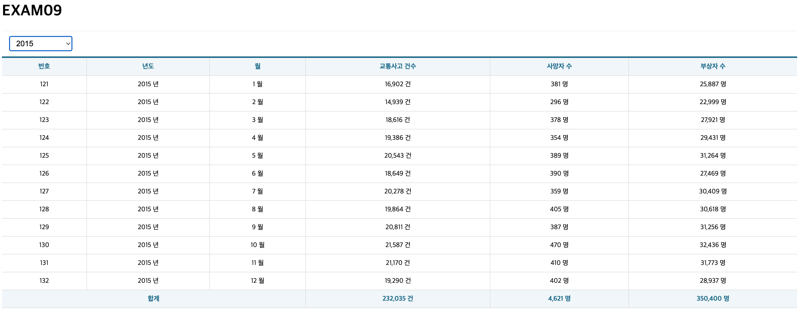

# 박찬우 리액트 연습문제09

> 2022-05-17

`- src/App.jsx`
```js
/**
 * @description: 연습문제 09
 */

import React, { memo, useCallback, useEffect, useState } from 'react';
import useMounterRef from './hook/useMounterRef';

// 패키지 참조
import styled from 'styled-components';
import Spinner from './components/Spinner';
import Table from './components/Table';
import useAxios from 'axios-hooks';

// 드롭다운을 배치하기 위한 박스
const SelectContainer = styled.div`
  position: sticky;
  top: 0;
  background-color: #fff;
  border-top: 1px solid #eee;
  border-bottom: 1px solid #eee;
  padding: 10px 0;
  margin: 0;

  select {
    margin-left: 15px;
    font-size: 16px;
    padding: 5px 10px;
  }
`;

function App() {

  const [{ data, loading, error }, refetch] = useAxios('http://localhost:3001/traffic_acc');

  // ----------------------------------------------------------------- 드롭다운 시작
  // 드롭다운 선택 상태를 저장하기 위한 상태변수
  const [ year, setYear ] = useState({ year: '' });

  // 드롭다운 선택 변경시 호출되는 이벤트
  const onSelectChange = useCallback(e => {
    e.preventDefault();

    // 드롭다운 입력값 가져오기
    const current = e.target;
    const key = current.name;
    const value = current[current.selectedIndex].value;

    // 기존의 상태값을 그대로 복사한 상태에서 드롭다운의 name 속성과 일치하는 key에 대한 value를 수정
    const newYear = {...year, [key]: value};

    // 상태값 갱신
    setYear(newYear);

  }, [year]);
  // ----------------------------------------------------------------- 드롭다운 끝


  // ----------------------------------------------------------------- 마운트 확인 시작
  // 이 컴포넌트가 화면에 마운트 되었는지를 확인하기 위한 hook
  const mountedRef = useMounterRef();

  // year 상태값이 변경되었을 때 실행될 hook
  useEffect(() => {
    // 컴포넌트가 화면에 마운트 된 이후에만 동작하도록 한다.
    if(mountedRef.current) {
      // 상태값 중에서 빈값이 아닌 항목들을 옮겨담는다.
      const params = {};
      for(const key in year) {
        console.log(key);
        if(year[key]) {
          params[key] = year[key];
        }
      }

      // ajax 재요청
      refetch({
        params: params,
      })
    }
  }, [mountedRef, refetch, year]);
  // ----------------------------------------------------------------- 마운트 확인 끝


  // TODO: 에러가 발생했다면 에러 메세지를 표시
  if(error) {
    console.error(error);
    return (
      <div>
        <h1>{error.code} Error</h1>
        <p>{error.message}</p>
      </div>
    );
  };

  
  // TODO: 합계 계산
  let totalAccident = 0, totalDeath = 0, totalInjury = 0;
  
  const head = ['번호', '년도', '월', '교통사고 건수', '사망자 수', '부상자 수'];
  
  return (
    <div>
      <h1>EXAM09</h1>

      <Spinner visible={loading} />

      <SelectContainer>
        <select name="year" onChange={onSelectChange}>
          <option value="">-- 연도 선택 --</option>
          <option value="2005">2005</option>
          <option value="2006">2006</option>
          <option value="2007">2007</option>
          <option value="2008">2008</option>
          <option value="2009">2009</option>
          <option value="2010">2010</option>
          <option value="2011">2011</option>
          <option value="2012">2012</option>
          <option value="2013">2013</option>
          <option value="2014">2014</option>
          <option value="2015">2015</option>
        </select>
      </SelectContainer>

      <Table>
        <thead>
          <tr>
            {head.map((v,i) => <th key={i}>{v}</th>)}
          </tr>
        </thead>
        <tbody>
          {data && data.map(({
            id, year, month, accident, death, injury
          }, i) => {

            totalAccident += accident;
            totalDeath += death;
            totalInjury += injury;

            return (
              <tr key={i}>
                <td>{id}</td>
                <td>{year + ' 년'}</td>
                <td>{month + ' 월'}</td>
                <td>{accident.toLocaleString() + ' 건'}</td>
                <td>{death.toLocaleString() + ' 명'}</td>
                <td>{injury.toLocaleString() + ' 명'}</td>
              </tr>
            );
          })}
        </tbody>
        <tfoot>
          <tr>
            <th colSpan={3}>합계</th>
            <th>{totalAccident.toLocaleString() + ' 건'}</th>
            <th>{totalDeath.toLocaleString() + ' 명'}</th>
            <th>{totalInjury.toLocaleString() + ' 명'}</th>
          </tr>
        </tfoot>
      </Table>


    </div>
  );
}

export default memo(App);
```

---

> > 실행결과

</img>
</img>
</img>


