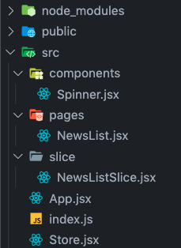
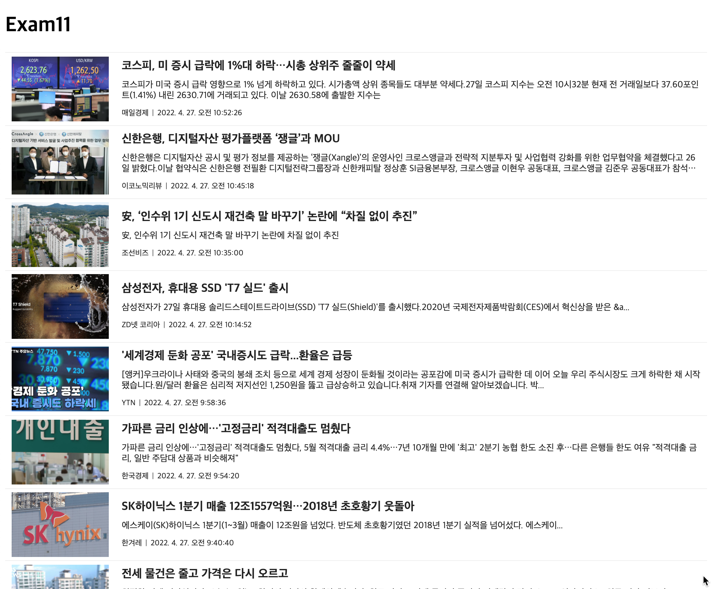

# 박찬우 리액트 연습문제11

> 2022-05-23

</img>

`- src/index.js`
```js
import React from 'react';
import ReactDOM from 'react-dom/client';
import App from './App';

import { Provider } from 'react-redux';
import Store from './Store';

const root = ReactDOM.createRoot(document.getElementById('root'));
root.render(
  <React.StrictMode>
    <Provider store={Store}>
      <App />
    </Provider>
  </React.StrictMode>
);
```

`- src/App.jsx`
```js
import React from 'react';
import NewsList from './pages/NewsList';

function App() {
  return (
    <div>
      <h1>Exam11</h1>
      <NewsList />
    </div>
  );
}

export default App;
```

`- src/slice/NewsListSlice.jsx`
```js
import { createSlice, createAsyncThunk } from '@reduxjs/toolkit';
import axios from 'axios';

// TODO: 비동기 처리 함수 구현
export const getList = createAsyncThunk('news/getList', async (payload, {rejectWithValue}) => {
  let result = null;

  try {
    result = await axios.get('http://localhost:3001/news');
  } catch(e) {
    result = rejectWithValue(e.response);
  }

  return result;
});

// TODO: Slice 정의
const NewsListSlice = createSlice({
  name: 'newsList',
  initialState: {
    data: null,
    loading: false,
    error: null,
  },

  extraReducers: {
    [getList.pending]: (state, {payload}) => {
      return {...state, loading: true}
    },

    [getList.fulfilled]: (state, {payload}) => {
      return {
        data: payload?.data,
        loading: false,
        error: null,
      }
    },

    [getList.rejected]: (state, {payload}) => {
      return {
        data: payload?.data,
        loading: false,
        error: {
          code: payload?.status ? payload.status : 500,
          message: payload?.statusText ? payload.statusText : 'Server Error',
        }
      }
    }
  }
});

export default NewsListSlice.reducer;
```


`- src/Store.jsx`
```js
import { configureStore, getDefaultMiddleware } from '@reduxjs/toolkit';

import NewsListSlice from './slice/NewsListSlice';

const Store = configureStore({
  reducer: {
    newsList: NewsListSlice,
  },

  middleware: [...getDefaultMiddleware({serializableCheck: false})],

  devTools: true,
});

export default Store;
```

`- src/pages/NewsList.jsx`
```js
import React, { useEffect, memo } from 'react';
import { useSelector, useDispatch } from 'react-redux';

import { getList } from '../slice/NewsListSlice';
import Spinner from '../components/Spinner';
import styled from 'styled-components';

const ListItem = styled.li`
  border-top: 1px solid #eee;
  list-style: none;

  &:last-child {
    border-bottom: 1px solid #eee;
  }

  .list-item-link {
    box-sizing: border-box;
    display: flex;
    flex-wrap: nowrap;
    flex-direction: row;
    align-items: center;
    padding: 5px 10px;
    text-decoration: none;
    color: #222;
    transition: all .1s;

    &:hover {
      background-color: #84c8dd5e;
    }

    .thumnail {
      width: 150px;
      height: 100px;
      display: block;
      object-fit: cover;
      flex: none;
    }

    .content {
      flex: 0 1 auto;
      padding: 5px 0 5px 20px;

      h3 {
        box-sizing: border-box;
        font-size: 18px;
        font-weight: bold;
        margin: 0;
        margin-bottom: 10px;

        display: -webkit-box;
        overflow: hidden;
        text-overflow: ellipsis;
        -webkit-line-clamp: 1;
        -webkit-box-orient: vertical;
      }

      p {
        font-size: 14px;
        margin: 0;
        margin-bottom: 8px;
        display: -webkit-box;
        overflow: hidden;
        text-overflow: ellipsis;
        -webkit-line-clamp: 2;
        -webkit-box-orient: vertical;
      }

      ul {
        list-style: none;
        padding: 0;
        margin: 0;

        li {
          display: inline-block;
          font-size: 12px;

          &:first-child::after {
            content: '|';
            display: inline-block;
            color: #555;
            padding: 0 5px;
          }
        }
      }
    }
  }
`;

const NewsList = () => {

  // hook을 통해 slice가 관리하는 상태값 가져오기
  const { data, loading, error } = useSelector((state) => state.newsList);

  // dispatch 함수 생성
  const dispatch = useDispatch();

  // 컴포넌트가 마운트 되면 데이터 조회를 위한 액션함수를 디스패치
  useEffect(() => {
    dispatch(getList())
  }, [dispatch])

  return (
    <div>
      <Spinner visible={loading} />

      {error ? (
        <h1>{error.code} Error</h1>
      ) : (
        <>
          {data && data.map(({author, title, description, url, image, datetime}, i) => {
            return (
              <ListItem key={i}>
                <a className='list-item-link' href={url} target='_blank' rel='noreferrer'>
                  
                  <div className='content'>
                    <h3>{title}</h3>
                    <p>{description}</p>
                    <ul>
                      <li>{author}</li>
                      <li>{new Date(datetime).toLocaleString()}</li>
                    </ul>
                  </div>
                </a>
              </ListItem>
            );
          })}
        </>
      )}
    </div>
  );
};

export default memo(NewsList);
```

---

> > 실행결과

</img>


