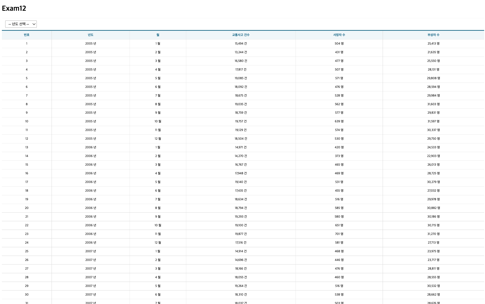
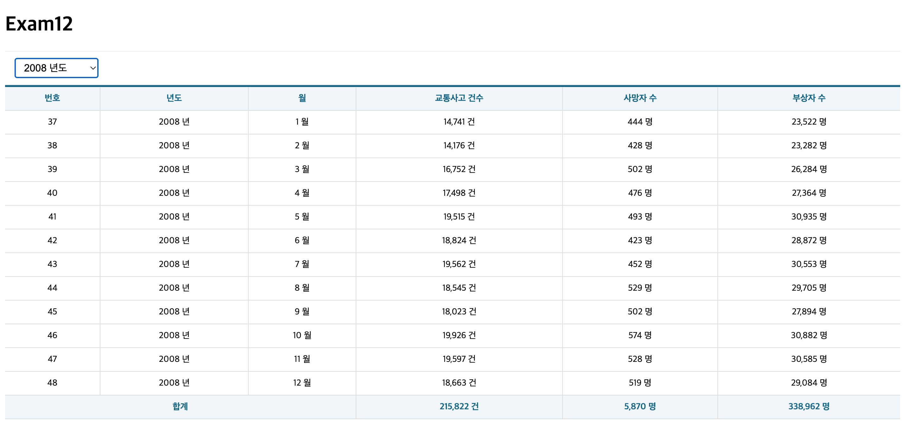
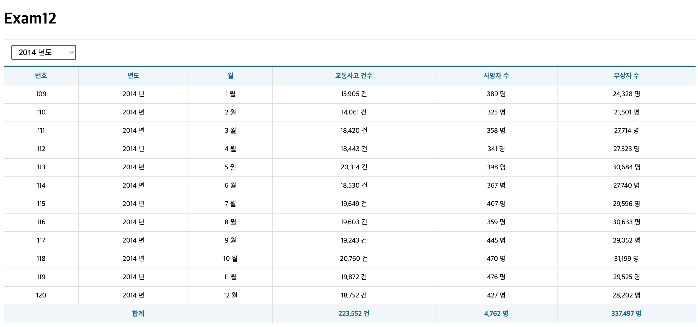
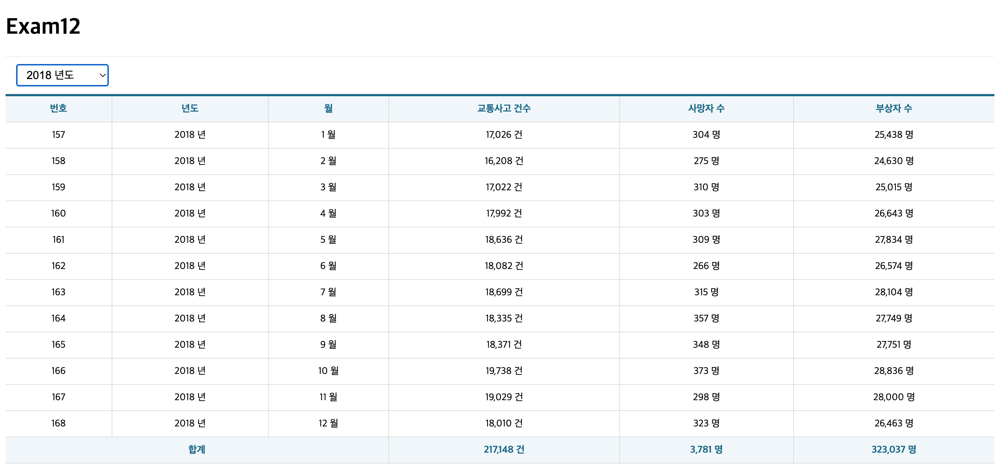

# 박찬우 리액트 연습문제12

> 2022-05-24

`- src/index.js`
```js
import React from 'react';
import ReactDOM from 'react-dom/client';
import App from './App';

// 리덕스 구성을 위한 참조
import { Provider } from 'react-redux';
import Store from './Store';


const root = ReactDOM.createRoot(document.getElementById('root'));
root.render(
  <React.StrictMode>
    <Provider store={Store}>
      <App />
    </Provider>
  </React.StrictMode>
);
```

`- src/App.jsx`
```js
import React from 'react';
import TrafficAcc from './pages/TrafficAcc';

const App = () => {
  return (
    <div>
      <h1>Exam12</h1>
      <TrafficAcc />
    </div>
  );
};

export default App;
```

`- src/slice/TrafficAccSlice.jsx`
```js
import { createAsyncThunk, createSlice } from '@reduxjs/toolkit';
import axios from 'axios';

// TODO: 비동기 처리 함수 구현
export const getTrafficAcc = createAsyncThunk('traffic/getTrafficAcc', async (payload, {rejectWithValue}) => {
  let result = null;

  try {
    result = await axios.get('http://localhost:3001/traffic_acc', {
      params: {
        year: payload.year,
      }
    });

    if(result.data.faultInfo !== undefined) {
      const err = new Error();
      err.response = { status: 500, statusText: result.data.faultInfo.message };
      throw err;
    }

  } catch(err) {
    result = rejectWithValue(err.response);
  }

  return result;
});

// TODO: Slice 정의
const TrafficAccSlice = createSlice({
  name: 'trafficAcc',
  initialState: {
    data: null,
    loading: false,
    error: null,
  },

  extraReducers: {
    [getTrafficAcc.pending]: (state, {payload}) => {
      return { ...state, loading: true }
    },

    [getTrafficAcc.fulfilled]: (state, {payload}) => {
      return {
        data: payload?.data,
        loading: false,
        error: null,
      }
    },

    [getTrafficAcc.rejected]: (state, {payload}) => {
      return {
        data: payload?.data,
        loading: false,
        error: {
          code: payload?.status ? payload.status : 500,
          message: payload?.statusText ? payload.statusText : 'Server Error',
        },
      }
    },
  }
});

export default TrafficAccSlice.reducer;
```


`- src/Store.jsx`
```js
import { configureStore } from "@reduxjs/toolkit";

import TrafficAccSlice from "./slice/TrafficAccSlice";

const Store = configureStore({
  reducer: {
    trafficAcc: TrafficAccSlice,
  },

  middleware: (getDefaultMiddleware) => getDefaultMiddleware({serializableCheck: false}),
  devTools: true,
});

export default Store;
```

`- src/pages/TrafficAcc.jsx`
```js
import React, { memo, useCallback, useEffect, useState } from 'react';
import { useSelector, useDispatch } from 'react-redux';
import styled from 'styled-components';
import useMountedRef from '../hook/useMounterRef';

import Spinner from '../components/Spinner';
import Table from '../components/Table';
import ErrorPage from '../components/ErrorPage';
import { getTrafficAcc } from '../slice/TrafficAccSlice';

// 드롭다운을 배치하기 위한 박스
const SelectContainer = styled.div`
  position: sticky;
  top: 0;
  background-color: #fff;
  border-top: 1px solid #eee;
  border-bottom: 1px solid #eee;
  padding: 10px 0;
  margin: 0;

  select {
    margin-left: 15px;
    font-size: 16px;
    padding: 5px 10px;

  }
`;

const TrafficAcc = () => {

  // hook을 통해 slice가 관리하는 상태값 가져오기
  const { data, loading, error } = useSelector((state) => state.trafficAcc);

  // 드롭다운 상태값 정의
  const [getYear, setGetYear] = useState('');

  // dispatch 함수 생성
  const dispath = useDispatch();

  // 이 컴포넌트가 화면에 마운트 되었는지를 확인하기 위한 hook
  const mountedRef = useMountedRef();

  // 컴포넌트가 마운트 직후 모든 정보 호출
  useEffect(() => {
    dispath(getTrafficAcc(getYear));
  }, [dispath, getYear]);

  // 년도 선택 시 -> 
  useEffect(() => {
    if(mountedRef.current) {
      dispath(getTrafficAcc({ year: getYear }));
    }
  }, [mountedRef, dispath, getYear]);

  const onSelectChange = useCallback(e => {
    e.preventDefault();

    const current = e.target;
    const value = current[current.selectedIndex].value;

    setGetYear(value);
  }, []);

  const head = ['번호', '년도', '월', '교통사고 건수', '사망자 수', '부상자 수'];

  // TODO: 메인화면 구성
  return (
    <div>
      <Spinner visible={loading} />

      <SelectContainer>
        <select name="year" onChange={onSelectChange}>
          <option value="">-- 년도 선택 --</option>
          {[...new Array(2018 - 2005 + 1)].map((v,i) => {
            return (<option key={i} value={2005 + i}>{2005 + i} 년도</option>);
          })}
        </select>
      </SelectContainer>

      {error ? <ErrorPage error={error} /> : (
        <>
          {data && (
            <Table>
              <thead>
                <tr>
                  {head.map((v,i) => <th key={i}>{v}</th>)}
                </tr>
              </thead>
              <tbody>
              {data && data.map(({ id, year, month, accident, death, injury }, i) => {
                return (
                  <tr key={i}>
                    <td>{id}</td>
                    <td>{year} 년</td>
                    <td>{month} 월</td>
                    <td>{accident.toLocaleString()} 건</td>
                    <td>{death.toLocaleString()} 명</td>
                    <td>{injury.toLocaleString()} 명</td>
                  </tr>
                );
              })}
              </tbody>
              <tfoot>
                <tr>
                  <th colSpan={3}>합계</th>
                  <th>{data.map((v,i) => v.accident).reduce((a,b) => a + b, 0).toLocaleString()} 건</th>
                  <th>{data.map((v,i) => v.death).reduce((a,b) => a + b, 0).toLocaleString()} 명</th>
                  <th>{data.map((v,i) => v.injury).reduce((a,b) => a + b, 0).toLocaleString()} 명</th>
                </tr>
              </tfoot>
            </Table>
          )}
        </> 
      )}
    </div>
  );
}

export default memo(TrafficAcc);
```

---

> > 실행결과

</img>
</img>
</img>
</img>


