# 소스코드

### 【문항1】 페이지 번호와 키워드 검색 기능이 포함된 목록 조회 기능을 갖는 웹 페이지를 구현하고 이에 대한 소 스코드와 실행 스크린샷을 제출하시오.

```jsx
/**
 * @filename: ProfessorSlice.jsx
 * @author: 박찬우
 * @description: 다중행 데이터 조회를 위한 비동기 함수
 */
export const getList = createAsyncThunk(
  'ProfessorSlice/getList',
  async (payload, { rejectWithValue }) => {
    let result = null;

    try {
      result = await axios.get(API_URL, {
        params: {
          query: payload?.query,
          page: payload?.page,
          rows: payload?.rows,
        },
      });
    } catch (err) {
      result = rejectWithValue(err.response);
    }

    return result;
  }
);
```

```jsx
/**
 * @filename: ProfessorList.jsx
 * @author: 박찬우
 * @description: 목록조회, 키워드 검색기능
 */
const dispatch = useDispatch();
const { data, loading, error } = useSelector((state) => state.Professor);
/** 최초 마운트 혹은 QueryString이 변경될 때 마다 실행되는 hook -> 리덕스를 통해 목록 조회한다. */
useEffect(() => {
  dispatch(
    getList({
      query: query,
      rows: rows,
      page: page,
    })
  );

  refRowsDropdown.current.value = rows;
  refTextInput.current.value = query;
}, [dispatch, rows, query, page]);

/** 키워드 검색 */
const onSearchSubmit = useCallback(
  (e) => {
    e.preventDefault();

    const dropdown = refRowsDropdown.current;
    const input = refTextInput.current;

    navigate(`/?query=${input.value}&rows=${dropdown.value}`);
  },
  [navigate]
);

/**
 * @filename: ProfessorList.jsx
 * @author: 박찬우
 * @description: 리덕스를 통해 받은 페이지 번호 구현
 */
{
  data && (
    <Pagination>
      {data.pagination.prevGroupLastPage > 0 ? (
        <li>
          <NavLink
            to={`/query=${query}&rows=${rows}&page=${data.pagination.prevGroupLastPage}`}
          >
            &laquo;
          </NavLink>
        </li>
      ) : (
        <li>
          <NavLink to="#" className="disabled">
            &laquo;
          </NavLink>
        </li>
      )}

      {(() => {
        const li = [];
        const start = data.pagination.groupStart;
        const end = data.pagination.groupEnd + 1;

        for (let i = start; i < end; i++) {
          if (i === data.pagination.nowPage) {
            li.push(
              <li key={i}>
                <NavLink to="#" className="current-page">
                  {i}
                </NavLink>
              </li>
            );
          } else {
            li.push(
              <li key={i}>
                <NavLink to={`/?query=${query}&rows=${rows}&page=${i}`}>{i}</NavLink>
              </li>
            );
          }
        }
        return li;
      })()}

      {data.pagination.nextGroupLastPage > 0 ? (
        <li>
          <NavLink
            to={`/query=${query}&rows=${rows}&page=${data.pagination.nextGroupLastPage}`}
          >
            &raquo;
          </NavLink>
        </li>
      ) : (
        <li>
          <NavLink
            to={`/?query=${query}&rows=${rows}&page=${data.pagination.groupEnd}`}
            className="disabled"
          >
            &raquo;
          </NavLink>
        </li>
      )}
    </Pagination>
  );
}
```

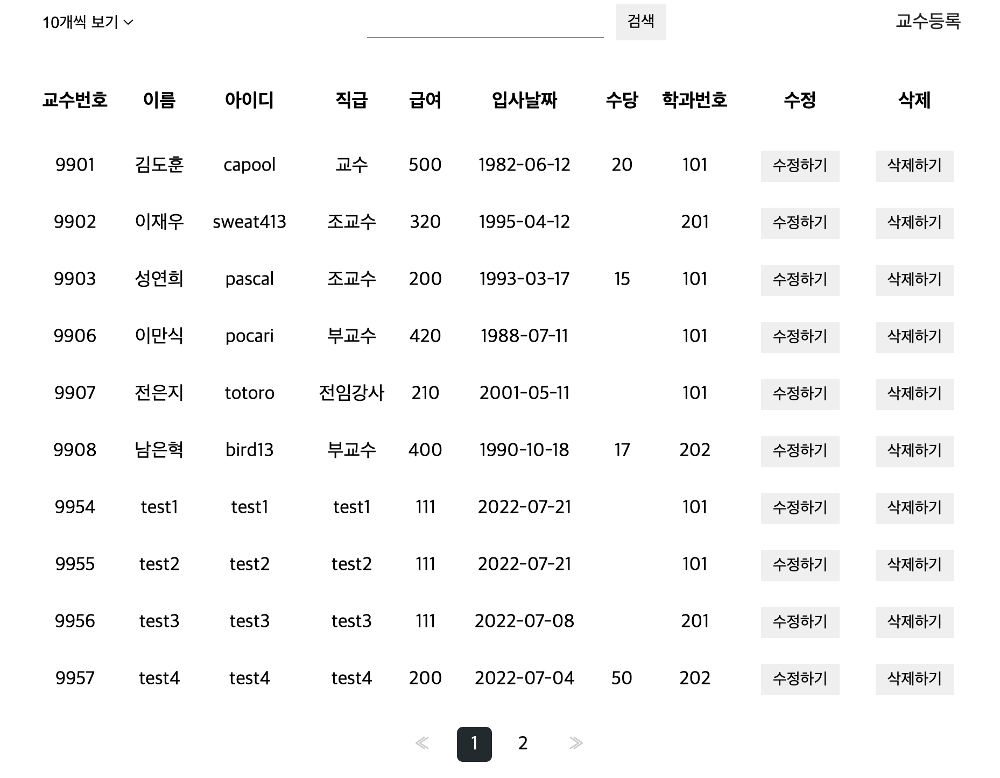
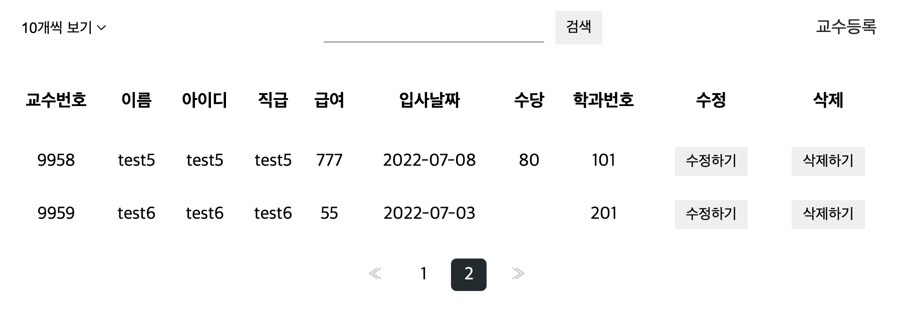
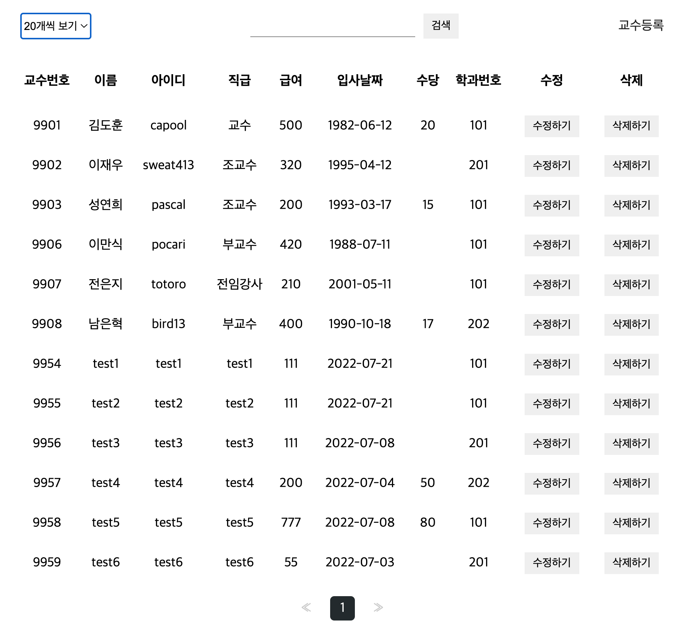
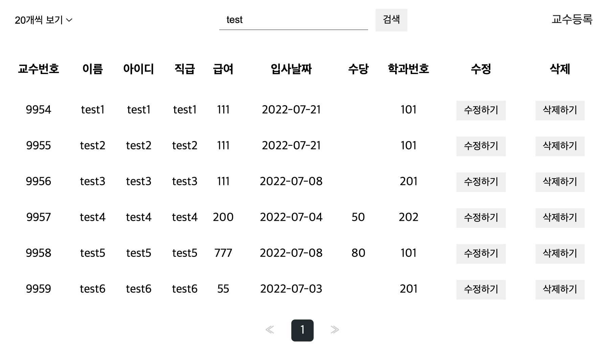

### 【문항2】 단일 항목에 대한 상세 조회 기능을 갖는 웹 페이지를 구현하고 이에 대한 소스코드와 실행 스크린샷 을 제출하시오.

```jsx
/**
 * @filename: ProfessorSlice.jsx
 * @author: 박찬우
 * @description: 단일행 데이터 조회를 위한 비동기 함수
 */
export const getItem = createAsyncThunk(
  'ProfessorSlice/getItem',
  async (payload, { rejectWithValue }) => {
    let result = null;

    try {
      result = await axios.get(`${API_URL}${payload?.profno}/`);
    } catch (err) {
      result = rejectWithValue(err.response);
    }

    return result;
  }
);
```

```jsx
/**
 * @filename: ProfessorList.jsx
 * @author: 박찬우
 * @description: 검색 기능 구현
 */
const onSearchSubmit = useCallback(
  (e) => {
    e.preventDefault();

    const dropdown = refRowsDropdown.current;
    const input = refTextInput.current;

    navigate(`/?query=${input.value}&rows=${dropdown.value}`);
  },
  [navigate]
);
```

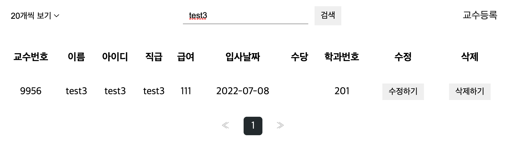

### 【문항3】 신규 데이터를 등록할 수 있는 기능을 갖는 웹 페이지를 구현하고 이에 대한 소스코드와 실행 스크린 샷을 제출하시오. 관련된 참조키는 Redux가 아닌 hook을 사용하여 백엔드로부터 데이터를 받아온 후 Dropdown을 통해 선택할 수 있어야 합니다.

```jsx
/**
 * @filename: ProfessorSlice.jsx
 * @author: 박찬우
 * @description: 데이터 저장을 위한 비동기 함수
 */
export const postItem = createAsyncThunk(
  'ProfessorSlice/postItem',
  async (payload, { rejectWithValue }) => {
    let result = null;

    try {
      result = await axios.post(API_URL, {
        name: payload.name,
        userid: payload.userid,
        position: payload.position,
        sal: payload.sal,
        hiredate: payload.hiredate,
        comm: payload.comm,
        deptno: payload.deptno,
      });
    } catch (err) {
      alert('교수 등록에 실패했습니다.');
      result = rejectWithValue(err.response);
    }
    console.log(result);
    return result;
  }
);
```

```jsx
/**
 * @filename: ProfessorAdd.jsx
 * @author: 박찬우
 * @description: 교수 데이터 등록
 */
const ProfessorAdd = memo(() => {

  /** 저장 완료 후 목록으로 되돌아가기 위한 페이지 강제 이동 함수 생성 */
  const navigate = useNavigate();

  /** 리덕스 관련 초기화 */
  const dispatch = useDispatch();
  const { loading, error } = useSelector((state) => state.Professor);

  /** <form>의 submit 버튼이 눌러졌을 때 호출될 이벤트 핸들러 */
  const onSubmit = React.useCallback(
    (e) => {
      e.preventDefault();

      // 이벤트가 발생한 폼 객체
      const current = e.target;

      // 입력값에 대한 유효성 검사
      try {
        regexHelper.value(current.name, '교수이름을 입력하세요.');
        regexHelper.minLength(current.name, 2, '이름은 2글자 이상 입력가능합니다.');
        regexHelper.maxLength(current.name, 10, '이름은 10글자 이하 입력가능합니다.');

        regexHelper.value(current.userid, '아이디를 입력하세요.');
        regexHelper.minLength(current.userid, 2, '아이디는 2글자 이상 입력가능합니다.');
        regexHelper.maxLength(current.userid, 10, '아이디는 10글자 이하 입력가능합니다.');

        regexHelper.value(current.position, '직급을 입력하세요.');

        regexHelper.value(current.sal, '급여를 입력하세요.');
        regexHelper.num(current.sal, '급여는 숫자만 입력 가능합니다.');

        regexHelper.value(current.hiredate, '입사 날짜를 입력하세요.');

        // regexHelper.num(current.comm, '수당은 숫자만 입력 가능합니다. 없으면 0 입력');

        regexHelper.value(current.deptno, '학과번호를 입력하세요.');
        regexHelper.num(current.deptno, '학과번호는 숫자만 입력 가능합니다.');

      } catch (e) {
        window.alert(e.message);
        e.field.focus();
        return;
      }

      // 리덕스를 통한 데이터 저장 요청. --> 처리가 완료된 후 목록 페이지로 강제 이동한다.
      dispatch(
        postItem({
          name: current.name.value,
          userid: current.userid.value,
          position: current.position.value,
          sal: current.sal.value,
          hiredate: current.hiredate.value,
          comm: current.comm.value || null,
          deptno: current.deptno.value,
        })
      ).then(() => {
        navigate('/');
      });
    },
    [dispatch, navigate]
  );
```


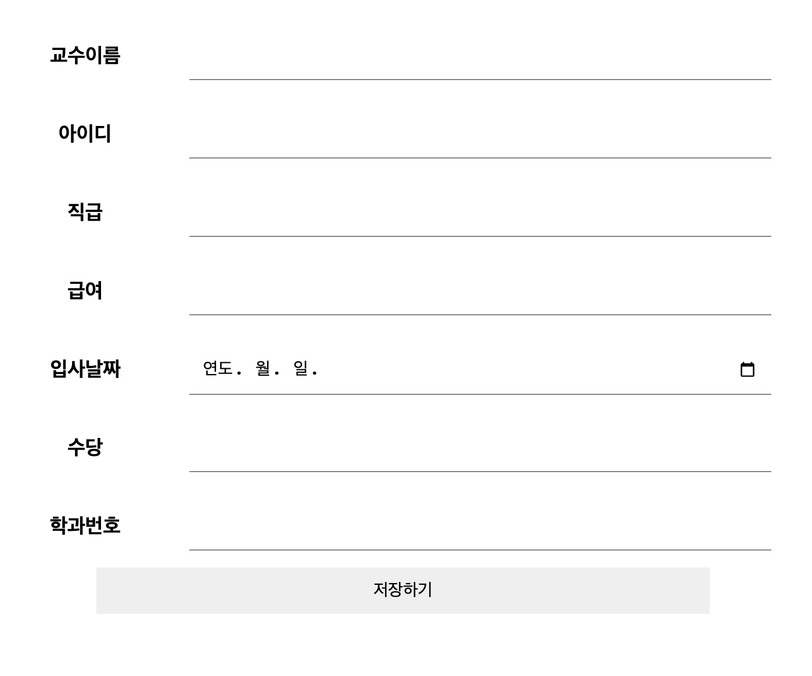
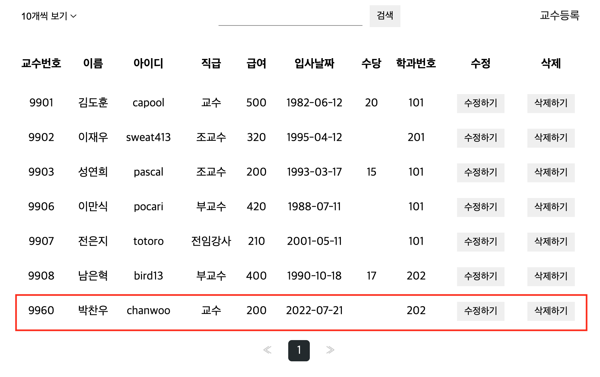

### 【문항4】 데이터를 수정할 수 있는 기능을 갖는 웹 페이지를 구현하고 이에 대한 소스코드와 실행 스크린샷을 제출하시오. 관련된 참조키는 Redux가 아닌 hook을 사용하여 백엔드로부터 데이터를 받아온 후 Dropdown을 통해 선택할 수 있어야 합니다.

```jsx
/**
 * @filename: ProfessorSlice.jsx
 * @author: 박찬우
 * @description: 데이터 수정을 위한 비동기 함수
 */
export const putItem = createAsyncThunk(
  'ProfessorSlice/putItem',
  async (payload, { rejectWithValue }) => {
    let result = null;

    try {
      result = await axios.put(`${API_URL}${payload.profno}/`, {
        name: payload.name,
        userid: payload.userid,
        position: payload.position,
        sal: payload.sal,
        hiredate: payload.hiredate,
        comm: payload.comm,
        deptno: payload.deptno,
      });
    } catch (err) {
      result = rejectWithValue(err.response);
    }

    return result;
  }
);
```

```jsx
/**
 * @filename: ProfessorEdit.jsx
 * @author: 박찬우
 * @description: 교수 데이터 수정
 */
const ProfessorEdit = memo(() => {
  const { profno } = useParams();

  /** 데이터 수정 후 목록 페이지로 강제 이동하기 위한 함수 생성 */
  const navigate = useNavigate();

  /** 리덕스 초기화 */
  const dispatch = useDispatch();
  const { data, loading, error } = useSelector((state) => state.Professor);
  const [origin, setOrigin] = useState({
    name: '',
    userid: '',
    position: '',
    sal: '',
    hiredate: '',
    comm: '',
    deptno: '',
  });

  /** 페이지가 열림과 동시에 id값에 대한 데이터를 조회하여 리덕스 상태값에 반영한다. */
  useEffect(() => {
    const index = data.item.findIndex((e) => e.profno === parseInt(profno));

    setOrigin({
      name: data.item[index].name,
      userid: data.item[index].userid,
      position: data.item[index].position,
      sal: data.item[index].sal,
      hiredate: data.item[index].hiredate,
      comm: data.item[index].comm,
      deptno: data.item[index].deptno,
    });
  }, [data, profno]);

  /** <form>의 submit 버튼이 눌러졌을 때 호출될 이벤트 핸들러 */
  const onSubmit = React.useCallback(
    (e) => {
      e.preventDefault();

      // 이벤트가 발생한 폼 객체
      const current = e.target;

      // 입력값에 대한 유효성 검사
      try {
        regexHelper.value(current.name, '교수이름을 입력하세요.');
        regexHelper.minLength(current.name, 2, '이름은 2글자 이상 입력가능합니다.');
        regexHelper.maxLength(current.name, 10, '이름은 10글자 이하 입력가능합니다.');

        regexHelper.value(current.userid, '아이디를 입력하세요.');
        regexHelper.minLength(current.userid, 2, '아이디는 2글자 이상 입력가능합니다.');
        regexHelper.maxLength(current.userid, 10, '아이디는 10글자 이하 입력가능합니다.');

        regexHelper.value(current.position, '직급을 입력하세요.');

        regexHelper.value(current.sal, '급여를 입력하세요.');
        regexHelper.num(current.sal, '급여는 숫자만 입력 가능합니다.');

        regexHelper.value(current.hiredate, '입사 날짜를 입력하세요.');

        // regexHelper.num(current.comm, '수당은 숫자만 입력 가능합니다.);

        regexHelper.value(current.deptno, '학과번호를 입력하세요.');
        regexHelper.num(current.deptno, '학과번호는 숫자만 입력 가능합니다.');
      } catch (e) {
        window.alert(e.message);
        e.field.focus();
        return;
      }

      /** 리덕스를 통한 상태값 갱신 --> 완료 후 목록 페이지로 강제 이동함 */
      dispatch(
        putItem({
          profno: profno,
          name: current.name.value,
          userid: current.userid.value,
          position: current.position.value,
          sal: current.sal.value,
          hiredate: current.hiredate.value,
          comm: current.comm.value || null,
          deptno: current.deptno.value,
        })
      ).then(() => {
        navigate('/');
      });
    },
    [dispatch, profno, navigate]
  );
```

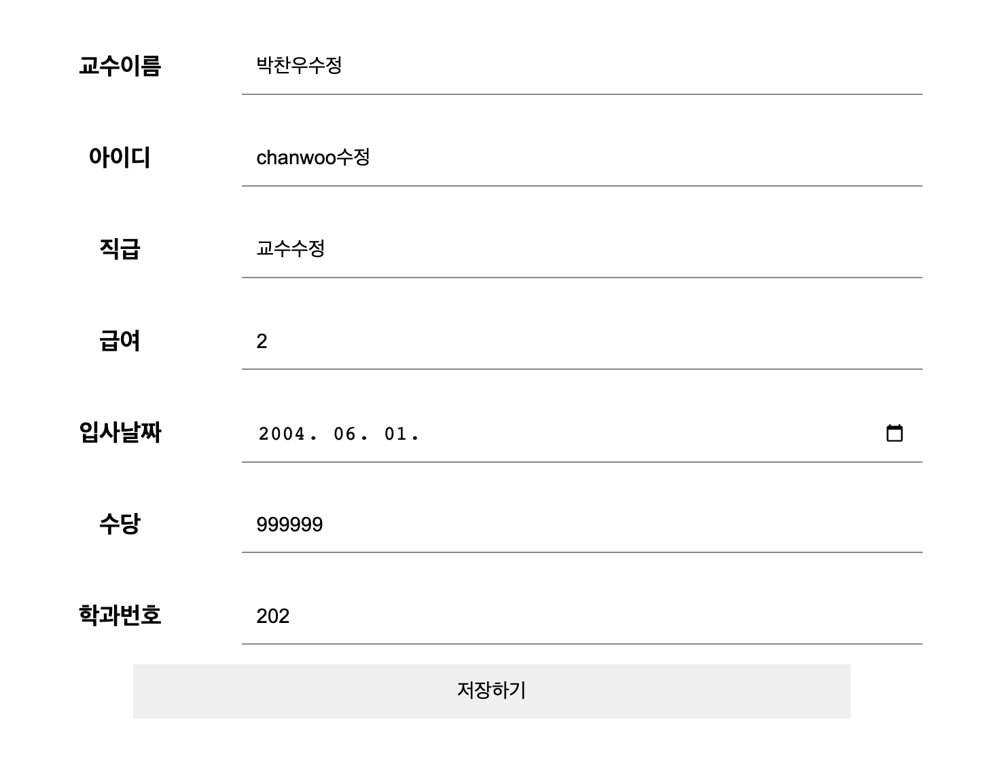
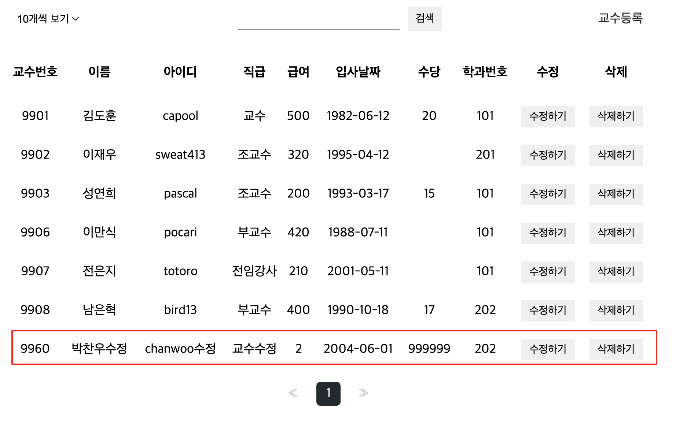

### 【문항5】 목록 페이지의 삭제버튼을 통해 데이터를 삭제할 수 있는 기능을 갖는 웹 페이지를 구현하고 이에 대 한 소스코드와 실행 스크린샷을 제출하시오.

```jsx
/**
 * @filename: ProfessorSlice.jsx
 * @author: 박찬우
 * @description: 데이터 삭제를 위한 비동기 함수
 */
export const deleteItem = createAsyncThunk(
  'ProfessorSlice/deleteItem',
  async (payload, { rejectWithValue }) => {
    let result = null;

    try {
      result = await axios.delete(`${API_URL}${payload?.profno}/`);
    } catch (err) {
      result = rejectWithValue(err.response);
    }

    return result;
  }
);
```

```jsx
/**
 * @filename: ProfessorList.jsx
 * @author: 박찬우
 * @description: 교수 데이터 삭제
 */
/** 삭제 버튼 클릭 이벤트 처리 -> 리덕스를 통해 삭제 처리 -> data 값이 갱신되므로 화면에 자동 반영된다. */
const onDeleteClick = useCallback(
  (e) => {
    e.preventDefault();

    const current = e.target;

    if (window.confirm(`정말 ${current.dataset.name}을(를) 삭제하시겠습니까?`)) {
      dispatch(
        deleteItem({
          profno: current.dataset.profno,
        })
      );
    }
  },
  [dispatch]
);
```

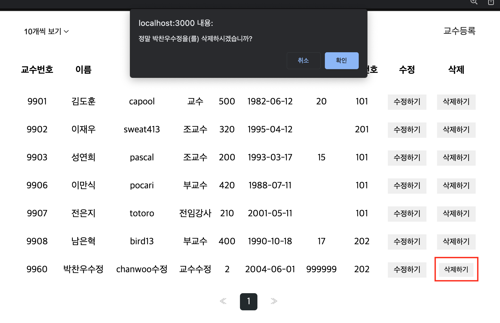
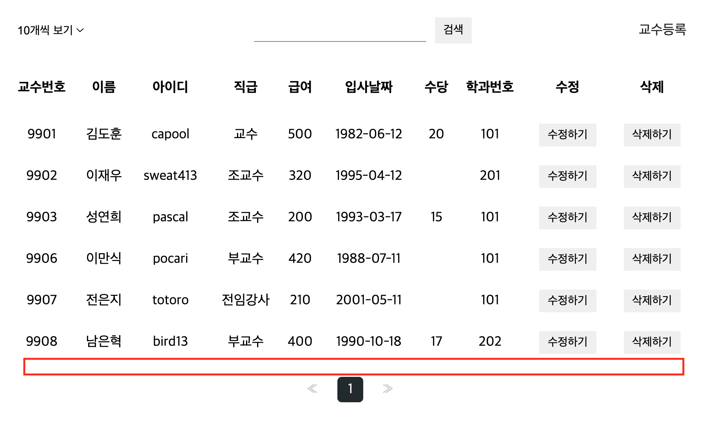
