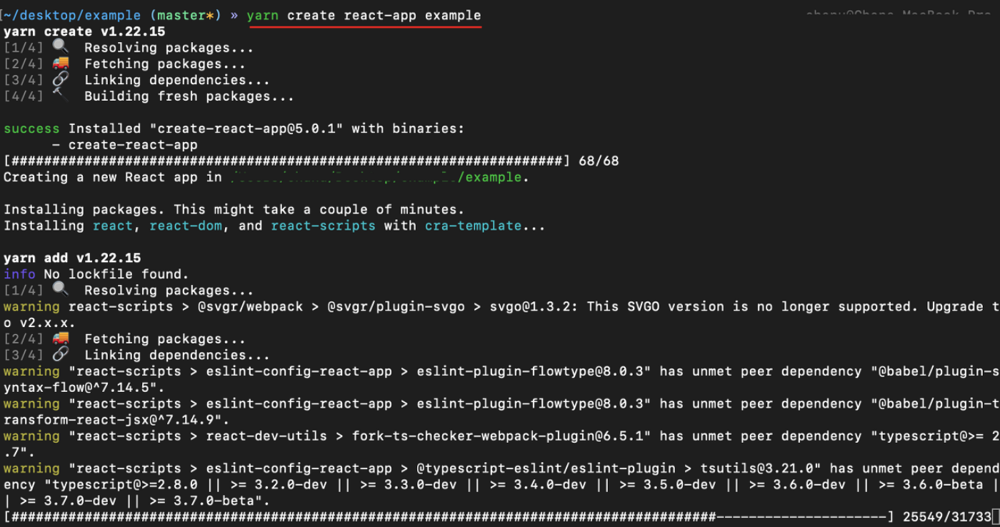
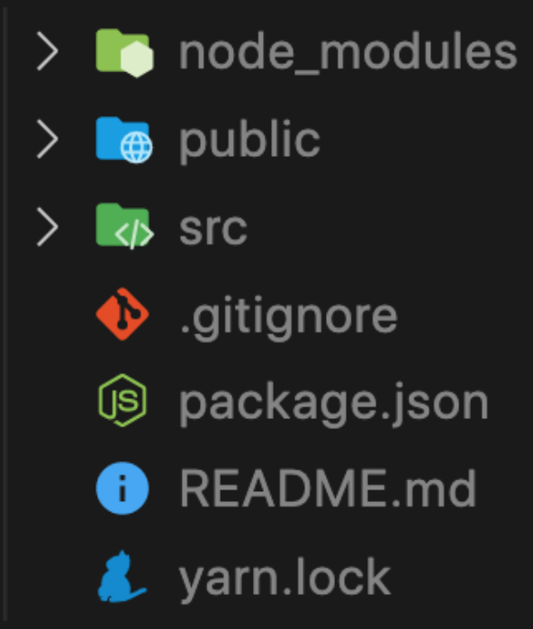
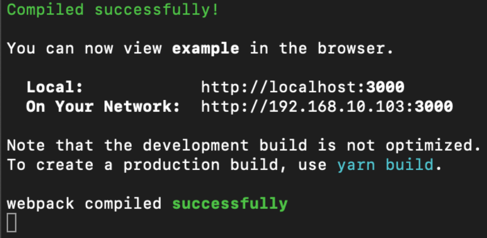

# 리액트를 다루는 기술

22.05.04 박찬우

<br/>

> ## _1장. 리액트 시작_

### 1) React의 개념

- 리액트는 페이스북에서 개발한 자바스크립트 라이브러리이다. (사용자 인터페이스(UI)를 만들기 위한 라이브러리)
- 리액트는 컴포넌트 기반으로, 컴포넌트에 데이터를 보내면 개발자가 설계한 대로 UI가 만들어져 사용자에게 보여진다.
- 하나의 HTML에 여러개의 페이지를 구성하는 싱글페이지 어플리케이션(Sing Page Application, SPA)에 사용된다.
- 리액트를 사용하지 않아도 웹페이지를 만들 수 있지만, 사용자와 상호작용을 UI로 쉽게 구현하고, 대규모의 웹페이지를 관리하기 위해 사용된다.
- 리액트는 똑같은 구조가 여러번 나타날 때 재사용할 수 있다는게 핵심이다.

```
※ 프레임워크

자바스크립트를 기반으로 규모가 큰 애플리케이션을 만들 수 있는 시대가 왔고, 수많은 프레임워크들이 등장하고 있다.
ex) React.js, Angular.js, Vue.js

이 프레임워크들은 주로 MVC(Model-View-Controller) 아키텍처, MVVM(Model-View-View Moeld) 아키텍처를 사용한다.
(Angular.js 같은 경우는 MVW(Model-View-Whatever) 사용)

* MVC

  Model - data(데이터베이스 시스템)
  View - 화면
  Controller - 데이터 + 화면

  이 구조들은 백엔드 없이는 사용하기 힘들다.
```

<br/>

### 2) React의 이해

React는 오직 View만 신경 쓰는 라이브러리이다.

#### `컴포넌트 (Component)`

- 컴포넌트는 독립적인 단위의 모듈을 뜻한다.
- 리액트 프로젝트에서 특정 부분이 어떻게 생길지 정하는 선언체이다.
- 재사용이 가능한 API로 수많은 기능들을 내장하고 있다.
- 컴포넌트 하나에 해당 컴포넌트의 생김새와 작동 방식을 정의한다.
  - 즉, 한 페이지 내에서 여러 부분을 독립된 컴포넌트로 만들고, 이 컴포넌트들을 조립해 화면을 구성한다.
- 전체 코드를 파악하기가 상대적으로 쉽고, 단위별로 관리하기 때문에 재사용성이 높다.
  - 코드를 반복해서 입력할 필요 없이 import를 통해 사용하면 되고, 유지보수 및 관리가 용이해진다.

#### `렌더링`

- 사용자의 화면에 뷰를 보여주는 것을 말한다.
- 리액트 컴포넌트가 최초로 실행한 `초기 렌더링`과 컴포넌트의 데이터 변견으로 다시 실행되는 `리렌더링`의 개념이 있다.

```
render() { ... }
```

#### `render함수`

- 리액트에서는 맨 처음 어떻게 보일지를 정하는 초기 렌더링으로 `render함수`를 사용한다.
- render 함수는 컴포넌트가 어떻게 생겼는지 정의하는 역할을 한다.
  - 뷰가 어떻게 생겼고, 어떻게 작동하는지에 대한 정보를 지닌 객체를 반환한다.
- 컴포넌트 내부에는 또다른 컴포넌트들이 들어갈 수있다.
- render 함수를 실행하면 그 내부에 있는 컴포넌트들도 재귀적으로 렌더링한다.
- 작업이 끝나면 HTML 마크업을 만들고, 이를 우리가 정하는 실제 페이지의 DOM안에 주입힌다.

#### `조화과정`

- 데이터 변화가 있을 때 우리가 보기에는 변화에 따라 뷰가 변형되는 것 처럼 보이지만, 사실은 새로운 요소로 갈아 끼우는 개념이다.
  - 이를 보통 업데이트 과정이라고 부르지만, 조화 과정이라고 부르는게 더 정확한 표현이다.
- 리액트에서는 이 작업을 render 함수가 처리하며, 컴포넌트는 데이터를 업데이트 했을 때 단순히 업데이트한 값을 수정하는 것이 아니라, 새로운 데이터를 가지고 render 함수를 또 다시 호출한다.
  - 이 때, render 함수가 반환하는 결과를 곧바로 DOM에 반영하지 않고, 이전에 만들었던 컴포넌트 정보와 현재 render함수가 만든 컴포넌트 정보를 비교하여 조화과정을 거친다. (최소한의 연산)

#### `Virtual DOM`

- 가상의 Document Object Model을 뜻한다.
- 실제 DOM에 접근하여 조작하는 대신, 이를 추상화한 자바스크립트 객체를 구성하여 사용한다.
- 가상의 DOM을 만들어 변경 사항이 있을 경우 전체를 새롭게 만들지 않고, 변경된 부분만 실제 DOM에 반영하는 방식이다
  - 효율성과 속도가 높아진다.

```
※ DOM의 단점

일반적인 DOM 구조는 HTML 코드를 작성하고 HTML 파일을 열면 작성된 코드들이 DOM을 만든다.
이는 HTML 코드가 수정되면 전체 DOM을 새롭게 만드는 아주 비효율적인 구조이다.
또, 규모가 큰 웹 어플리케이션에서 DOM에 직접 접근하여 변화를 주면 성능 저하가 발행한다.
React에서는 이를 Virtual DOM으로 해결한다.
```

<br/>

### 3) 작업 환경 설정

#### `Node.js`

- 리액트를 사용하기 위해서는 Node.js가 필수로 설치되어 있어야 한다.
  - 프로젝트를 개발하는데 필요한 주요 도구들이 Node.js를 사용하기 때문이다.
  - 이 때 사용되는 도구에는 ES6를 호환시켜주는 `Babel`과 모듈화 된 코드를 한 파일로 번들링 하고 코드를 수정할 때 마다 웹 브라우저를 리로딩 하는 등의 기능을 가진 `Webpack`이 필수로 쓰인다.
- 작성일 기준 18.0.0 버전이 최신 버전이지만 LTS 버전을 설치하는게 안정적이다.
  - Mac M1의 경우 17이상의 버전 필요

</img>

```
※ 설치 확인
  윈도우의 명령프롬프트나 맥의 터미널에서 아래 명령어를 수행한다.

node --version
```

#### `yarn`

- yarn은 npm을 대체할 수 있는 도구로 npm 보다 더 빠르며 효율적인 캐시 시스템과 기타 부가 기능을 제공한다.

</img>

```
※ 설치 확인
  윈도우의 명령프롬프트나 맥의 터미널에서 아래 명령어를 수행한다.

yarn -version
```

```
※ npm과 yarn
  둘다 패키지 관리자 역할을 하며, 목적이 같기 때문에 둘이 같다고 봐도 무방하다.

  예를들어 pakage.json을 저장할 때,
    npm은 npm install --save 파일이름 을 사용하고, yarn은 yarn add 파일이름 명령어를 사용한다.

  반대로 삭제할 때는
    npm은 npm uninstall --save 파일이름, yarn은 yarn remove 파일이름 명령어를 사용한다.
```

> > 그외 에디터는 Visual Studio Code를 설치하고, 형상 관리 도구인 git을 설치한다.

#### `프로젝트 생성하기`

- 프로젝트 생성
  - 윈도우의 명령프롬프트나 맥의 터미널에서 프로젝트 폴더를 생성할 위치에서 아래 명령어를 수행한다.
  - 프로젝트 이름은 영어 소문자만 가능하다.

```
yarn create react-app example

※ yarn을 사용하지 않을 경우에는 다음 명령어를 사용한다.
  npm init react-app 프로젝트이름
```

> > > 설치 중인 화면

</img>

> > > 설치가 완료 된 후 생성된 파일들

</img>

```
※ create-react-app (cra)

  리액트 프로젝트를 생성할 때 필요한 도구들(Webpack, Babel 등)의 설치 및 설정 과정을 생략하고 바로 간편하게 프로젝트 작업 환경을 구축해 주는 도구이다.
```

- 프로젝트 실행
  - 해당 프로젝트가 생성된 위치에서 아래 명령어를 수행한다.
  - 주의할점은 실행중인 명령프롬프트나 터미널을 종료하면 접속이 끊긴다.
    - 계속 키고 있어야 작업이 가능하다. (localhost:3000)

```
cd example
yarn start
```

> > > 실행 성공시 보여지는 화면

</img>

> > > 리액트를 공부한다면 누구나 보게되는 화면

</img>

---

<br/>

> ## _2장. JSX_

### 1) 코드 이해하기

- 프로젝트 생성 과정에서 node_modules 디렉터리에 React 모듈이 설치된다.
- 이 모듈들을 import 구문을 통해 리액트를 불러와서 사용한다.
  - import는 다른 js파일을 불러와 조립한다.
  - 일반 자바스크립트에서는 사용이 안된다.
  - 최신 Node.js 에서는 require 뿐만 아니라 import도 사용 가능하다.
- 이러한 기능을 웹 브라우저에서는 Bundler를 사용해 파일들을 묶듯이 연결한다.

#### `Webpack`

- 리액트에서는 Webpack을 사용해서 import한 모듈들을 모두 합쳐 하나의 파일을 생성한다.

#### `Babel`

- 자바스크립트 파일들을 불러오면서 최신 자바스크립트 문법으로 작성된 코드를 ES5문법으로 변환한다.

<br/>

### 2) JSX의 개념

- JavaScript eXtention의 약자로 리액트에서 사용 가능한 자바스크립트 확장 문법이다.
- 리액트에서는 HTML을 표현할 때 JSX를 사용하여 표현한다.
- 겉으로 보기엔 HTML과 다를게 없어 보이지만, 빌드 시 Babel에 의해 자바스크립트로 변환된다.
  - ES6로 작성(node) -> Webpack으로 병합 -> Babel로 변환(웹브라우저용)
- 자바스크립트 코드를 HTML 처럼 표현할 수 있다는게 큰 장점이다.
- JSX는 공식적인 문법이라고는 볼 수 없다.

```
※ ES5로 변환하는 이유

최신 자바스크립트로 작성된 코드는 구버전 웹 브라우저에서는 실행되지 않기 때문에 사전에 변환시켜줘야한다.
또, JSX는 정식 자바스크립트 문법이 아니므로 ES5 형태의 코드로 변환해줘야 한다.

```

<br/>

### 3) JSX 사용시 주의사항

- HTML 요소에 class 값을 정의할 때는 class="" 를 사용하지 않고 `className=""` 을 사용한다.
  - class 단어는 ES6의 클래스 문법과 겹치는 예약어이기 때문이다.
- 요소에서 이벤트를 핸들링하는 onclick 같은 단어는 onClick 처럼 `카멜표기법`을 사용해야 한다.
- 주석은 `<!-- 주석 -->` 이 아닌, `{/* 주석 */}` 을 사용한다.
  - 이는 태그 밖에서 사용 가능하고, 태그 안에서는 `//`주석도 사용 가능하다.
- HTML Custom-Element는 <my-element>와 같이 표기했지만, React에서는 <MyElement /> 와 같이 Pascal Case로 표기한다.
- JSX 내부에서 JS를 사용할 때는 { }를 사용한다. `{console.log("example")}`
- HTML에서는 닫는 태그 </>를 안붙여도 오류가 안나지만, JSX에서는 오류가 발생한다.
  - 반드시 닫는태그를 명시해야한다. (ex `<br>` → `<br />`)
    - 어떤 태그라도 Sel-closing tag가 가능하다.

<br/>

### 4) JSX 사용하기

#### `컴포넌트 작성`

```
import React from 'react';

const App = () => {
  return (
    <div>
      <h1>React 안녕!</h1>
      <h1>잘 작동하니?</h1>
    </div>
  );
};

export default App;
```

```
import React, { Fragment } from 'react';

const App = () => {
  return (
    <Fragment>
      <h1>React 안녕!</h1>
      <h1>잘 작동하니?</h1>
    </Fragment>
  );
};

export default App;
```

```
import React from 'react';

const App = () => {
  return (
    <>
      <h1>React 안녕!</h1>
      <h1>잘 작동하니?</h1>
    </>
  );
};

export default App;
```

- 리액트 컴포넌트 작성 시 요소를 여러개 사용할 경우 하나의 요소로 감싸주어야 한다.
  - `<div>` 나 `<Fragment>` `<></>` 를 사용해서 감싸준다.
  - 컴포넌트 내부는 하나의 DOM 트리구조로 이루어져야 한다는 규칙 때문이다.

#### `자바스크립트 표현`

```
import React from 'react';

const App = () => {
  const name = 'React';

  return (
    <>
      <h1>{name} 안녕!</h1>
      <h1>잘 작동하니?</h1>
    </>
  );
};

export default App;
```

- JSX 안에서 자바스크립트 표현식을 사용할 수 있다.
  - JSX 내부에서 `{ }`로 감싸서 사용하면 된다.

</img>

<br/>

### 5) 조건분기

#### `조건부 연산자(삼항연산자)`

```
import React from 'react';

const App = () => {
  const name = 'React';

  return <>{name === 'React' ? <h1>리액트입니다.</h1> : <h1>리액트아니다.</h1>}</>;
};

export default App;
```

- 자바스크립트에서는 if문을 사용하지만 리액트에서는 삼항연산자를 사용한다
- `{}`안에 조건부 연산자를 사용하면 된다.

  - { 조건 ? 참일 때 결과 : 거짓일 때 결과 }

- 조건이 거짓인 경우를 사용하지 않고자 한다면 null을 사용한다.

</img>

#### `AND(&&) 연산자`

```
import React from 'react';

const App = () => {
  const isLogin = true;
  return (
    <>
      {isLogin === true && <h1>로그인 되셨습니다.</h1>}
      {isLogin === false && <h1>로그인 해주세요.</h1>}
    </>
  );
};

export default App;
```

- `조건 && 조건이 참인 경우 출력할 내용` 형식으로 사용한다.
- AND 연산자는 모든 조건이 참이 되어야 참이기 때문에 하나라도 거짓인 경우 출력하지 않는다.

</img>

#### `OR(||) 연산자`

```
import React from 'react';

const App = () => {
  const example = undefined;
  return <> {example || <h1>조회된 게시글이 없습니다.</h1>} </>;
};

export default App;
```

- `조건 || 조건이 거짓인 경우 출력할 내용` 형식으로 사용한다.
- 조건이 참인 경우 표시되는 내용이 없다.
  - 즉, 조건이 거짓일 경우에 내용을 출력하고자 할 때 사용한다.

</img>

<br/>

### 6) 인라인 스타일링

#### `style 객체 선언`

```
import React from 'react';

const App = () => {
  const name = 'React';

  const style = {
    backgroundColor: 'black',
    color: 'aqua',
    fontSize: '48px',
    fontWeight: 'bold',
    padding: 16, // 단위를 생략하면 px로 지정
  };

  return <div style={style}>{name}</div>;
};

export default App;
```

- 리액트에서 DOM 요소에 스타일을 적용할 때는 객체 형태로 넣어 줘야 한다.
- 일반 css와 다르게 카멜표기법으로 작성해야 한다.
  - background-color → `backgroundColor`

#### `직접 style 지정`

```
import React from 'react';

const App = () => {
  const name = 'React';

  return (
    <div
      style={{
        backgroundColor: 'black',
        color: 'aqua',
        fontSize: '48px',
        fontWeight: 'bold',
        padding: 16, // 단위를 생략하면 px로 지정
      }}
    >
      {name}
    </div>
  );
};

export default App;
```

- 객체를 미리 선언하지 않고 바로 style 값을 지정할 수 있는데, 이 때 괄호가 이중으로 쓰이는 점을 유의해야 한다.

</img>

<br/>

### 7) ESLint와 Prettier

#### `ESLint`

- ESLint는 문법 검사 도구이다.
- 코드를 작성할 때 실수를 하면 에러 혹은 경고 메세지를 에디터에서 바로 확인할 수 있게 해준다.

#### `Prettier`

- Prettier는 코드 스타일 자동 정리 도구이다.
- JSX를 작성할 때는 코드의 가독성을 위해 들여쓰기를 사용하는데, Prettier가 이를 도와준다.
  - 코드의 들여쓰기를 자동 정렬해 주고, 세미콜론이 빠진 부분에 자동으로 추가시켜 준다.
  - 홑따옴표 또는 쌍따옴표를 정해서 하나로 정리해준다.
