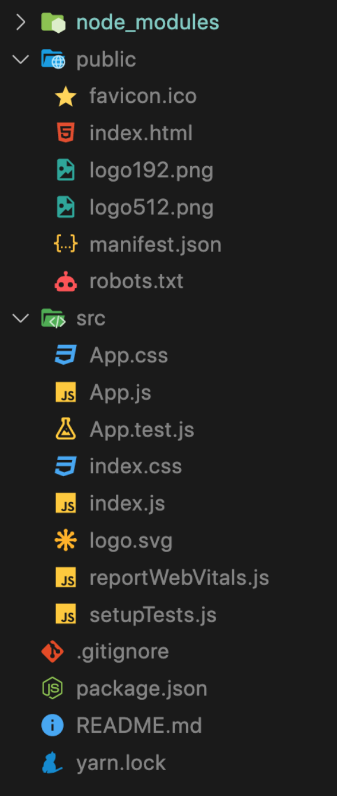
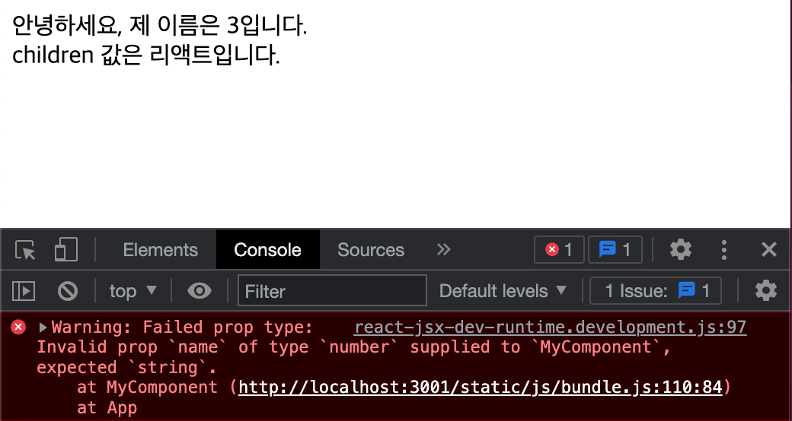
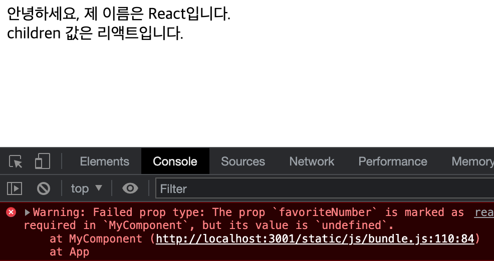
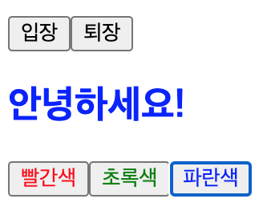
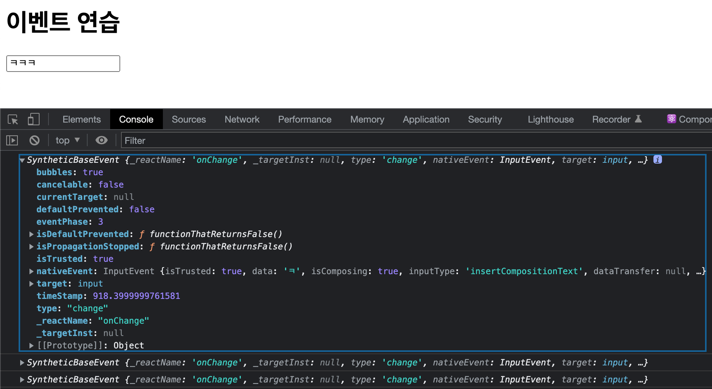
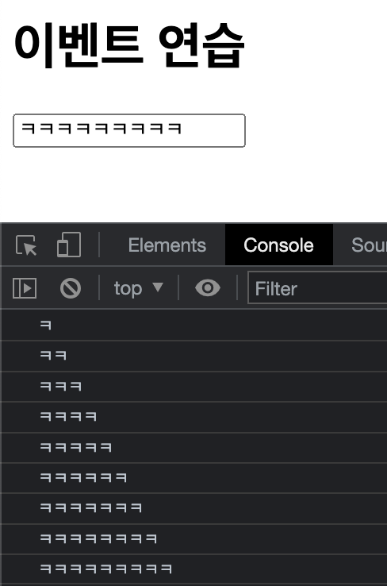
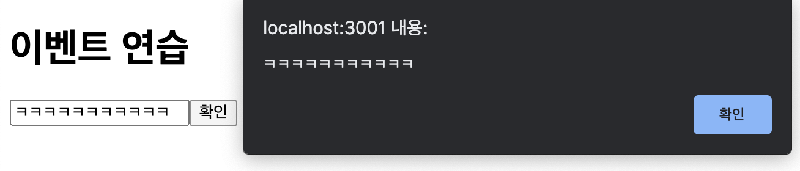
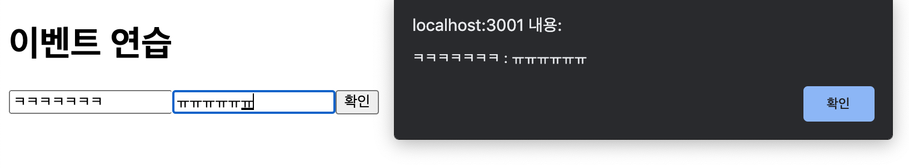

# 리액트를 다루는 기술

22.05.06 박찬우

<br/>

>> ## _3장. 컴포넌트_

```
컴포넌트는 데이터가 주어졌을 때 이에 맞춰 UI를 만들어 주며, Hook(함수형)을 이용하여 컴포넌트가 화면에서 나타날 때, 사라질 때, 변화가 일어날 때 주어진 작업들을 처리할 수 있으며, 커스텀 Hook을 통해 특별한 기능을 붙여줄 수 있다.
```

※ 클래스형 컴포넌트 기본 구조
```js

import React, { Component } from 'react'; 

class App extends Component { 
  render(){ 
    return ( 
      //jsx 
    ); 
  }; 
}; 

export default App;
```

※ 함수형 컴포넌트 기본 구조
```js
import React from 'react'; 

function App() { 
// 화살표 함수 표현도 가능하다. const App = () => {};
  return( 
    //jsx 
  ); 
}; 

export default App; 
```

### 1) 함수형 컴포넌트

#### `함수형 컴포넌트 정의`

- 함수 이름은 혼선을 방지하기 위해 소스파일의 이름과 동일하게 구성하는것이 일반적이다.
  - 함수 이름의 `첫 글자는 대문자`로 써야한다. 그래서 소스파일 이름도 첫 글자는 대문자로 한다.
- 함수의 리턴으로 값을 받고 HTML구조를 의미하는 JSX 문법으로 작성해야한다.
- JSX 구조는 무조건 `단 하나의 태그 요소만 반환` 해야한다.
  - 즉, 리턴하는 태그가 여러개일 경우 부모 태그 하나에 모두 포함 시켜야한다.(보통 <div> 태그로 감싼다.)

#### `장점`

- 클래스형 컴포넌트 보다 선언하기가 훨씬 편하다.
- 메모리 자원도 클래스형 컴포넌트 보다 덜 사용한다.
- 프로젝트를 완성하여 빌드한 후 배포할 때 결과물의 파일 크기가 더 작다.
  - 파일크기가 성능에 영향을 주는건 아니다.

#### `단점`

- 클래스형의 state와 라이프사이클 API의 사용이 불가능하다.
  - 리액트 16.8 업데이트로 이후 Hooks 라는 기능이 도입되면서 해결됐다.

```
리액트 공식 매뉴얼에서는 컴포넌트를 새로 작성할 때 함수형 컴포넌트와 Hooks의 사용을 권장하고 있다.
```

<br/>

### 2) 컴포넌트 생성

#### `컴포넌트 생성`

- 컴포넌트를 생성할 파일은 src 디렉터리에 생성한다.

> ※ React 디렉터리 구조
> 
> 
> 
> <b>node_modules</b> : 리액트에서 사용할 수 있는 모듈들이 위치하는 폴더
>
> <b>public</b> : static 자원 폴더, 정적 파일들을 위치하는 폴더
>
> <b>src</b> : 실질적으로 화면에 보여질 내용들을 작업하는 폴더

#### `코드 작성`

- 컴포넌트의 기본 구조

MyComponent.jsx
```js
import React from 'react';

const MyComponent = () => {
  return (
    <div>
      나의 새롭고 멋진 컴포넌트
    </div>
  );
};
```

#### `내보내기`

- 작성한 컴포넌트 맨 아래에 `export`를 사용해서 함수이름을 내보낸다.

```js
export default MyComponent;
```

#### `불러오기(참조하기)`

- 참조할 컴포넌트 상단에 `import 참조명 from 파일주소` 형식으로 참조한다.

App.jsx
```js
import React from 'react';
import MyComponent from './MyComponent';

const App = () => {
  return (
    <div>
      <MyComponent />
    </div>
  );
};

export default App;
```


<br/>

### 3) props

#### `props의 개념`

- `컴포넌트 속성을 설정`할 때 사용하는 요소이다.
- props는 Properties의 줄임말이다.
- 상위 컴포넌트가 하위 컴포넌트에 값을 전달할 때 사용한다. 
  - 단반향 데이터 흐름을 갖는다.
- 프로퍼티는 수정할 수 없다는 특징이 있다. 
  - 자식 입장에서는 `읽기 전용인 테이터`.
- 프로퍼티에 `문자열을 전달할 때는 따옴표('')`를 사용하고, `문자열 외의 값을 전달할 때는 중괄호({})`를 사용한다.
  - 컴포넌트를 사용하는 부모로 부터 전달 받는 변수값이 포함되어 있는 객체이다.
  - 컴포넌트에게 HTML 속성 같은 형태로 전달된다.

#### `JSX 내부에서 props 렌더링`

MyComponent.jsx
```js
import React from 'react';

const MyComponent = (props) => {
  return (
    <div>
      안녕하세요, 제 이름은 {props.name}입니다.
    </div>
  );
};

export default MyComponent;
```

- `props`라는 매개변수로 부모 컴포넌트에서 프로퍼리 값을 받고, 객체 처럼 사용할 수 있다.

#### `컴포넌트를 사용할 때 props 값 지정하기`

App.jsx
```js
import React from 'react';
import MyComponent from './MyComponent';

const App = () => {
  return (
    <div>
      <MyComponent name='React' />
    </div>
  );
};

export default App;
```

- 부모 컴포넌트에서 자식 컴포넌트에 name 값을 지정하여 프로퍼티로 넘겨준다.
- 문자열을 넘겨줄 때는 따옴표, 그 외는 중괄호를 사용한다.


#### `props 기본값 설정 : defaultProps`

MyComponent.jsx
```js
import React from 'react';

const MyComponent = (props) => {
  return (
    <div>
      안녕하세요, 제 이름은 {props.name}입니다.
    </div>
  );
};

MyComponent.defaultProps ={
  name: '기본 이름',
};

export default MyComponent;
```

- `defaultProps`는 부모 컴포넌트에서 props 값을 따로 지정하지 않았을 때 보여주는 기본값이다.


#### `태그 사이의 내용을 보여주는 children`

- `children`은 컴포넌트 태그 사이의 내용을 보여주는 props 이다.

App.jsx
```js
import React from 'react';
import MyComponent from './MyComponent';

const App = () => {
  return (
    <div>
      <MyComponent>리액트</MyComponent>
    </div>
  );
};

export default App;
```

- `<MyComponent>` 태그 사이에 내용 입력.

MyComponent.jsx
```js
import React from 'react';

const MyComponent = (props) => {
  return (
    <div>
      안녕하세요, 제 이름은 {props.name}입니다. <br />
      children 값은 {props.children}
      입니다.
    </div>
  );
};

MyComponent.defaultProps ={
  name: '기본 이름',
};

export default MyComponent;
```

- `props.children` 으로 값을 가져온다.


#### `비구조화 할당 문법 사용하기`

- 비구조화 문법을 통해 변수 속성값을 변수로 선언해서 사용할 수 있다.
- 처음부터 매개변수에 프로퍼티를 선언하는 방법이다.

MyComponent.jsx
```js
import React from 'react';

const MyComponent = ({name, children}) => {
  return (
    <div>
      안녕하세요, 제 이름은 {name}입니다. <br />
      children 값은 {children} // props 값을 변수처럼 사용
      입니다.
    </div>
  );
};

MyComponent.defaultProps ={
  name: '기본 이름',
};

export default MyComponent;
```

#### `propTypes 사용하기`

- 컴포넌트로 전달되는 props 값들에 대한 데이터 타입과 필수 여부를 지정할 수 있다.
- 기본 값 설정을 하지 않는 경우, 해당 프로퍼티를 필수 프로퍼티로 선언할 수 있다.
- 규칙에 맞지 않는 props 값에 대해 브라우저 개발자 콘솔에 경고 메세지가 출력된다.
- propTypes를 사용하기 위해서는 `prop-types`를 import 해야한다.

```js
import PropTypes from "prop-types";
```

MyComponent.jsx
```js
import React from 'react';
import propTypes from 'prop-types';

const MyComponent = ({name, children}) => {
  return (
    <div>
      안녕하세요, 제 이름은 {name}입니다. <br />
      children 값은 {children}
      입니다.
    </div>
  );
};

MyComponent.defaultProps ={
  name: '기본 이름',
};

MyComponent.propTypes = {
  name: propTypes.string,
}

export default MyComponent;
```

- name의 propTypes를 string으로 지정.

App.js
```js
import React from 'react';
import MyComponent from './MyComponent';

const App = () => {
  return (
    <div>
      {/* <MyComponent name='React' /> */}
      <MyComponent name={3}>리액트</MyComponent>
    </div>
  );
};

export default App;
```



> name 값에는 문자열을 지정해야 하는데, 숫자를 지정해서 에러메세지 출력

#### `isRequire`

- `isRequire`를 사용하여 필수 propTypes를 설정할 수 있다.
  - 즉, propTypes를 지정하지 않았을 때 경고 메세지를 띄워주는 역할을 한다.
- 사용 방법은 propTypes를 지정할 때 뒤에 `isRequire를 붙여 주면` 된다.

MyComponent.jsx
```jsx
import React from 'react';
import propTypes from 'prop-types';

const MyComponent = ({name, children, favoriteNumber}) => {
  return (
    <div>
      안녕하세요, 제 이름은 {name}입니다. <br />
      children 값은 {children}
      입니다.
      <br />
      제가 좋아하는 숫자는 {favoriteNumber} 입니다.
    </div>
  );
};

MyComponent.defaultProps ={
  name: '기본 이름',
};

MyComponent.propTypes = {
  name: propTypes.string,
  favoriteNumber: propTypes.number.isRequired, // 숫자형, 필수
}

export default MyComponent;
```



> 부모 컴포넌트에서 favoriteNumber 값을 설정하지 않아 발생하는 오류 메세지

App.jsx
```js
import React from 'react';
import MyComponent from './MyComponent';

const App = () => {
  return (
    <div>
      <MyComponent name='React' favoriteNumber={1}>리액트</MyComponent>
    </div>
  );
};

export default App;
```

- 부모 컴포넌트에 favoriteNumber 값을 지정.

#### `PropTypes 종류`

- <b>`array`</b>: 배열
- arrayOf(다른 Protype): 특정 PropType으로 이루어진 배열을 의미한다. 예를 들어 arrayOf(Proptypes.number)는 숫자로 이루어진 배열이다.
- <b>`bool`</b>: true(참) 혹은 false(거짓) 값
- <b>`func`</b>: 함수
- <b>`number`</b>: 숫자
- <b>`object`</b>: 객체
- <b>`string`</b>: 문자열
- symbol: ES6의 Symbol
- node: 렌더링 할 수 있는 모든 것 (숫자, 문자열, 혹은 JSX코드, children)
- `instanceOf(클래스)`: 특정 클래스의 인스턴스 (ex instanceOf(Mycalss))
- `oneOf['dog', 'cat']`: 주어진 배열 요소 중 값 하나
- `oneOfType([React.PropTypes.string, PropTypes.number])`: 주어진 배열 안의 종류 중 하나
- shape({ name: PropTypes.string, num:PropTypes.number}): 주어진 스키마를 가진 객체
- any: 아무 종류

<br/>

### 4) useState 사용하기

#### `useState의 개념`

- 가장 기본적인 Hook 함수 이다.
- 함수형 컴포넌트에서 state 값을 생성한다. (이 페이지 안에서 유효한 전역변수 같은 개념)
- 하나의 useState 함수는 `하나의 값만 관리`할 수 있다.
- state 값은 직접 변경할 수 없고, 반드시 `setter를 통해서만 변경`이 가능하다.
- 컴포넌트에서 관리해야 할 상태가 여러개라면 `useState를 여러번 사용`하면 된다.

#### `useState 사용하기`

useState 함수를 import 하고 사용하는 경우
```js
import React, {useState} from 'react'; 

const [상태변수 , 변수에대한setter함수] = useState(초기값);
```

useState( ) 함수를 import 하지 않고 직접 사용하는 경우
```js
import React from 'react';

const [상태변수 , 변수에대한setter함수] = React.useState(초기값);
```

- useState `함수의 인자에는 상태의 초깃값`을 넣어준다. (값의 형태는 자유)
- 함수를 호출하면 배열이 반환 되는데, 배열의 `첫 번째 원소는 현재 상태`, `두 번째 원소는 상태를 바꾸어 주는 함수`이다.
  - 이 함수를 setter 함수라고 부른다. (두 번째 원소)
    - setter에 의해 값이 변경되면 실시간으로 화면에 갱신된다.
- 이름은 자유롭게 정해줄 수 있다.

Say.jsx
```js
import React, { useState } from 'react';
import styled from 'styled-components';

const Colors = styled.div`
  .red { color: red; }
  .green { color: green; }
  .blue { color: blue; }
`;

const Say = () => {
  const [message, setMessage] = useState('');
  const onClickEnter = () => setMessage('안녕하세요!');
  const onClickOut = () => setMessage('안녕히 가세요!');

  const [color, setColor] = useState('black');

  return (
    <div>
      <h1>useState 사용하기</h1>
      <button onClick={onClickEnter}>입장</button>
      <button onClick={onClickOut}>퇴장</button>
      <br />

      <Colors>
        <h2 style={{color}}>{message}</h2>
        <button className="red" onClick={() => setColor('red')}>
          빨간색
        </button>
        <button className="green" onClick={() => setColor('green')}>
          초록색
        </button>
        <button className="blue" onClick={() => setColor('blue')}>
          파란색
        </button>
      </Colors>
    </div>
  );
};

export default Say;

```



### 5) 정리

- props는 부모 컴포넌트가 설정한다.
- state는 컴포넌트가 자체적으로 지닌 값으로 컴포넌트 내부에서 값을 업데이트 할 수 있다.
- 부모 컴포넌트의 state를 자식 컴포넌트의 props로 전달하고, 자식 컴포넌트에서 특정 이벤트가 발생할 때 부모 컴포넌트의 메서드를 호출하면 props도 유동적으로 사용할 수 있다.
- 새로운 컴포넌트를 만들 때는 useState를 사용할 것을 권장한다. (클래스형은 권장하지 않음)

<br />

>> ## _4장. 이벤트 핸들링_

```
사용자가 웹 브라우저에서 DOM 요소들과 상호 작용하는 것을 이벤트(event)라고 한다.
```

### 1) 리액트의 이벤트 시스템

- 리액트의 이벤트 시스템은 웹 브라우저의 HTML 이벤트와 인터페이스가 동일하기 때문에 사용방법이 비슷하다.

Say.jsx
```js
import React, { useState } from 'react';

const Say = () => {
  const [message, setMessage] = useState('');
  const onClickEnter = () => setMessage('안녕하세요!');
  const onClickOut = () => setMessage('안녕히 가세요!');

  const [color, setColor] = useState('black');

  return (
    <div>
      <h1>useState 사용하기</h1>

      <button onClick={onClickEnter}>입장</button>
      <button onClick={onClickOut}>퇴장</button>
  );
};
```

#### `이벤트 사용시 주의사항`

1. 이벤트 이름은 카멜 표기법으로 작성해야 한다.
   - ex) oncick -> `onClick`, onleyup -> `onKeyUp`
2. 이벤트에 실행할 자바스크립트 코드를 전달하는 것이 아니라, 함수 형태의 값을 전달해야 한다.
   - ex) onClick={() => {...}} 또는  onClick={함수}
3. DOM 요소에만 이벤트를 설정할 수 있다.
   - ex) <MyComponent onClick={...} /> 은 안된다.

#### `이벤트 종류`

- Clipboard         
- Touch
- Composition
- UI
- Keyboard
- Wheel
- Focus
- Media
- Form
- Image
- Mouse
- Animation
- Selection
- Transition

#### `onChange 이벤트 핸들링하기`

EventPractice.jsx
```js
import React from 'react';

const EventPractice = () => {
  return (
    <div>
      <h1>이벤트 연습</h1>
      <input type='text' name='message' placeholder='아무거나입력해보세요'
      onChange={(e) => {console.log(e)}} />
    </div>
  );
};

export default EventPractice;
```



- 여기서 콘솔에 기록되는 e 객체는 SyntheticEvent로 웹 브라우저의 네이티브 이벤트를 감싸는 객체이다.
- 네이티브 이벤트와 인터페이스가 같으므로 순수 자바스크릅트에서 HTML 이벤트를 다룰 때와 똑같이 사용하면 된다.

input값 가져오기
```js
return (
    <div>
      <h1>이벤트 연습</h1>
      <input type='text' name='message' placeholder='아무거나입력해보세요'
      onChange={(e) => {
        console.log(e.target.value)
      }} />
    </div>
  );
```



#### `버튼을 누를 때 comment 값을 공백으로 설정`

EventPractice.jsx
```js
import React, { useState } from 'react';

const EventPractice = () => {
  
  const [message, setMessage] = useState('');

  return (
    <div>
      <h1>이벤트 연습</h1>

      <input type='text' name='message' placeholder='아무거나입력' value={message}
      onChange={(e) => {
        setMessage(e.target.value);  // 현재 입력값으로 변경
      }} />

      <button onClick={() => {
        alert(message);  // 버튼을 누르면 입력값 알림
        setMessage('');  // 버튼을 누르면 빈문자열로 변경
      }}>확인</button>
    </div>
  );
};

export default EventPractice;
```



- 알림창이 나타나고 확인 버튼을 누르면 입력창이 공백으로 설정된다.

#### `onKeyPress 이벤트 핸들링하기`

- 키를 눌렀을 때 발생하는 이벤트는 KeyPress 이다.

EventPractice.jsx
```js
import React, { useState } from 'react';

const EventPractice = () => {
  const [form, setForm] = useState({
    username: '',  // 상태값이 JSON 형태로 구성되어 있기 때문에
    message: '',   // 하나의 form 이라는 값에 여러 하위 값을 포함한다.
  });

  const { username, message } = form;

  const onChange = (e) => {
    const nextFrom = {
      ...form, // 기존의 form 내용을 이자리에 복사한 뒤
      [e.target.name]: e.target.value, // 원하는 값을 덮어 씌우기
      // [e.target.name] -> 해당 name 값을 가져온다
    };
    setForm(nextFrom);
  };

  const onClick = () => {
    alert(`${username} : ${message}`);
    setForm({
      username: '',
      message: '',
    });
  };

  const onKeyPress = (e) => {
    if (e.key === 'Enter') {
      onClick();
    }
  };

  return (
    <div>
      <h1>이벤트 연습</h1>
      <input type="text" name="username" placeholder="사용자명" value={username} onChange={onChange} />
      <input type="text" name="message" placeholder="아무거나 입력" value={message} onChange={onChange} onKeyPress={onKeyPress} />

      <button onClick={onClick}>확인</button>
    </div>
  );
};

export default EventPractice;
```



- 객체 안에서 key를 대괄호[ ]로 감싸면 그 안에 넣은 레퍼런스가 가리키는 실제 값이 key값으로 사용된다.