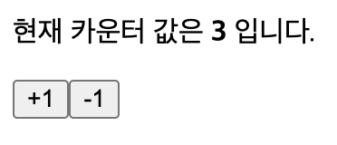
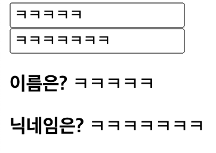

# 리액트를 다루는 기술

22.05.09 박찬우

<br/>

>> ## _5장. Ref: DOM에 이름달기_

### 1) Ref의 개념

- ref(reference)는 리액트 프로젝트내부에서 DOM에 이름을 다는 방법이다.
  - 프로그램에서 말하는 reference는 참조관계라는 뜻이다.
  - HTML에서 DOM 요소에 이름을 달 때 id를 사용하는 것과 같은 역할을 한다.
- 특정 DOM에 작업을 해야할 때 사용한다.
  - DOM을 꼭 직접적으로 접근해야 할 때 사용.
    - 특정 input에 포커스 줘야 할 때
    - 스크롤 박스 조작해야 할 때
    - canvas 요소에 그림 그리기 등
- 리액트 컴포넌트에서 id를 사용할 수는 있지만, 특수한 경우가 아니면 권장하지는 않는다.

```
※ id 사용의 단점

JSX 안에서 DOM에 id를 달면 해당 DOM을 렌더링 할 때 그대로 전달된다.
이 때, 컴포넌트를 여러번 사용하게 된다면 중복 id를 가진 DOM이 여러개 생겨서 문제가 된다.
(id값은 유일해야 한다.)

하지만, ref는 전역적으로 작동하지 않고 컴포넌트 내부에서만 작동하기 때문에 이런 문제가 발생하지 않는다.
```

<br/>

### 2) Ref 사용하기

- ref를 달고자 하는 요소에 값을 넣어준다.
- ref를 설정한 DOM에 접근하려면 뒤에 .current를 붙여주면 된다.

ValidationSample.jsx
```js
import React, { useState, useRef } from 'react';
import styled from 'styled-components';

const Validation = styled.div`
  .success {
    background-color: lightgreen;
  }

  .failure {
    background-color: lightcoral;
  }
`;

const ValidationSample = () => {

  const useInput = useRef();

  const [state, setState] = useState({
    password: '',
    clicked: false,
    validated: false,
  })

  const handleChange = (e) => {
    setState({
      password: e.target.value
    });
  };

  const handleButtonClick = (e) => {
    setState({
      clicked: true,
      validated: state.password === '0000',
    });
    useInput.current.focus();
  }

  return (
    <Validation>
      <h1>useRef(createRef)</h1>

      <input 
        ref={useInput} 
        type='password' 
        value={state.password} 
        onChange={handleChange}
        className={
          state.clicked ? 
          (state.validated ? 'success' : 'failure') : ''
        }
      />

      <button onClick={handleButtonClick}>검증하기</button>
    </Validation>
  );
};

export default ValidationSample;
```


<br/>

### 3) 컴포넌트에 ref 달기

- 컴포넌트 내부에 있는 DOM을 컴포넌트 외부에서 사용할 때 컴포넌트에 ref값을 준다.

#### `forwardRef`

- `forwardRef()`는 리액트 컴포넌트에서 ref prop을 사용할 때 사용하는 hook 이다.
- 부모 컴포넌트로 부터 하위 컴포넌트로 ref를 전달 할 수 있다.
  - 첫번째 파라미터는 부모로 부터 전달 받은 props 값을 가져오고, 두번째 파라미터는 전달 받은 ref 참조변수를 받는다.

```js
forwardRef((props, ref) => {...})
```

ScrollBox.jsx
```js
import React, { forwardRef } from 'react';
import styled from 'styled-components';

const ScrollBoxContainer = styled.div`
  & {
    border: 1px solid #000;
    height: 300px;
    width: 300px;
    overflow: auto;
    position: relative;

    .innerStyle {
      width: 100%;
      height: 650px;
      background: linear-gradient(#fff, #000);
    }
  }
`;

const ScrollBox = forwardRef((props, ref) => {
  return (
    <div>
      <ScrollBoxContainer ref={ref}>
        <div className='innerStyle' />
      </ScrollBoxContainer>
    </div>
  );
});

export default ScrollBox;
```

- forwardRef를 활용해 부모 컴포넌트로 부터 ref 참조변수 값을 받는다.
- 이 참조변수를 통해 부모 컴포넌트로 ref 참조변수가 연결된 요소의 DOM에 접근할 수 있다.

App.jsx
```js
import React, { useRef } from 'react';
import ScrollBox from '../5_ref-page/ScrollBox';

function App() {

  const scrollBoxRef = useRef();

  return (
    <div>
      {/* ref 참조변수를 자식 컴포넌트에 전달한다. */}
      <ScrollBox ref={scrollBoxRef} />

      <button onClick={() => {
        // .current를 활용해 자식 컴포넌트 DOM에 접근
        const {scrollHeight, clientHeight} = scrollBoxRef.current;

        // ScrollBox를 통해 scrollBoxRe를 받은 DOM에 접근하여 제어
        scrollBoxRef.current.scrollTop = scrollHeight - clientHeight;
      }}>맨 밑으로</button>

    </div>
  );
}

export default App;
```

- .current를 활용해 자식 컴포넌트 DOM에 접근한다.
- 자식 컴포넌트를 통해 ref값을 받은 DOM에 접근하여 제어한다.


<br/>

### 4) 정리

- ref는 컴포넌트 내부에서 DOM에 직접 접근해야 할 때 사용한다.
  - ref를 사용하지 않고 기능을 구현 할 수 있는지 먼저 고려해야한다.
- 서로 다른 컴포넌트 끼리 데이터를 교류할 때 ref를 사용하는 것은 좋은 방법이 아니다.
  - 가능은 하지만, 리액트 규칙에 어긋나는 설계.
  - 컴포넌트 끼리 데이터를 교류할 때는 언제나 데이터가 단방향 흐름이어야 한다. (부모 -> 자식)

<br/>

>> ## _6장. 컴포넌트 반복_

### 1) map 함수

- map() 함수는 파라미터로 전달된 함수를 사용해서 배열 내 각 요소를 원하는 규칙에 따라 변환한 후  그 결과로 새로운 배열을 생성한다.
- 콜백함수의 리턴하는 값들을 하나의 배열로 묶어 변수에 저장한다.
- 반복문 형태로 사용되며, 배열 함수 중에서 가장 많이 쓰인다.

```js
배열.map((callback, [thisArg]) => {...});
```

#### `map() 함수의 파라미터`

- `callback`: 새로운 배열의 요소를 생성하는 함수로 아래 3가지의 파라미터값을 받는다.
  - `currentValue`: 현재 처리하고 있는 요소
  - `index`: 현재 처리하고 있는 요소의 index 값
  - `array`: 현재 처리하고 있는 원본 배열
- `thisArg(선택항목)`: callback 함수 내부에서 사용할 this 레퍼런스

<br />

### 2) 데이터 배열을 컴포넌트 배열로 변환하기

UseMap.jsx
```js
import React from 'react';

const UseMap = () => {

  const name = ['눈사람', '얼음', '눈', '바람'];
  const nameList = name.map((v,i) => <li>{v}</li>)

  return (
    <div>
      <h1>map함수 사용하기</h1>
      <ul>
        {/* 하나의 배열 - JSX코드로 된 배열*/}
        {nameList}
      </ul>
    </div>
  );
};

export default UseMap;
```

- 문자열로 구성된 배열을 선언하고, 이 값을 사용하여 `<li />` jsx 코드로 된 배열을 새로 생성한 후 변수에 담는다.
- map 함수에서 jsx를 작성할 때는 DOM 요소를 작성해도 되고, 컴포넌트를 사용해도 된다.


> 위 코드를 실행하면 "key" prop이 없다는 경고 메세지가 출력된다.

<br />

### 3) key

- 리액트에서 `key`는 컴포넌트 배열을 렌더링 했을 때 어떤 원소에 변동이 있었는지 알아내려고 사용한다.
- 반복적으로 처리되는 컴포넌트 요소는 각 항목을 식별하기 위해 고유한 값을 갖는 key 속성을 포함해야한다.

#### `key 설정`

- map 함수의 인자로 전달되는 함수 내부에서 컴포넌트 props를 설정하듯이 지정하면 된다.
- key 값은 언제 유일해야 한다.
  - 데이터가 가진 고윳값을 key값으로 설정해야 한다.

UseMap.jsx
```js
import React from 'react';

const UseMap = () => {

  const name = ['눈사람', '얼음', '눈', '바람'];
  const nameList = name.map((v,i) => <li key={i}>{v}</li>)  // key 설정

  return (
    <div>
      <h1>map함수 사용하기</h1>
      <ul>
        {/* 하나의 배열 - JSX코드로 된 배열*/}
        {nameList}
      </ul>
    </div>
  );
};

export default UseMap;
```

- 하지만, index를 key로 사용하면 배열이 변경될 때 효율적으로 리렌더링 하지 못한다.
  - 고유한 값이 없을 때만 index 값을 key로 사용해야 한다.

<br />

### 4) 응용 예제

```js
import React, { useState } from 'react';

const IterationSample = () => {
  const [names, setNames] = useState([
    { id: 1, text: '눈사람' },
    { id: 2, text: '얼음' },
    { id: 3, text: '눈' },
    { id: 4, text: '바람' },
  ]);

  const [nextId, setNextId] = useState(5); // 새로운 항목을 추가할 때 사용할 id
  const [inputText, setInputText] = useState('');

  // 입력값을 변경
  const onChange = (e) => setInputText(e.currentTarget.value);

  // 클릭시 concat 함수를 활용하여 배열을 추가 하고, 다른 state값을 변경한다.
  const onClick = () => {
    const nextNames = names.concat({
      id: nextId,
      text: inputText,
    });

    setNextId(nextId + 1); // nextId값에 1을 더해준다.
    setNames(nextNames); // names 값을 업데이트 한다.
    setInputText(''); // setInputText 초기화
  };

  // filter 함수를 활용하여 특정 원소만 제외
  const onRemove = (id) => {
    const nextName = names.filter((v) => v.id !== id);
    setNames(nextName);
  };

  // map 함수를 활용해 더블클릭시 데이터 삭제
  const nameList = names.map((v) => (
    <li key={v.id} onDoubleClick={() => onRemove(v.id)}>
      {v.text}
    </li>
  ));

  return (
    <div>
      <input value={inputText} onChange={onChange} />
      {/* 데이터 추가 기능 */}
      <button onClick={onClick}>추가</button>
      <ul>{nameList}</ul>
    </div>
  );
};

export default IterationSample;
```


##### `concat() 함수`

- push()는 `기존 배열 자체를 변경`해 주는 반면, concat()은 `새로운 배열을 만들어 준다`는 차이점이 있다.
- 리액트에서 상태를 업데이트 할 때 `기존 상태는 그대로 두면서 새로운 값을 상태로 설정`해야 하는데 이것을 `불변성 유지` 라고 한다.

##### `filter() 함수`

- 불변성을 유지하면서 배열의 특정 항목을 지울 때 사용한다.

```js
const numbers = [1,2,3,4,5,6];
const noThree = numbers.filter(v => v !== 3);
// [ 1, 2, 4, 5, 6 ]
```

<br />

### 5) 정리

- key 값을 설정할 때 값은 언제나 유일해야 한다.
  - key 값이 중복된다면 렌더링 과정에서 오류가 발생한다.
- 배열을 변경할 때는 배열에 직접 접근하여 수정하는 것이 아니라 `concat`, `filter` 등의 배열 내장 함수를 사용하여 새로운 배열을 만든 후 이를 새로운 상태로 설정해 주어야 한다.

<br/>

>> ## _8장. Hooks_

### 1) Hook의 개념

#### `Hook이란?`

- React가 16.8 버전으로 업데이트 되면서 새로 도입된 기능이다.
- 클래스형 컴포넌트의 단점을 극복하고자 나온 함수형 컴포넌트에 대한 기능이다.
- 즉, 함수 형태의 컴포넌트에서 사용되는 기술을 Hook이라 부른다.
  - 또는 함수형 컴포넌트로도 클래스형 컴포넌트의 기능을 사용할 수 있도록 해주는 기술을 Hook이라 부른다.

#### `Hook의 규칙`
- Hook은 반드시 최상위에서만 호출해야 한다.
- 반복문, 조건문 또는 중첩된 함수 내에서는 Hook을 실행 할 수 없다.
- React 컴포넌트 내에서만 호출해야 한다. (일반 자바스크립트에서는 안됨)

#### `React에서 이벤트 구현시 주의할 점`
- 이벤트 리스너의 이름은 HTML 속성이 아닌 JSX에 의한 자바스크립트 프로퍼티 이므로 카멜표기법으로 작성해야한다.
  - ex) onclick → onClick
- 이벤트 리스너에 전달할 이벤트 핸들러는 코드 형태가 아니라 반드시 함수 형태로 전달해야 한다.
  - ex) onClick(() => {...})

<br />

### 2) useState

- 가장 기본적인 Hook 함수 이다.
- 함수형 컴포넌트에서도 가변적인 상태를 지닐 수 있게 해준다.
  - 함수형 컴포넌트에서 state 값을 생성한다. (이 페이지 안에서 유효한 전역변수 같은 개념)
- 하나의 useState 함수는 하나의 값만 관리 할 수 있다.
- state 값은 직접 변경할 수 없고, 반드시 setter를 통해서만 변경이 가능하다.
- 컴포넌트에서 관리해야 할 상태가 여러개라면 usestate를 여러번 사용하면 된다.

`useState() 함수를 import하고 사용하는 경우`

```js
import React, {useState} from 'react'; 

const [상태변수 , 변수에대한setter함수] = useState(초기값);
```

`useState() 함수를 import 하지 않고 직접 사용하는 경우`

```js
import React from 'react'; 

const [상태변수 , 변수에대한setter함수] = React.useState(초기값);
```

- useState 함수의 파라미터에는 상태의 기본값을 넣어준다.
- 배열의 첫 번째 원소는 `상태값`, 두 번째 원소는 `상태를 설정하는 함수`를 반환한다.

Counter.jsx
```js
import React, { useState, useCallback } from 'react';

const Counter = () => {
  const [value, setValue] = useState(0);

  const plus = useCallback((e) => {
    setValue(value + 1)
  },[value]);

  const minus = useCallback((e) => {
    setValue(value - 1)
  },[value]);

  return (
    <div>
      <p>
        현재 카운터 값은 <b>{value}</b> 입니다.
      </p>

      <button onClick={plus}>+1</button>
      <button onClick={minus}>-1</button>
    </div>
  );
};

export default Counter;
```



#### `useState 여러 번 사용하기`

Info.jsx
```js
import React, {useState} from 'react';

const Info = () => {

  const [name, steName] = useState('');
  const [nickName, setNickName] = useState('');

  const onChangeName = (e) => {
    steName(e.currentTarget.value);
  }

  const onChangeNickName = (e) => {
    setNickName(e.currentTarget.value);
  }

  return (
    <div>
      <input value={name} placeholder='이름입력' 
        onChange={onChangeName} 
      /> <br />
      <input value={nickName} placeholder='닉네임입력' 
        onChange={onChangeNickName} 
      />
      <p>
        <b>이름은?</b> {name}
      </p>
      <p>
        <b>닉네임은?</b> {nickName}
      </p>
    </div>
  );
}

export default Info;
```



<br />

### 3) useEffect

- 리액트 컴포넌트가 `렌더링 될 때마다 특정 작업을 수행`하도록 설정하는 Hook이다.
- 기본적으로 렌더링 직후마다 실행되며, 두 번째 파라미터 배열에 무엇을 넣는지에 따라 `실행되는 조건이 달라`진다.
- 클래스형 컴포넌트의 componentDidMount와 componentDidUpdate를 합친 형태와 비슷하다.

```js
// useEffect import 
import React, { useEffect } from 'react';
```

#### `렌더링 될 때마다 실행`

```js
useEffect(() => {
   //jsx 
});
```

- 최초 등장하거나 state 값이 변경될 때 모두 실행된다.

#### `마운트 될 때만 실행`

```js
useEffect(() => {
   //jsx 
}, []);
```

- 컴포넌트가 마운트 될 때 최초 1회만 실행된다. (state 값이 변경 될 때는 실행되지 않는다.)
- 함수의 두 번째 파라미터로 `빈 배열`을 넣어주면 된다.
  
#### `특정 값이 업데이트 될 때만 실행`

```js
useEffect(() => {
   //jsx 
}, [값이름]);
```

- 두 번째 파라미터로 전달되는 배열 안에 `검사하고 싶은 값`을 넣어주면 된다.
  - 여기엔 useState를 통해 관리하고 있는 상태를 넣어 줘도 되고, props로 전달 받은 값을 넣어 줘도 된다.
  
#### `언마운트 될 때 실행`

```js
useEffect(() => {
  return () => {
    //jsx 
  };
}, []);
```

- 클로저(리턴되는 함수)를 명시한다.
- state 값이 변경되어 화면이 다시 렌더링 되거나 화면 이동 등의 이유로 `컴포넌트가 사라질 때 실행`된다.
- 오직 언마운트 될 때만 함수를 호출하고 싶다면 `두 번째 파라미터에 빈 배열`을 넣어주면 된다.

#### `useEffect 실습`

Info.jsx
```js
import React, {useState, useEffect} from 'react';

const Info = () => {

  const [name, steName] = useState('');
  const [nickName, setNickName] = useState('');

  //TODO: useEffect 사용
  useEffect(() => {
    console.log('[1]useEffect 사용!');
    console.log({name, nickName});
  })

  //TODO: 마운트 될 때만 실행하고 싶으면 빈배열 지정.
  useEffect(() => {
    console.log('[2]마운트 될 때만 실행!');
    console.log({name, nickName});
  }, [])

  //TODO: 특정 값이 업데이트 될 때만 실행
  useEffect(() => {
    console.log('[3]특정 값이 업데이트 될 때만 실행!');
    console.log({name, nickName});
  }, [name])

  //TODO: 뒷정리하기
  useEffect(() => {
    console.log('[4]뒷정리하기!');
    console.log({name, nickName});
    return () => {
      console.log('CLEAN!!!');
    }
  }, [])


  const onChangeName = (e) => {
    steName(e.currentTarget.value);
  }

  const onChangeNickName = (e) => {
    setNickName(e.currentTarget.value);
  }

  return (
    <div>
      <input value={name} placeholder='이름입력' onChange={onChangeName} /> 
      <br />
      <input value={nickName} placeholder='닉네임입력' onChange={onChangeNickName} />

      <p>
        <b>이름은?</b> {name}
      </p>
      <p>
        <b>닉네임은?</b> {nickName}
      </p>
    </div>
  );
}

export default Info;
```

App.jsx
```js
import React, { useState } from 'react';
import Info from './components/Effect-Info';

const UseEffect = () => {

  const [visible, setVisible] = useState(false);

  return (
    <div>
      <h1>useEffect 사용하기</h1> 

      <button onClick={()=> {
        setVisible(!visible)
      }}>{visible ? '숨기기' : '보이기'}
      </button>

      {visible && <Info />}
      {/* css의 display 속성을 제어하는 것이 아니라 실제 DOM 자체가 사라졌다가 생성됐다가를 반복 */}
    </div>
  );
};

export default UseEffect;
```


<br />

### 4) useReducer

- useState와 비슷하지만, `더 다양한 컴포넌트 상황에 따라 다양한 상태를 다른 값으로 업데이트` 하고자 하는 경우 사용된다.
  - useState의 대체 함수로 이해하면 된다.
- state 값이 다수의 하위값을 포함하거나 이를 활용한 복잡한 로직을 만드는 경우 useState보다 useReducer를 선호한다.

#### `reducer 함수`

- reducer 함수는 `현재 상태`와 `업데이트를 위해 필요한 정보를 담은 action 값`을 전달 받아 `새로운 상태를 반환하는 함수`이다.
- useReducer에서 전달 받은 값은 action으로 들어와 state에 따라 action 값을 어떻게 할지 정의한다.

```js
function reducer(state, action) {
   return ...; 
} 
// 함수명은 개발자 마음대로 해도 된다.
```

#### `useReducer의 구조`
```js
import React, { useReducer } from 'react'; 

// reducer 함수
function reducer(state, action) { 
  return ...; 
} 

// useReducer
const [현재상태, reducer함수로전달할값] = useReducer(reducer함수, 초기값);
```

1. 어떤 이벤트에 의해 reducer함수로전달할값에 값이 들어오면, reducer 함수의 action 파라미터 값으로 이동한다.
2. reducer 함수 내에서 action 파라미터를 통해 상태를 어떻게 할지 정의하고, 그 값을 useReducer의 현재 상태 값으로 보낸다.
3. reducer 함수의 state는 현재상태가 업데이트 되기전의 값을 나타낸다.

#### `카운터 구현하기`

Counter.jsx
```js
import React, { useReducer } from 'react'

const reducer = (state, action) => {
  // action.type에 따라 다른 작업 수행
  switch(action.type) {
    case 'INCREMENT':
      return {value: state.value + 1};
    case 'DECREMENT':
      return {value: state.value - 1};
    default:
      return state;
  };
};

const Counter = () => {
  const [state, dispatch] = useReducer(reducer, {value: 0});

  return (
    <div>
      <p>현재 카운터 값은 <b>{state.value}</b>입니다.</p>
      <button onClick={() => dispatch({type: 'INCREMENT'})}>+1</button>
      <button onClick={() => dispatch({type: 'DECREMENT'})}>-1</button>
    </div>
  );
}

export default Counter;
```

- 첫 번째 파라미터에는 리듀서 함수를 넣고, 두 번째 파라미터에는 해당 리듀서의 기본값을 넣어준다.
- 리듀서의 state는 현재 가리키고 있는 상태이고, dispatch는 액션을 발생시키는 함수이다.
- 함수 안에서 파라미터로 액션 값을 넣어 주면 리듀서 함수가 호출되는 구조이다.
- 컴포넌트 업데이트 로직을 컴포넌트 바깥으로 빼낼 수 있다는 장점이 있다.


#### `인풋 상태 관리하기`

Info.jsx
```js
import React, { useReducer } from 'react'

const reducer = (state, action) => {
  return {
    ...state, // 상태값 복사
    [action.name]: action.value // Json의 key를 동적으로 명시
  }
};  // useReducer에서의 액션은 그 어떤 값도 사용 가능하다.

const Info = () => {

  const [state, dispatch] = useReducer(reducer, {
    name: '',
    nickname: '',
  });

  const {name, nickname} = state;

  const onChange = e => dispatch(e.currentTarget);

  return (
    <div>
      <div>
        <input name='name' value={name} onChange={onChange} /> <br />
        <input name='nickname' value={nickname} onChange={onChange} />
      </div>

      <div>
        <b>이름:</b> {name} <br />
        <b>닉네임:</b> {nickname}
      </div>
    </div>
  );
}

export default Info;
```


<br />

### 5) useMemo

- useMemo를 사용하면 함수형 컴포넌트 내부에서 발생하는 연산을 최적화 할 수 있다.
- 숫자, 문자열, 객체 처럼 일반 값을 재사용하고자 할 경우 사용한다.
- useEffect의 `특정값이 업데이트 될 때만 실행`하는 구조와 비슷하다.
  - 두 번째 파라미터인 배열에 설정된 state값이 이전 상태와 다를 경우에만 콜백을 실행한다.

```js
const 변수명 = useMemo(() => 사용할함수, [검사할값]);
```

```
※ memoized

컴퓨터 프로그램이 동일한 계산을 반복해야 할 때, 이전에 계산한 값을 메모리에 저장함으로써 동일한 계산의 반복 수행을 제거하여 프로그램 실행 속도를 빠르게 하는 기술
```

Average.jsx
```js
import React, { useState, useMemo } from 'react';

const getAverage = numbers => {
  console.log('평균값 계산중...');
  if(numbers.length === 0) return 0;

  const sum = numbers.reduce((a,b) => a + b);
  return sum / numbers.length;
}

const Average = () => {

  const [list, setList] = useState([]);
  const [number, setNumber] = useState('');

  const onChange = e => {
    setNumber(e.currentTarget.value);
  }

  const onInsert = e => {
    // 기존의 list 배열에 number의 값을 추가한 새로운 복사본을 생성
    const nextList = list.concat(parseInt(number)); 

    setList(nextList);
    setNumber('');
  }

  // useMemo 사용 -> 상태값인 list가 변경되었을 때만 함수 호출
  const avg = useMemo(() => getAverage(list), [list])

  return (
    <div>
      <input value={number} onChange={onChange} />
      <button onClick={onInsert}>등록</button>
      <ul>
        {/* list 배열의 원소 수 만큼 반복 출력 */}
        {list.map((v,i) => (
          <li key={i}>{v}</li>
        ))}
      </ul>
      <div>
        <b>평균값: </b> {avg}
      </div>
    </div>
  );
};

export default Average;
```


> 최초 실행 후 연산할 때만 getAverage 함수 호출

<br />

### 6) useCalback

- useMemo와 비슷한 함수로 렌더링 성능 최적화에 사용된다.
  - memoized 된 콜백을 반환한다.
- 이벤트 핸들러 함수가 필요한 경우에만 생성할 수 있다.
- 일반적으로 이벤트 핸들러 함수를 선언하게 되면 컴포넌트가 리렌더링 될 때마다 이벤트 함수들이 새로 생성된다.
  - 대부분의 경우에 이런 방식은 문제가 되지 않지만, 컴포넌트의 렌더링이 자주 발생하거나, 렌더링 해야할 컴포넌트의 개수가 많아진다면 문제가 된다.

Average.jsx
```js
import React, { useState, useMemo, useCallback } from 'react';

const getAverage = numbers => {
  console.log('평균값 계산중...');
  if(numbers.length === 0) return 0;

  const sum = numbers.reduce((a,b) => a + b);
  return sum / numbers.length;
}

const Average = () => {

  const [list, setList] = useState([]);
  const [number, setNumber] = useState('');

  const onChange = useCallback(e => {
    setNumber(e.currentTarget.value);
  }, []); // 컴포넌트가 처음 렌더링 될 때만 함수 생성

  const onInsert = useCallback(e => {
    const nextList = list.concat(parseInt(number));
    setList(nextList);
    setNumber('');
  }, [list, number]);  // list, 혹은 number가 변경되었을 때 함수 생성

  // useMemo 사용
  const avg = useMemo(() => getAverage(list), [list])

  return (
    <div>
      <input value={number} onChange={onChange} />
      <button onClick={onInsert}>등록</button>
      <ul>
        {list.map((v,i) => (<li key={i}>{v}</li>))}
      </ul>
      <div>
        <b>평균값: </b> {avg}
      </div>
    </div>
  );
}

export default Average;
```

- 첫 번째 파라미터에는 `생성하고 싶은 함수`를 넣고, 두 번째 파라미터에는 `배열`을 넣는다.
  - 배열에는 어떤 값이 바뀌었을 때 함수를 새로 생성할지 명시 해야한다.
  - 빈 배열을 명시할 경우, 컴포넌트가 렌더링 될 때 만들었던 함수를 계속해서 재사용하게 된다.
  - 값을 넣을 경우, 내용이 바뀌거나 새로운 항목이 추가될 때 새로 만들어진 함수를 사용하게 된다.
  - 함수 내부에서 상태 값에 의존해야 할 때는 그 값을 반드시 두 번째 파라미터 안에 포함시켜 줘야 한다.

<br />

### 7) useRef

- 함수형 컴포넌트에서 ref를 쉽게 사용할 수 있도록 처리해 준다.
- 자바스크립트에서 document.getElementById( ) 나 document.querySelector( )로 DOM객체를 가져오는 과정을 React로 표현한 것으로 이해할 수 있다.

Average.jsx
```js
import React, { useState, useMemo, useCallback, useRef } from 'react';

const getAverage = numbers => {
  console.log('평균값 계산중...');
  if(numbers.length === 0) return 0;

  const sum = numbers.reduce((a,b) => a + b);
  return sum / numbers.length;
}

const Average = () => {

  const [list, setList] = useState([]);
  const [number, setNumber] = useState('');
  const inputEl = useRef();  // ref 지정

  // useCallback 사용
  const onChange = useCallback(e => {
    setNumber(e.currentTarget.value);
  }, []); // 컴포넌트가 처음 렌더링 될 때만 함수 생성

  // useCallback 사용
  const onInsert = useCallback(e => {
    const nextList = list.concat(parseInt(number));
    setList(nextList);
    setNumber('');
    inputEl.current.focus();  // ref를 통해 포커스 되도록 지정
  }, [list, number]);  // list, 혹은 number가 변경되었을 때 함수 생성

  // useMemo 사용
  const avg = useMemo(() => getAverage(list), [list])

  return (
    <div>
      <input value={number} onChange={onChange} ref={inputEl} />
      <button onClick={onInsert}>등록</button>
      <ul>
        {list.map((v,i) => (<li key={i}>{v}</li>))}
      </ul>
      <div>
        <b>평균값: </b> {avg}
      </div>
    </div>
  );
}

export default Average;
```


> 등록 버튼을 누르면 input 창이 포커스 된다.

<br />

### 8) 커스텀 Hook 만들기

- 여러 컴포넌트에서 비슷한 기능을 공유할 경우, 이를 커스텀 Hook으로 작성하여 로직을 재사용할 수 있다.

useInputs.jsx
```js
import { useReducer } from 'react';

function reducer(state, action) {
  return {...state, [action.name]: action.value};
};

export default function useInputs(initialForm) {
  const [state, dispatch] = useReducer(reducer, initialForm);
  const onChange = (e) => dispatch(e.currentTarget);

  return [state, onChange];
};
```

Info.jsx
```js
import React from 'react';
import useInputs from './Custom-useInputs';

const Info = () => {
  const [state, onChange] = useInputs({
    name: '',
    nickname:'',
  });

  const {name, nickname} = state;

  return (
    <div>
      <div>
        <input name='name' value={name} onChange={onChange} /> <br />
        <input name='nickname' value={nickname} onChange={onChange} />
      </div>
      <div>
        <b>이름: </b> {name} <br />
        <b>닉네임: </b> {nickname}
      </div>
    </div>
  );
};

export default Info;
```


<br />

### 9) 정리

- 리액트에서 Hook을 사용하면 클래스형 컴포넌트를 작성하지 않고도 대부분의 기능을 구현 할 수 있다.
- 메뉴얼에서는 함수형 컴포넌트와 Hook 사용을 권장하고 있다.