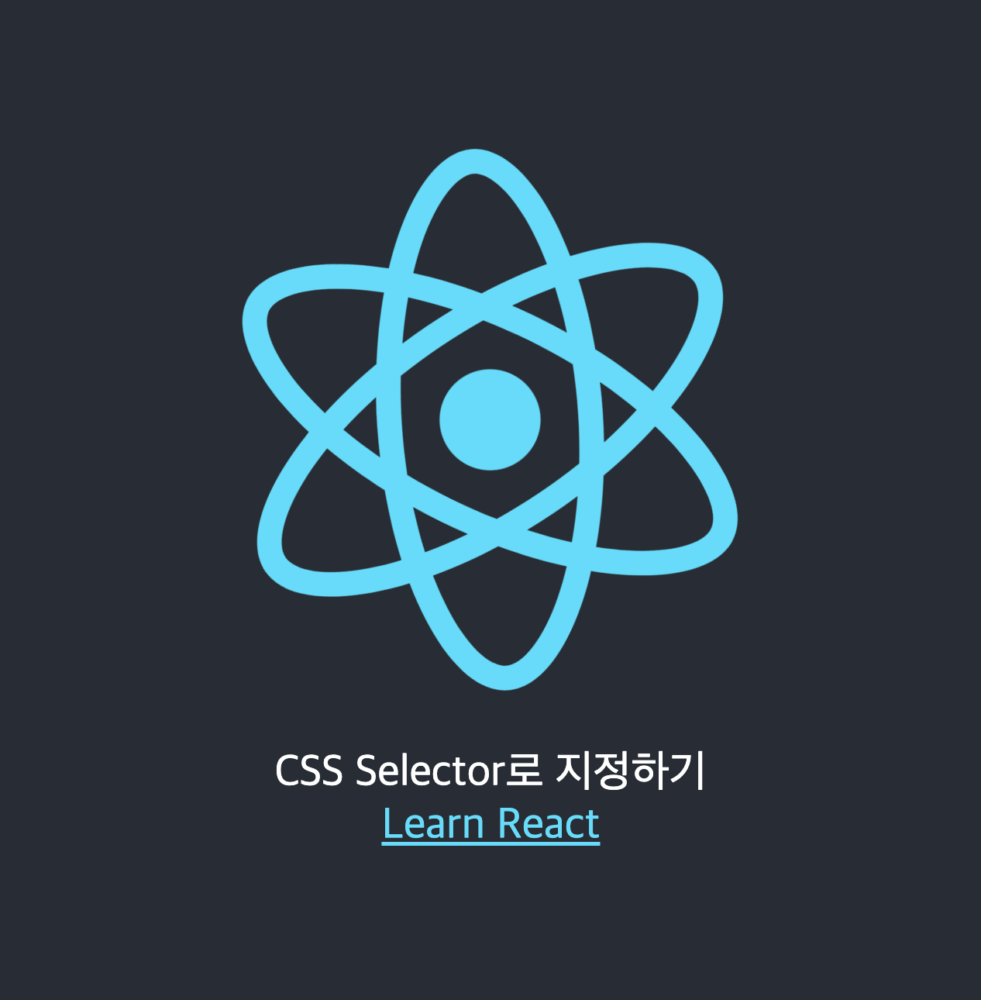
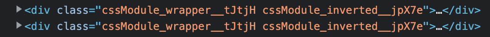
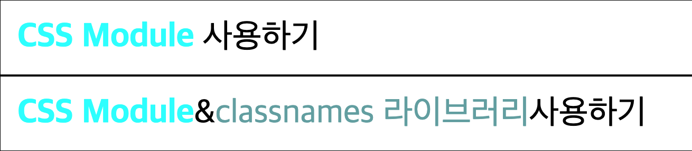
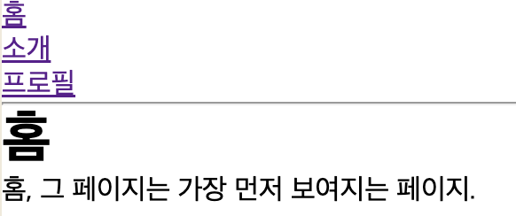
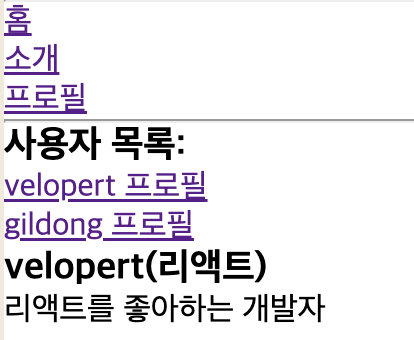

# 리액트를 다루는 기술

22.05.10 박찬우

<br/>

>> ## _컴포넌트 스타일링_

### 1) CSS

- 컴포넌트 스타일링 하는 `가장 기본적인 방식`이다.
- 클래스 이름을 지을 때 일종의 규칙을 준수하여 해당 클래스가 어디에서 어떤 용도로 사용되는지 명확하게 작성하는 방식을 `BEM 네이밍`이라고 한다.(ex_ `.card__title-primary`)
  - 자기만의 규칙을 만들거나 메이저 업체의 코딩 규칙 문서를 참고하는 것도 좋은 방법이다.
  
#### `Inline 방식으로 사용하기`

- 변수로 정의된 CSS 참조
  - css 구조를 `JSON 형태`로 작성한다.
  - 단위가 포함된 수치값의 경우 문자열로 표기, 한쌍의 속성-값 뒤에는 세미콜론이 아닌 콤마를 사용해야한다.
  - css 속성 이름은 자바스크립트의 프로퍼티 이름으로 지정해야 한다. (카멜표기법)
  - Inline 방식을 너무 많이 사용하면 좋지 않다.

App.jsx
```js
import React from "react";

function App() {
  
  // JSON 형태로 작성
  const myStyle = {
    fontWeight : "bold",
    color: "#22b8cf",
    textDecoration: "none",
    marginRight: "10px",
  };

  return (
    <div>
      <h1 style={myStyle}>EXAMPLE</h1>
    </div>
  );
}

export default App;
```
  
- 변수를 사용하지 않고 직접 코딩

```js
import React from "react";

function App() {

  return (
    <div>
      <h1 
        style={{
    	  fontWeight : "bold",
    	  color: "#22b8cf",
    	  textDecoration: "none",
    	  marginRight: "10px",
        }}>EXAMPLE
      </h1>
    </div>
  );
}

export default App;
```

- 중괄호 안에 중괄호를 중첩해서 사용에 주의해야한다. {{...}}
- 추천하는 방법은 아님.


  
#### `CSS 파일을 impot 해서 사용`

- className을 사용하거나 태그를 사용해서 css파일을 작성한다.
- 작성한 css 파일을 참조하여 사용한다.

```js
import './assets/css/css.css';
```

- 외부에 있는 css파일을 참조 할 때는 참조변수 이름을 지정하지 않는다.
- 경로는 상대경로 형식으로 지정한다.

```
* CSS Selector

CSS 클래스가 특정 클래스 내부에 있는 경우에만 스타일을 적용할 수 있다.
또, 태그를 사용하여 클래스 이름이 불필요한 경우에는 생략할 수 있다.
```

Css.jsx
```js
import React from 'react';
import logo from '../logo.svg';
import './assets/css/css.css';

const Css = () => {
  return (
    <div className='App'>
      <header>
        
        <p>
          CSS Selector로 지정하기
        </p>
        <a 
          href='http://reactjs.org' 
          target='_blank'
          rel='noopener noreferrer'
        >Learn React</a>
      </header>
    </div>
  );
};

export default Css;
```

css.css
```css
.App {
  text-align: center;
}

.App .logo {
  animation: App-logo-spin infinite 10s linear;
  height: 40mvin;
  width: 600px;
}

/*
  .App 안에 들어 있는 header
  header 클래스가 아닌 header 태그 자체에 스타일을 적용하기 때문에 .이 생략
*/

.App header {
  background-color: #282c34;
  min-height: 100vh;
  display: flex;
  flex-direction: column;
  align-items: center;
  justify-content: center;
  font-size: calc(10px + 2vmin);
  color: #fff;
}

.App a {
  color: #61dafb;
}

@keyframes App-logo-spin {
  from {
    transform: rotate(0deg);
  }
  to {
    transform: rotate(360deg);
  }
}
```



<br />

### 2) Sass 사용하기

#### `Sass의 개념`

- Sass는 CSS 전처리기로 복잡한 작업을 쉽게 할 수 있도록 해주고, 스타일 코드의 재활용성을 높여 줄 뿐만ㅇ 아니라 코드의 가독성을 높여서 유지 보수를 더욱 쉽개 해준다.
- Sass는 .Sass 확장자와 .Scss 확장자가 있는데, 둘의 차이는 중괄호와 세미콜론을 사용하냐 안하느냐 차이이다.
- 리액트에서 Scss를 사용하려면 컴파일 해주는 패키지를 추가로 설치해줘야 한다.

```
yarn add sass
```

#### `Sass로 스타일링하기`

ScssComponent.scss
```scss
// 다른 scss 파일을 불러올 때는 @import 구문을 사용한다.
@import './utils.scss';

.ScssComponent {
  display: flex;
  background-color: $oc-gray-2;
  @include media('<768px') {
    background-color: $oc-gray-9;
  }

  .box {  // 일반 css에서는 .ScssComponent .box 와 같음
    background: $red;
    cursor: pointer;
    transition: all .3s ease-in;

    // &은 상위 선택자를 가르킨다.
    &.red {  // .red 클래스가 .box와 함께 사용되었을 때
             // 띄어쓰기 하냐 안하냐에 따라 달라진다.
      // 함수 호출
      @include square(1);

      // 변수 사용
      background-color: $red;
    }

    &.orange {
      @include square(2);
      background-color: $orange;
    }

    &.yellow {
      @include square(3);
      background-color: $yellow;
    }

    &.green {
      @include square(4);
      background-color: $green;
    }

    &.blue {
      @include square(5);
      background-color: $blue;

    }

    &.indigo {
      @include square(6);
      background-color: $indigo;
    }

    &.violet {
      @include square(7);
      background-color: $violet;
    }

    &:hover {
      background-color: black;
    }
  }  
}
```

utils.scss
- 다른 scss 파일을 불러올 때는 `@import` 구문을 사용한다.

```scss
@import '~include-media/dist/include-media';
@import '~open-color/open-color';

// 변수 사용하기
$red: #fa5252;
$orange: #fd7e14;
$yellow: #fcc419;
$green: #40c057;
$blue: #339af0;
$indigo: #5c7cfa;
$violet: #7950f2;

// 믹스인 만들기(재사용되는 스타일 블록을 함수처럼 사용할 수 있음)
// 믹스인을 호출한 위치에서 {}안의 스타일 코드가 적용됨
@mixin square($size) {
  $calculate: 32px * $size;
  width: $calculate;
  height: $calculate;
}
```

Scss.jsx
```jsx
import React from 'react';

import './assets/scss/ScssComponent.scss';

const Scss = () => {
  return (
    <div>
      <h1>Scss사용하기 & 라이브러리 불러오기</h1>
      <p>include-media, open-color 사용</p>
      <div className='ScssComponent'>
        <div className='box red' />
        <div className='box orange' />
        <div className='box yellow' />
        <div className='box green' />
        <div className='box blue' />
        <div className='box indigo' />
        <div className='box violet' />
      </div>
    </div>

  );
};

export default Scss;
```


> 마우스를 올리면 색이 변한다.

<br />

### 3) CSS Module

#### `CSS Moudle의 개념`

- Css Module은 CSS를 불러와서 사용할 때 클래스 이름을 고유한 값, 즉 `[파일이름]_[클래스이름]_[해시값]`형태를 자동으로 만들어서 컴포넌트 스타일 클래스 이름이 중첩되는 현상을 방지해 준다.
  - 클래스명이 충돌하는 단점을 극복할 수 있다.
  - 컴포넌트 단위로 스타일을 적용할 때 유용하다.
- CSS Module을 사용하면 클래스 이름을 지을 때 서로 다른 css파일에 같은 클래스 이름이 있어도 서로 다른 값으로 인식하기 때문에 고유성에 대해 고민하지 않아도 된다.



#### `CSS(Scss) Module 파일 작성`

- 별도로 설정해 줄 필요 없이 확장자를 `*.module.css`로 지정해 주기만 하면된다.
  - `Scss`는 확장자만 `*.module.scss`로 바꿔주면 된다.
- 모든 클래스 이름이 자바스크립트 변수화 되기 때문에 클래스 이름을 카멜표기법으로 지정해야 한다.
- 스네이크 표기법도 가능하지만, 스네이크표기법은 []를 사용해서 호출 해야하기 때문에 가급적 카멜표기법으로 쓰는게 좋다.
- id 속성에 의한 접근은 사용할 수 없다.

```
사용 방법은 CSS와 Scss 둘 다 같다.
```

#### `CSS(Scss) Module 사용`

```jsx
import styles from './assets/css/cssModule.module.css';
```

- 외부에 있는 CSS 파일을 참조할 때는 참조변수를 지정하지 않지만, 모듈을 참조할 때는 참조변수를 지정한다.

```html
<div className={styles.wrapper}></div>
```

- 클래스에 적용시킬 때는 변수를 호출하는 것 처럼 CSS Module 클래스명을 호출하면 된다.
- css 클래스 이름이 멤버변수로 인식 되므로 클래스 이름을 카멜표기법으로 지정해야한다.
  - 스테이크 표기법은을 호출할 때는 styles['클래스이름'] 형식으로 적용한다.

```jsx
// 백틱 사용
<div className={`${styles.wrapper} ${styles.inverted}`}></div>

// 배열 사용
<div className={[styles.wrapper, styles.inverted].join(' ')}></div>
```

- 여러개의 클래스를 적용할 때는 `백틱(``)`을 사용하거나 배열로 구성한 후 `join 함수`로 결합한다.

#### `classnames 라이브러리`

- CSS클래스를 조건부로 설정할 때 유용한 라이브러리이다.

```jsx
import classNames from 'classnames';

const MyComponent = ({hightlighted, theme}) => (
  <div className={classNames('MyComponent', {highlighted}, theme)} >Hello</div>
);

// 삼항연산자
const MyComponent = ({hightlighted, theme}) => (
  <div className={`MyComponent ${theme} ${hightlighted ? 'hightlighted' : ''}}`} >Hello</div>
);
```

- props 값이 존재할 때만 props에 저장된 값이 class 이름으로 사용된다.

#### `bind 함수사용`

- CSS Module을 사용할 때 클래스를 여러개 설정하거나, 조건부로 클래스를 설정할 때 bind 함수를 사용하면 편리하게 작성할 수 있다.
  
cssModule.module.css
```css
/* 자동으로 고유해질 것이므로 흔히 사용되는 단어를 클래스 이름으로 마음대로 사용가능 */

.wrapper {
	background: black;
	padding: 1rem;
	color: #fff;
	font-size: 2rem;
}

.inverted {
	color: #000;
	background-color: #fff;
	border: 1px solid #000;
}

/* 글로벌 css 를 작성하고 싶다면? */
:global .something {
	font-weight: 800;
	color: aqua;
}

.new {
	color: cadetblue;
}
```

CssModule.jsx
```jsx
import React from 'react';
import styles from './assets/css/cssModule.module.css';
import classNames from 'classnames/bind';

const cx = classNames.bind(styles);  // 미리 styles에서 클래스를 받아 오도록 설정

const CssModule = () => {
  return (
    <div>
      <h1>CSS Module 사용하기 & classnames 라이브러리 활용</h1>

      {/* TODO: 모듈에서 클래스 이름 2개 이상 사용하는 방법 */}
      <div className={`${styles.wrapper} ${styles.inverted}`}>
        <span className='something'>CSS Module</span> 사용하기
      </div>

      {/* TODO: classnames 라이브러리 활용 */}
      <div className={cx('wrapper', 'inverted')}>
        <span className='something'>CSS Module</span>& 
          <span className={cx('new')}>classnames 라이브러리</span>
        사용하기
      </div>
    </div>
  );
};

export default CssModule;
```



<br />

### 4) Styled Components

#### `styled Components의 개념`

- 컴포넌트 코드 안에서 CSS(SCSS) 문법을 적용한 컴포넌트를 직접 정의하는 것이다.
- 즉, 자바스크립트 안에서 CSS를 사용할 수 있도록 도와주는 프레임워크이다. (CSS-in-JS)
- React 컴포넌트에 특정 스타일링을 할 수 있기 때문에 재사용성을 높일 수 있고, 자바스크립트에 영향을 받는 스타일링을 간편하게 구현할 수 있다.
- styled components는 현존하는 CSS-in-JS 라이브러리 중에 가장 널리 사용되고 있는 라이브러리이다.

#### `패키지 설치`

```
yarn add styled-components
```

#### `스타일에서 props 조회하기`

StyledComponents.jsx
```jsx
import React from 'react';
import styled, { css } from 'styled-components';

const Box = styled.div`
  /* props로 넣어 준 값을 직접 전달해 줄 수 있다. */
  background-color: ${props => props.color || 'blue'}; // props 값이 있으면 그 값을 지정하거나 없다면 blue
  padding: 1rem;
  display: flex;
`;

// 하나의 컴포넌트
const Button = styled.button`
  background-color: #fff;
  color: #000;
  border-radius: 4px;
  padding: .5rem;
  display: flex;
  align-items: center;
  justify-content: center;
  box-sizing: border-box;
  font-size: 1rem;
  font-weight: 600;

  &:hover {
    background-color: rgba(255, 255, 255, .9);
  }

  // inverted 값이 true 일때 특정 스타일 부여
  ${props => props.inverted && 
    css`
      background: none;
      border: 2px solid #fff;
      color: #fff;

      &:hover {
        background-color: #fff;
        color: #000;
      }
    `};
  & + button {
    margin-left: 1rem;
  }    
`;

const StyledEx1 = () => {
  return (
    <Box color='black'>
      <Button>안녕하세요</Button>
      <Button inverted={true}>테두리만</Button>
    </Box>
  );
};

export default StyledEx1;
```


<br />
<br />

>> ## _13장 리액트 라우터로 SPA 개발하기_

### 1) Single Page Application의 개념

- 하나의 HTML 페이지로 다수의 페이지 효과를 내는 구현 방식을 말한다.
- js 파일로 웹 페이지 화면을 변경하는 형태로 구현된다.
- Single Page Application을 줄여서 SPA 라고 부르기도 한다.
- Router를 활용해서 페이지를 구현한다.

```
※ Router

- 분배하는 기능을 수행하는 소프트웨어나 하드웨어를 말한다. (대표적인 하드웨어로는 공유기가 있다)
- 리액트에서 Router는 URL에 의해 컴포넌트를 분배하는 기능을 말한다.
- HTML에서 자바스크립트에 추가된 기능 중 history 객체를 통해 URL을 변조하는 기능이 있다.
- 리액트의 Router는 이 기능을 활용하여 현재 페이지의 URL을 다양하게 변조하여 각각의 컴포넌트를 분배한다.
```

#### `장점`

- 페이지 이동 없이 JS에 의해 화면이 갱신되므로 실제로 네트워크 통신이 발생하지 않아 실행 속도가 빠르다.
- 웹 어플리케이션에 필요한 모든 정적 리소스를 최조에 한번만 다운로드 한다.
  - 이후 새로운 페이지 요청 시, 페이지 갱신에 필요한 데이터만 받기 때문에 전체적인 트래픽 감소

#### `단점`

- 서버가 해야할 일을 자바스크립트가 대신 하다보니 JS코드가 비대해 질 수 있다. (코드 스플리팅 기법으로 해결 가능, 코드 분할 작성)
- 하나의 HTML이므로 SEO(Search Engin Optimization)에 취약하다. (서버사이드 렌더링으로 해결 가능)

```
※ 검색엔진 최적화(SEO)

- 검색엔진이 이해하기 쉽도록 홈페이지의 구조와 페이지를 개발해 검색 결과를 상위에 노출될 수 있도록 하는 작업이다.
- 기본적인 작업 방식은 특정 검색어를 웹페이지에 적절하게 배치하고 다른 웹페이지에서 링크가 많이 연결되도록 하는 것이다.
```

<br />

### 2) Router 사용하기

#### `추가 패키지 설치하기`

```
yarn add react-router-dom
```

- SAP 앱을 만들 때 사용한다.
- URL에 따라 실행한 자바스크립를 분기해준다.
- 세가지 비슷한 패키지가 존재하며, 각각 용도가 다르다.
  - react-router : 웹 & 앱
  - react-router-dom : 웹
  - react-router-native : 앱

#### `Router 적용하기`

index.js

- 상단에 위의 import 구문을 추가한다.
  
```js
import { BrowserRouter } from "react-router-dom";
```

- .render 구문에 `<BrowserRouter>` 태그를 추가한다.
  - history API를 사용해 URL과 UI를 동기화 하는 라우터.

```js
const root = ReactDOM.createRoot(document.getElementById('root'));
root.render(
  <React.StrictMode>
  
    <BrowserRouter>     // BrowserRouter 태그 추가
      <App />
    </BrowserRouter>
    
  </React.StrictMode>
);
```

- 라우터를 적용할 페이지에 아래 import 구문을 추가한다.

```jsx
import { Link, Routes, Route } from 'react-router-dom';
```

- Link : "a" 태그와 비슷하지만, a태그는 클릭시 페이지를 새로 불러오기 때문에 사용하지 않는다.
  - to 속성에 설정된 링크로 이동하고, 기록이 history 스택에 저장된다.
- Routes : 컴포넌트는 여러 Route를 감싸서 그 중 규칙이 일치하는 라우트 하나만을 렌더링 시켜주는 역할을 한다.
- Route : 컴포넌트의 속성에 설정된 URL과 현재 경로가 일치하면 해당하는 컴포넌트, 함수를 렌더링한다.
  - path 속성에 경로, element 속성에는 컴포넌트를 넣어준다. 여러 라우팅을 매칭하고 싶은 경우 URL 뒤에 " /* "을 사용한다.

<br />

### 3) 페이지 만들기

Home.jsx
```jsx
import React from 'react';

const Home = () => {
  return (
    <div>
      <h1>홈</h1>
      <p>홈, 그 페이지는 가장 먼저 보여지는 페이지.</p>
    </div>
  );
};

export default Home;
```

About.jsx
```jsx
import React from 'react';

const About = () => {
  return (
    <div>
      <h1>소개</h1>
      <p>이 프로젝트는 리액트 라우터 기초를 실습해 보는 예제 프로젝트입니다.</p>
    </div>
  );
};

export default About;
```

UseSpa.jsx
```jsx
import React from 'react';
import { NavLink, Routes, Route } from 'react-router-dom';

import Home from './components/Home';
import About from './components/About';
import Params from './Params';

const UseSpa = () => {
  return (
    <div>

      <ul>
        <li><NavLink to='home'>홈</NavLink></li>
        <li><NavLink to='about'>소개</NavLink></li>
      </ul>

      <hr />
      
      <Routes>
        <Route path='home' exact={true} element={<Home/>} />

        {/* path를 여러개 설정 가능 */}
        <Route path='about' element={<About/>} />
        <Route path='info' element={<About/>} />
      </Routes>
      
    </div>
  );
};

export default UseSpa;
```




<br />

### 4) 파라미터 사용

Params.jsx
```jsx
import React from 'react';
import { NavLink, Routes, Route } from 'react-router-dom';

import Profile from './components/Profile';

const Params = () => {
  return (
    <div>
      <h3>사용자 목록: </h3>
      <ul>
        <li><NavLink to='profile/velopert'>velopert 프로필</NavLink></li>
        <li><NavLink to='profile/gildong'>gildong 프로필</NavLink></li>
      </ul>
      
      <Routes>
        <Route path='profile/:username' element={<Profile />} />
      </Routes>
    </div>
  );
};

export default Params;
```

- 파라미터는 일반적으로 특정 아이디 혹은 이름을 사용하여 조회할 때 사용한다.
- 파라미터 예시 : /profile/velopert
- `<Route>`의 path 경로에 id 값을 지정해 준다.
  - `<Route path='profile/:username' element={<Profile />} />`
  - 여기서는 `/:username`이 id 값 역할을 한다.

Profile.jsx
```jsx
import React from 'react';
import { useParams } from 'react-router-dom';

const data = {
  velopert: {
    name: '리액트',
    description: '리액트를 좋아하는 개발자',
  },
  gildong: {
    name: '홍길동',
    description: '고전 소설 홍길동전의 주인공',
  }
}

const Profile = () => {
  const {username} = useParams();
  const profile = data[username];

  if(!profile) {
    return <div>존재하지 않는 사용자입니다.</div>;
  }

  return (
    <div>
      <h3>{username}({profile.name})</h3>
      <p>{profile.description}</p>
    </div>
  );
};

export default Profile;
```

- 컴포넌트 내에 useParams( )를 선언하고, id값(파라미터)을 호출한다. (클릭하는 <Link> 경로의 파라미터값을 받아온다)
- 호출한 id값을 날씨정보 데이터 객체에 매치 시켜(key) 배열을 비구조문법으로 변수에 호출하고(value) JSX에서 변수값을 사용한다.


<br />

### 5) 서브 라우트

useSpa.jsx
```jsx
import React from 'react';
import { NavLink, Routes, Route } from 'react-router-dom';

import Home from './components/Home';
import About from './components/About';
import Params from './Params';

const UseSpa = () => {
  return (
    <div>

      <ul>
        <li><NavLink to='home'>홈</NavLink></li>
        <li><NavLink to='about'>소개</NavLink></li>
        <li><NavLink to='profiles'>프로필</NavLink></li>
      </ul>

      <hr />
      
      <Routes>
        <Route path='home' exact={true} element={<Home/>} />

        {/* path를 여러개 설정 가능 */}
        <Route path='about' element={<About/>} />
        <Route path='info' element={<About/>} />

        {/* 서브라우트 사용 */}
        <Route path='profiles/*' element={<Params />} />
      </Routes>
      
    </div>
  );
};

export default UseSpa;

```




<br />

### 6) 정리

- 리액트 라우터는 주소 경로에 따라 다양한 페이지를 보여주는 방법이다.
- 큰 큐모의 프로젝트를 진행하면 최종 결과물인 자바스크립트 파일의 크기가 매우 커진다.
  - 이는 코드 스플리팅으로 해결할 수 있다.
