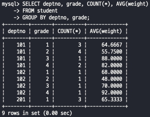
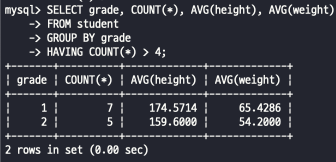
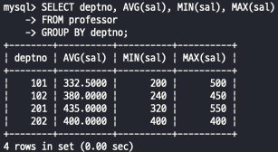
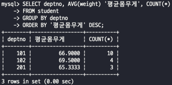
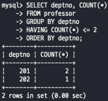
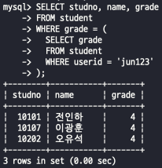
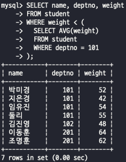
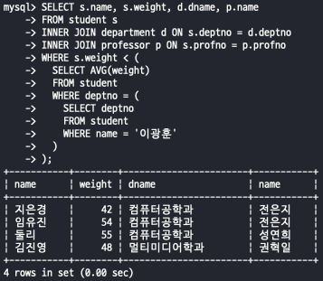
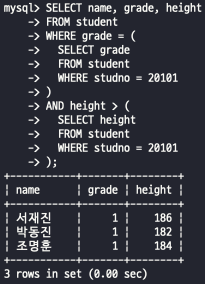
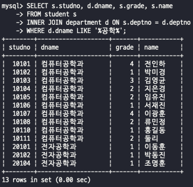

# SQL활용 시험

> 2022-06-21

## 문항1

### 1) 학생 테이블에서 전체 학생을 소속 학과별로 나누고, 같은 학과 학생은 다시 학년별로 그룹핑하여, 학과와 학년별로 인원수, 평균 몸무게를 출력하시오.

 

### 2) 학생 수가 4명 초과인 학년에 대해서 학년, 학생 수, 평균 키, 평균 몸무게를 출력하시오.

 

### 3) 학과별로 학과 번호, 교수들의 평균 급여, 최소 급여, 최대 급여를 출력하여라.

 

### 4) 학과별로 학과번호, 평균 몸무게, 학생수를 출력하되 평균 몸무게의 내림차순으로 정렬하시오.

 

### 5) 학과별 교수 수가 2명 이하인 학과의 학과 번호, 교수 수를 학과번호 순으로 정렬하여 출력 하세요.

 

---

## 문항2

### 1) 아이디가 ‘jun123’인 학생과 같은 학년인 학생의 학번, 이름, 학년을 조회 하시오

 

### 2) 101번 학과 학생들의 평균 몸무게보다 몸무게가 적은 학생의 이름, 학과번호, 몸무게를 조회하시오.

 

### 3) ‘이광훈 학생’과 같은 학과의 학생들에 대한 평균 몸무게보다 몸무게가 적게 나가는 학생들의 이름, 몸무게, 소속학과 이름, 담당교수 이름을 조회하시오.(담당교수가 없는 학생은 출력되지 않습니다.)

 

### 4) 20101번 학생과 같은 학년이고, 20101번 학생의 키보다 큰 키를 갖는 학생의 이름, 학년, 키를 조회하시오.

 

### 5) 학과 이름에 ‘공학’이라는 단어를 포함하고 있는 학과에 재학중인 학생의 학번, 학과 이름, 학년, 학생이름을 조회하시오.

