# SQL응용 시험

> 2022-06-28

## [문항1] 위 영화 관리 시스템의 ERD를 작성하고 그 결과 이미지를 제출하시오. 테이블 이름과 컬럼 이름은 직접 영문으로 정의해야 합니다.

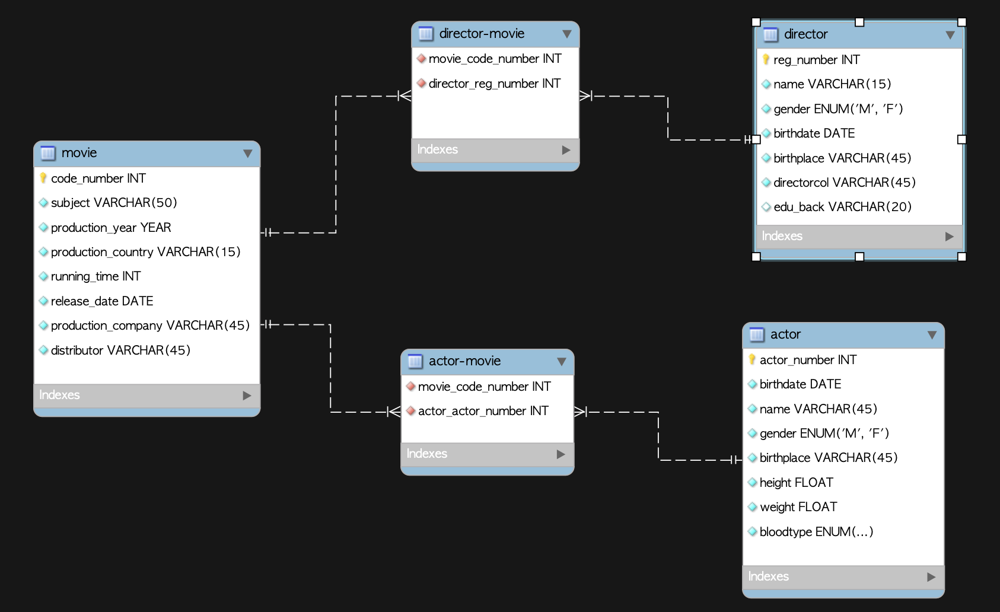

 
 

## [문항2] 문제 1의 ERD에 대한 물리 저장소를 생성하기 위한 DDL을 작성하시오.

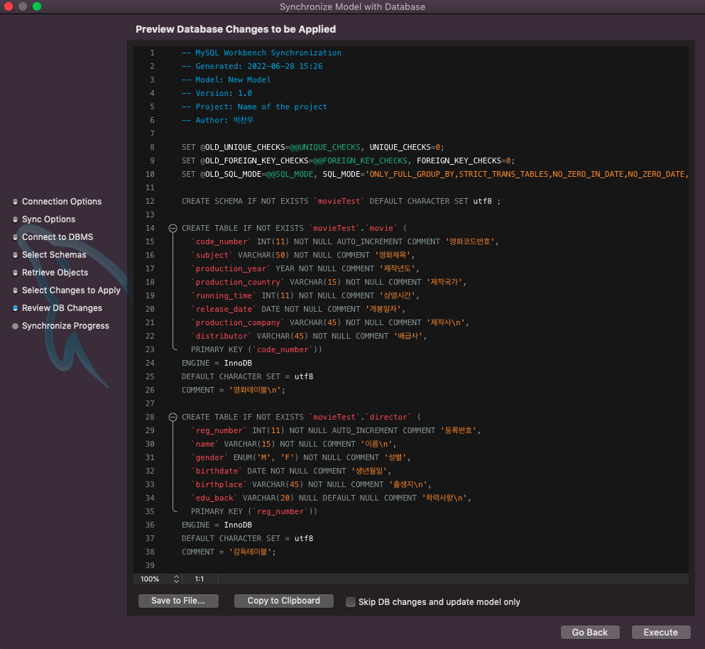
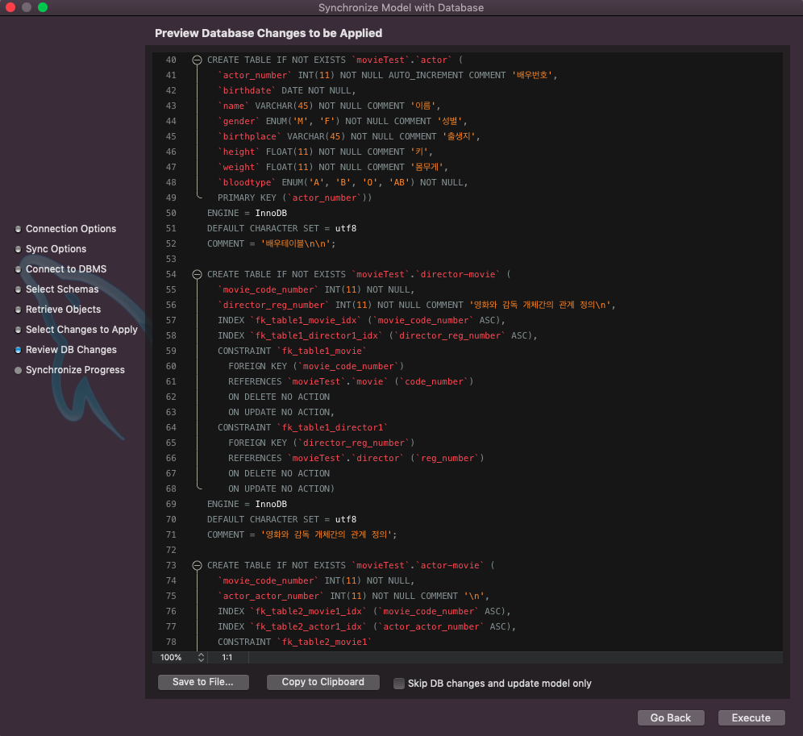

 
 

## [문항3] 문제 1의 ERD에 대한 테이블 명세서를 작성하시오.

#### director 테이블

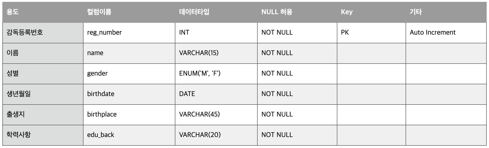

#### movie 테이블

#### actor 테이블

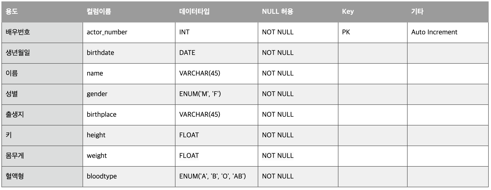

#### director_movie 테이블

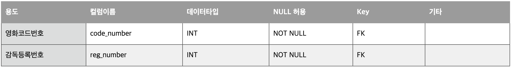

#### actor_movie 테이블

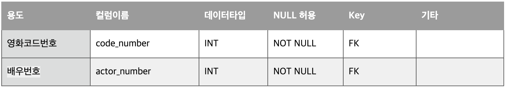

 
 

## [문항4] 문제 1의 스키마를 참조하여 다음 정보를 출력하기 위한 SQL문을 작성하시오. 조회에 필요한 데이터는 본인이 직접 가상의 데이터를 입력해야 합니다.

### 데이터 생성

`movie`

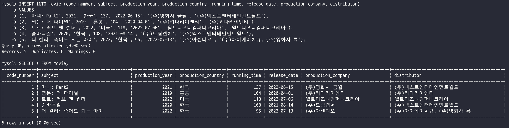

`director`

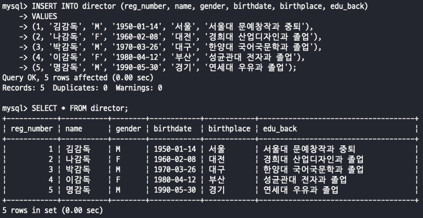

`actor`

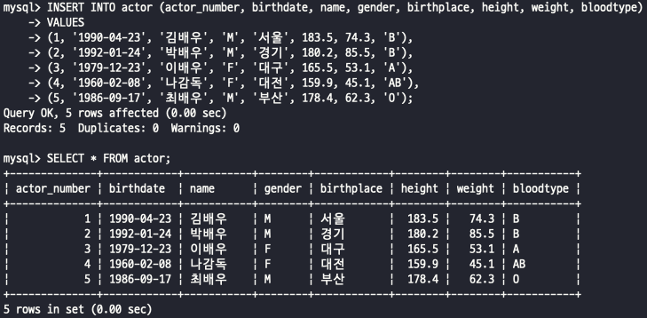

`director_movie`

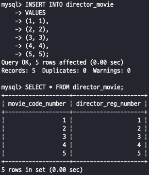

`actor_movie`

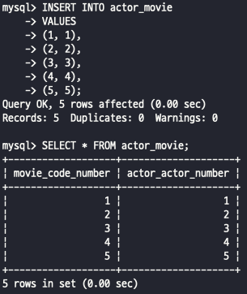

 

### [문항4-1]

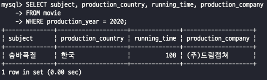

### [문항4-2]

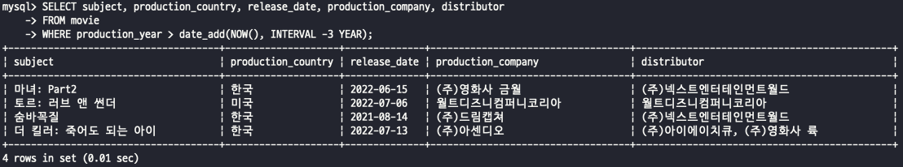

### [문항4-3]

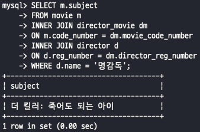

### [문항4-4]

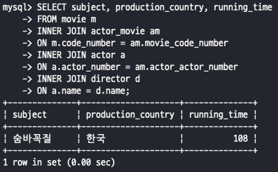