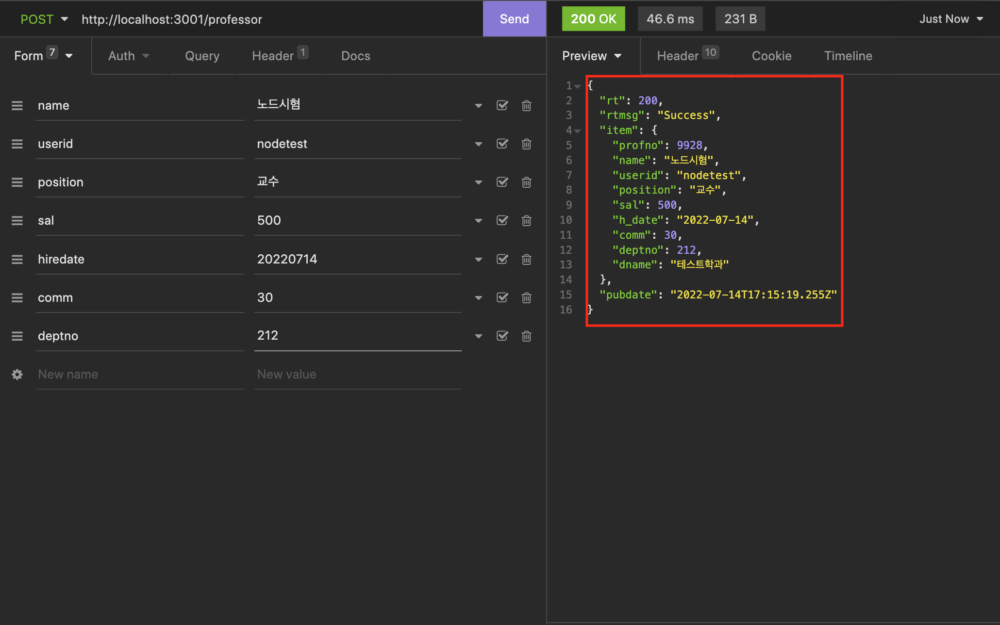
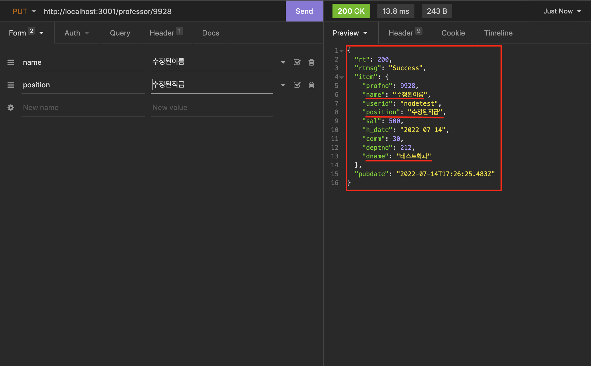
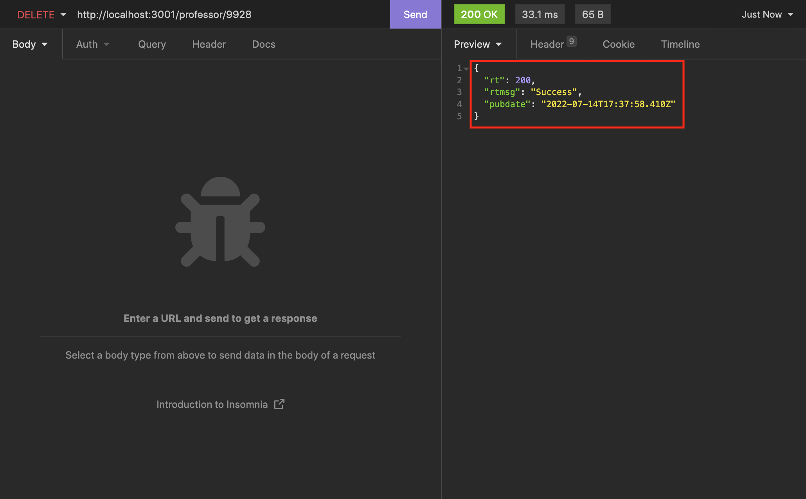
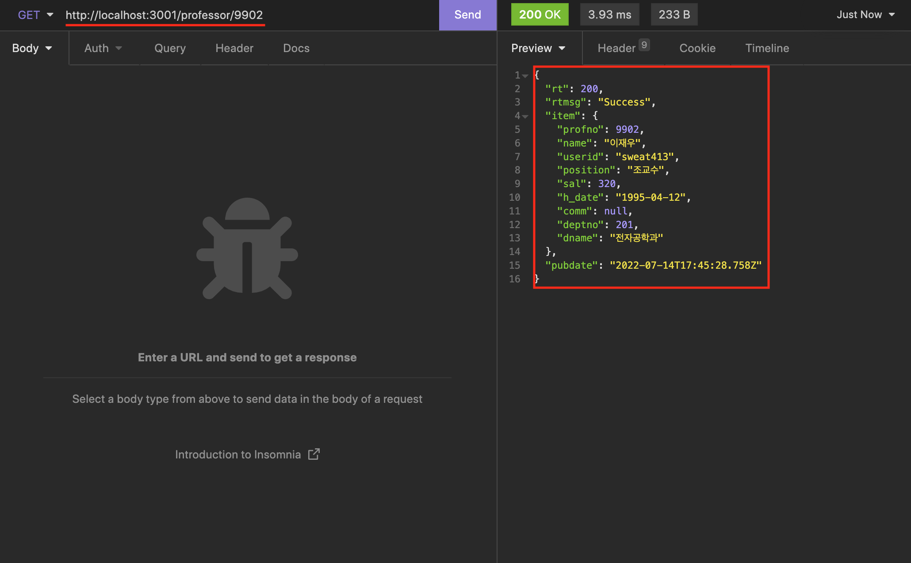
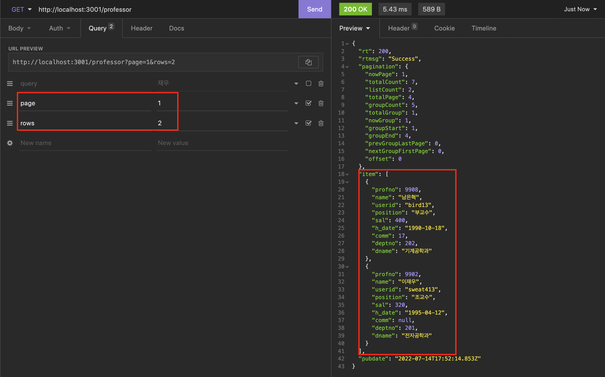
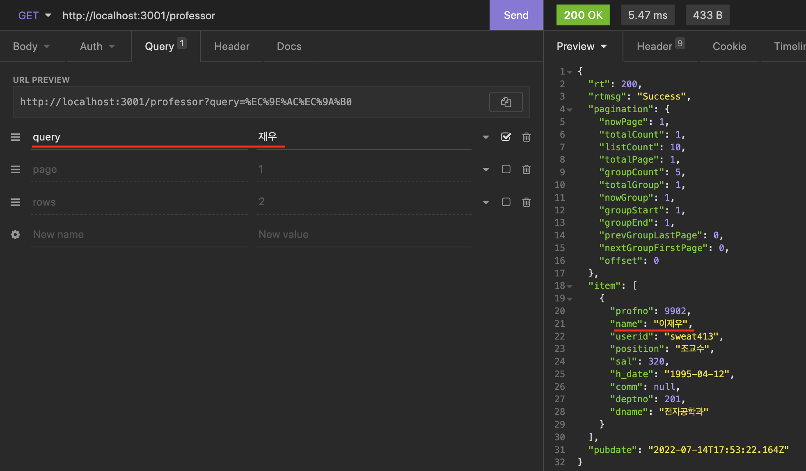

# 소스코드

### `- app.js`

```js
/**
 * @filename: app.js
 * @author: 박찬우
 * @description: - express 객체 생성 및 추가 설정
 *               - 사용할 백엔드 정의
 *               - 서버 구동
 */

/** 패키지 참조 */
import express from 'express';
import path from 'path';
import dotenv from 'dotenv';
import bodyParser from 'body-parser';
import methodOverride from 'method-override';
import useragent from 'express-useragent';
import cors from 'cors';

// helper 참조
import WebHelper from './helper/WebHelper.js';
import DBPool from './helper/DBPool.js';
import logger from './helper/logHelper.js';

// 예외처리 클래스 참조
import PageNotFoundException from './exception/PageNotFoundException.js';

// 컨트롤러 참조
import ProfessorController from './controller/ProfessorController.js';

/** Express 객체 생성 */
const app = express();

/** 보안성을 높이기 위한 config.env 파일 참조 */
const __dirname = path.resolve();
dotenv.config({ path: path.join(__dirname, '../config.env') });

/** 클라이언트 접속에 따른 이벤트 */
// 클라이언트의 접속을 감지
app.use(useragent.express());

app.use((req, res, next) => {
  logger.debug('클라이언트가 접속했습니다.');

  res.on('finish', () => {
    logger.debug('클라이언트의 접속이 종료 되었습니다.');
  });

  next();
});

// Crtl+C를 눌렀을 때의 이벤트
process.on('SIGINT', () => {
  process.exit();
});

// 프로그램이 종료될 때의 이벤트
process.on('exit', () => {
  DBPool.close();
  logger.debug('- - - - - - - - Server is Closed - - - - - - -');
});

/** express 객체 추가 설정 */
// cors
app.use(cors());

// WebHelper
app.use(WebHelper());

// POST 파라미터 수신 모듈 설정
app.use(bodyParser.urlencoded({ extended: true }));
app.use(bodyParser.text()); // TEXT형식의 파라미터 수신 가능
app.use(bodyParser.json()); // JSON형식의 파라미터 수신 가능

// HTTP PUT, DELETE 전송방식 확장
// 브라우저 개발사들이 PUT, DELETE 방식으로 전송하는 HTTP Header 이름
app.use(methodOverride('X-HTTP-Method'));
app.use(methodOverride('X-HTTP-Method-Override'));
app.use(methodOverride('X-Method-Override'));

/** URL별 백엔드 정의 */
app.use(ProfessorController());

// 컨트롤러에서 에러 발생이 next(에러객체)를 호출했을 때 동작할 처리 //
app.use((err, req, res, next) => res.sendError(err));

// 앞에서 정의하지 않은 기타 URL에 대한 일괄 처리 (무조건 맨 마지막에 정의해야 함) //
app.use('*', (req, res, next) => res.sendError(new PageNotFoundException()));

/** 서버 구동 */
app.listen(process.env.PORT, () => {
  logger.debug('-----------------------------------');
  logger.debug('|       Start Express Server      |');
  logger.debug('-----------------------------------');
  logger.debug('- - - - - - - - - - - - - - - - - -');
});
```

<br />

## [문항1] 교수의 데이터를 생성하기 위한 API를 구현하고 작성한 SQL Mapper, Service Layer, Controller의 소스코드를 제시하고 Insomnia로 테스트한 실행결과를 제출하시오.

- ProfessorController.js

```js
/**
 * @filename: ProfessorController.js
 * @author: 박찬우
 * @description: 프론트엔드로 부터 교수 데이터를 생성하기 위해 받은 값을 유효성 검사 후 service 계층에 보내고, 결과를 반환 받아 다시 프론트엔드에 보내준다. 
 */

router.post(url, async (req, res, next) => {
  // 파라미터 받기
  const name = req.post('name');
  const userid = req.post('userid');
  const position = req.post('position');
  const sal = req.post('sal');
  const hiredate = req.post('hiredate');
  const comm = req.post('comm');
  const deptno = req.post('deptno');

  // 유효성 검사
  try {
    RegexHelper.value(name, '이름을 입력해주세요');
    RegexHelper.value(userid, '아이디를 입력해주세요');
    RegexHelper.value(position, '직급을 입력해주세요');
    RegexHelper.value(sal, '급여를 입력해주세요');
    RegexHelper.value(hiredate, '입사일을 입력해주세요');
    RegexHelper.value(comm, '수당을 입력해주세요');
    RegexHelper.value(deptno, '학과번호를 입력해주세요');
  } catch (err) {
    return err;
  }

  // 데이터 저장
  let json = null;

  try {
    json = await ProfessorService.addItem({
      name: name,
      userid: userid,
      position: position,
      sal: sal,
      hiredate: hiredate,
      comm: comm,
      deptno: deptno,
    });
  } catch (err) {
    return next(err);
  }

  res.sendResult({ item: json });
});
```

<br />

- ProfessorService.js

```js
/**
 * @filename: ProfessorService.js
 * @author: 박찬우
 * @description: 데이터 생성을 위해 controller에서 받은 파라미터 값을 ProfessorMapper.xml에 작성된 쿼리문과 합쳐 하나의 쿼리문을 도출한다.
 */

async addItem(params) {
  let dbcon = null;
  let data = null;

  try {
    dbcon = await DBPool.getConnection();

    let sql = MybatisMapper.getStatement('ProfessorMapper', 'insertItem', params);
    let [{ insertId, affectedRows }] = await dbcon.query(sql);

    if(affectedRows === 0) {
      throw new RuntimeException('저장된 데이터가 없습니다.');
    }

    // 새로 저장된 데이터의 PK값을 활용하여 다시 조회
    sql = MybatisMapper.getStatement('ProfessorMapper', 'selectItem', {profno: insertId});
    let [result] = await dbcon.query(sql);

    if(result.length === 0) {
      throw new RuntimeException('저장된 데이터를 조회할 수 없습니다.');
    }

    data = result[0];

  } catch (err) {
    throw err;
  } finally {
    if(dbcon) dbcon.release();
  }

  return data;
};
```

<br />

- ProfessorMapper.xml

```html
/**
 * @filename: ProfessorMapper.xml
 * @author: 박찬우
 * @description: mybatis를 통해 교수 데이터를 생성하기 위한 쿼리문 작성
 */

<mapper namespace="ProfessorMapper">
  <!-- 교수 데이터 생성 -->
  <insert id="insertItem">
    INSERT INTO professor (name, userid, position, sal, hiredate, comm, deptno) VALUES
    (#{name}, #{userid}, #{position}, #{sal}, #{hiredate}, #{comm}, #{deptno});
  </insert>
</mapper>
```

<br />

- 실행결과



<br />

## [문항2] 교수의 데이터를 수정하기 위한 API를 구현하고 작성한 SQL Mapper, Service Layer, Controller의 소 스코드를 제시하고 Insomnia로 테스트한 실행결과를 제출하시오.

- ProfessorController.js

```js
/**
 * @filename: ProfessorController.js
 * @author: 박찬우
 * @description: 프론트엔드로 부터 교수 데이터를 수정하기 위해 받은 값을 유효성 검사 후 service 계층에 보내고, 결과를 반환 받아 다시 프론트엔드에 보내준다. 
 */

router.put(`${url}/:profno`, async (req, res, next) => {
  // 파라미터 받기
  const profno = req.get('profno');
  const name = req.put('name');
  const position = req.put('position');

  // 유효성 검사
  try {
    RegexHelper.value(profno, '교수번호가 없습니다.');
    RegexHelper.value(name, '이름이 없습니다.');
    RegexHelper.value(position, '직급이 없습니다.');
  } catch (err) {
    return err;
  }

  // 데이터 저장
  let json = null;

  try {
    json = await ProfessorService.editItem({
      profno: profno,
      name: name,
      position: position,
    });
  } catch (err) {
    return next(err);
  }

  res.sendResult({ item: json });
});
```

<br />

- ProfessorService.js

```js
/**
 * @filename: ProfessorService.js
 * @author: 박찬우
 * @description: 데이터 조회을 위해 controller에서 받은 파라미터 값을 ProfessorMapper.xml에 작성된 쿼리문과 합쳐 하나의 쿼리문을 도출한다.
 */

async editItem(params) {
  let dbcon = null;
  let data = null;

  try {
    dbcon = await DBPool.getConnection();

    let sql = MybatisMapper.getStatement('ProfessorMapper', 'updateItem', params);
    let [{affectedRows}] = await dbcon.query(sql);

    if(affectedRows === 0) {
      throw new RuntimeException('저장된 데이터가 없습니다.');
    }

    // 새로 저장된 데이터의 PK값을 활용하여 다시 조회
    sql = MybatisMapper.getStatement('ProfessorMapper', 'selectItem', {profno: params.profno});
    let [result] = await dbcon.query(sql);

    if(result.length === 0) {
      throw new RuntimeException('저장된 데이터를 조회할 수 없습니다.');
    }

    data = result[0];
  } catch(err) {
    throw err;
  } finally {
    if(dbcon) dbcon.release();
  }

  return data;
};
```

<br />

- ProfessorMapper.xml

```html
/**
 * @filename: ProfessorMapper.xml
 * @author: 박찬우
 * @description: - mybatis를 통해 교수 데이터를 수정하기 위한 쿼리문 작성
 *               - 이름과 직급만 수정
 */

<mapper namespace="ProfessorMapper">
  <!-- 교수 데이터 수정 -->
  <update id="updateItem">
    UPDATE professor SET name=#{name}, position=#{position}
    WHERE profno=#{profno};
  </update>
</mapper>
```

<br />

- 실행결과



<br />

## [문항3] 교수의 데이터를 삭제하기 위한 API를 구현하고 작성한 SQL Mapper, Service Layer, Controller의 소 스코드를 제시하고 Insomnia로 테스트한 실행결과를 제출하시오.

- ProfessorController.js

```js
/**
 * @filename: ProfessorController.js
 * @author: 박찬우
 * @description: 프론트엔드로 부터 교수 데이터를 삭제하기 위해 받은 값을 유효성 검사 후 service 계층에 보내고, 결과를 반환 받아 다시 프론트엔드에 보내준다. 
 */

router.delete(`${url}/:profno`, async (req, res, next) => {
  // 파라미터 받기
  const profno = req.get('profno');

  // 유효성 검사
  try {
    RegexHelper.value(profno, '교수번호가 없습니다.');
  } catch(err) {
    return(err);
  };

  try {
    await ProfessorService.deleteItem({
      profno: profno,
    });
  } catch(err) {
    console.log(err);
    return next(err);
  }

  res.sendResult();
});
```

<br />

- ProfessorService.js

```js
/**
 * @filename: ProfessorService.js
 * @author: 박찬우
 * @description: 데이터 삭제를 위해 controller에서 받은 파라미터 값을 ProfessorMapper.xml에 작성된 쿼리문과 합쳐 하나의 쿼리문을 도출한다.
 */

async deleteItem(params) {
  let dbcon = null;

  try {
    dbcon = await DBPool.getConnection();

    let sql = MybatisMapper.getStatement('StudentMapper', 'deleteItemByprofno', params);
    let [{affectedRows}] = await dbcon.query(sql);

    sql = MybatisMapper.getStatement('ProfessorMapper', 'deleteItem', params);
    [{affectedRows}] = await dbcon.query(sql);

  
    if(affectedRows === 0) {
      throw new RuntimeException('삭제된 데이터가 없습니다.');
    }

  } catch(err) {
    throw err;
  } finally {
    if(dbcon) dbcon.release();
  }
};
```

<br />

- ProfessorMapper.xml

```html
/**
 * @filename: ProfessorMapper.xml
 * @author: 박찬우
 * @description: mybatis를 통해 교수 데이터를 삭제하기 위한 쿼리문 작성
 */

<mapper namespace="ProfessorMapper">
  <!-- 데이터 삭제를 위한 기능 정의 -->
  <delete id="deleteItem">
    DELETE FROM professor WHERE profno=#{profno};
  </delete>
</mapper>
```

- StudentMapper.xml

```html
/**
 * @filename: StudentMapper.xml
 * @author: 박찬우
 * @description: student 테이블에 참조된 교수번호 삭제
 */

<mapper namespace="StudentMapper">

  <delete id="deleteItemByprofno">
    DELETE FROM student WHERE profno=#{profno};
  </delete>
</mapper>
```

<br />

- 실행결과



<br />

## [문항4] 한명의 교수의 데이터를 조회하기 위한 API를 구현하고 작성한 SQL Mapper, Service Layer, Controller의 소스코드를 제시하고 Insomnia로 테스트한 실행결과를 제출하시오.

- ProfessorController.js

```js
/**
 * @filename: ProfessorController.js
 * @author: 박찬우
 * @description: 프론트엔드로 부터 한명의 교수 데이터를 조회하기 위해 받은 값을 유효성 검사 후 service 계층에 보내고, 결과를 반환 받아 다시 프론트엔드에 보내준다. 
 */

router.get(`${url}/:profno`, async (req, res, next) => {
  // 파라미터 받기
  const profno = req.get('profno');

  // 파라미터 유효성검사
  try {
    RegexHelper.value(profno, '교수번호가 없습니다.');
    RegexHelper.num(profno, '교수번호가 잘 못 되었습니다.');
  } catch (err) {
    return next(err);
  }

  // 데이터 조회
  let json = null;

  try {
    json = await ProfessorService.getItem({
      profno: profno,
    });
  } catch (err) {
    return next(err);
  }

  res.sendResult({ item: json });
});
```

<br />

- ProfessorService.js

```js
/**
 * @filename: ProfessorService.js
 * @author: 박찬우
 * @description: 데이터 조회를 위해 controller에서 받은 파라미터 값을 ProfessorMapper.xml에 작성된 쿼리문과 합쳐 하나의 쿼리문을 도출한다.
 */

async getItem(params) {
  let dbcon = null;
  let data = null;

  try {
    dbcon = await DBPool.getConnection();

    let sql = MybatisMapper.getStatement('ProfessorMapper', 'selectItem', params);
    let [result] = await dbcon.query(sql);

    if(result.length === 0) {
      throw new RuntimeException('조회된 데이터가 없습니다.');
    }

    data = result[0];

  } catch(err) {
    throw err;
  } finally {
    if(dbcon) dbcon.release();
  }

  return data;
}
```

<br />

- ProfessorMapper.xml

```html
/**
 * @filename: ProfessorMapper.xml
 * @author: 박찬우
 * @description: mybatis를 통해 교수 데이터를 조회하기 위한 쿼리문 작성
 */

<mapper namespace="ProfessorMapper">
  <select id="selectItem">

    SELECT profno, name, userid, position, sal, date_format(hiredate, '%Y-%m-%d') AS h_date, comm, d.deptno, d.dname
    FROM professor p
    INNER JOIN department d
    ON p.deptno = d.deptno

    <where>
      profno=#{profno}
    </where>

  </select>
</mapper>
```

<br />

- 실행결과



<br />

## [문항5] 교수목록을 조회하기 위한 API를 구현하고 작성한 SQL Mapper, Service Layer, Controller의 소스코 드를 제시하고 Insomnia로 테스트한 실행결과를 제출하시오.

- ProfessorController.js

```js
/**
 * @filename: ProfessorController.js
 * @author: 박찬우
 * @description: 프론트엔드로 부터 교수 데이터 목록을 조회하기 위해 받은 값을 유효성 검사 후 service 계층에 보내고, 결과를 반환 받아 다시 프론트엔드에 보내준다. 
 */

router.get(url, async (req, res, next) => {
  // 검색어 파라미터
  const query = req.get('query');
  // 페이지 번호 파라미터 (기본값은 1)
  const page = req.get('page', 1);
  // 한 페이지에 보여질 목록 수 받기 (기본값은 10)
  const rows = req.get('rows', 10);

  const params = {};
  if(query) {
    params.name = query;
  }

  let json = null;
  let pageInfo = null;

  try {
    // 전체 데이터 수 얻기
    const totalCount = await ProfessorService.getCount(params);
    pageInfo = pagination(totalCount, page, rows);

    params.offset = pageInfo.offset;
    params.listCount = pageInfo.listCount;

    json = await ProfessorService.getList(params);

  } catch (e) {
    return next(e);
  }

  res.sendResult({ pagination: pageInfo, item: json });
});
```

<br />

- ProfessorService.js

```js
/**
 * @filename: ProfessorService.js
 * @author: 박찬우
 * @description: 데이터 조회를 위해 controller에서 받은 파라미터 값을 ProfessorMapper.xml에 작성된 쿼리문과 합쳐 하나의 쿼리문을 도출한다.
 */

/* 목록 데이터 조회 */
async getList(params) {
  let dbcon = null;
  let data = null;

  try {
    dbcon = await DBPool.getConnection();

    let sql = MybatisMapper.getStatement('ProfessorMapper', 'selectList', params);
    let [result] = await dbcon.query(sql);

    if(result.length === 0) {
      throw new RuntimeException('조회된 데이터가 없습니다.');
    }

    data = result;

  } catch(err) {
    throw err;
  } finally {
    if(dbcon) dbcon.release();
  }

  return data;
}

/** 전체 데이터 수 조회 */
async getCount(params) {
  let dbcon = null;
  let count = 0;

  try {
    dbcon = await DBPool.getConnection();

    let sql = MybatisMapper.getStatement('ProfessorMapper', 'selectCountAll', params);
    let [result] = await dbcon.query(sql);

    if(result.length > 0) {
      count = result[0].count;
    }
  } catch(err) {
    throw err;
  } finally {
    if(dbcon) dbcon.release();
  }

  return count;
};
```

<br />

- ProfessorMapper.xml

```html
/**
 * @filename: ProfessorMapper.xml
 * @author: 박찬우
 * @description: mybatis를 통해 교수 데이터를 조회하기 위한 쿼리문 작성
 */

<mapper namespace="ProfessorMapper">
  <select id="selectList">

    SELECT profno, name, userid, position, sal, date_format(hiredate, '%Y-%m-%d') AS h_date, comm, d.deptno, d.dname
    FROM professor p
    INNER JOIN department d
    ON p.deptno = d.deptno

     <!-- where절 사용 -->
     <where>
      <if test="name != null and name != ' '">
        name LIKE concat('%', #{name}, '%')
      </if>
    </where>

    ORDER BY deptno DESC

    <if test="listCount > 0">
      LIMIT ${offset}, ${listCount}
    </if>
    
  </select>
</mapper>
```

<br />

- 실행결과




<br />
