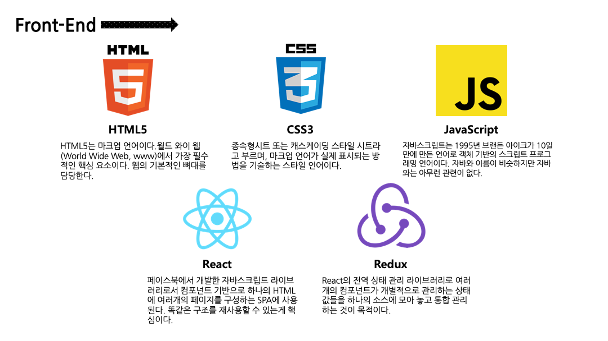
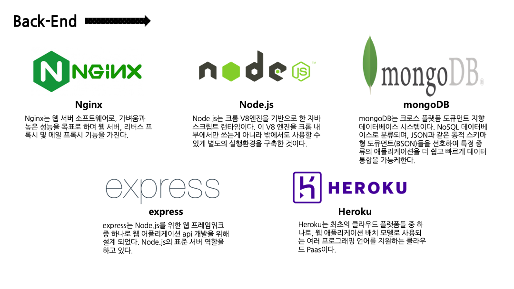
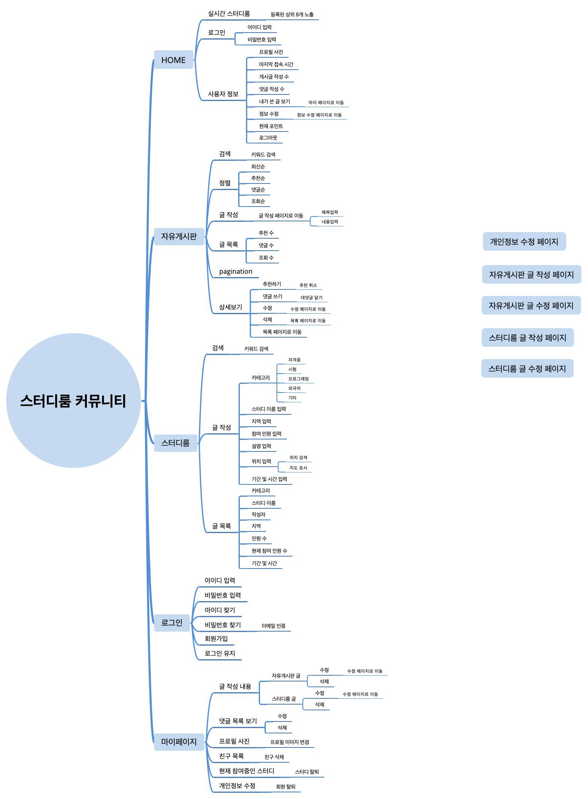
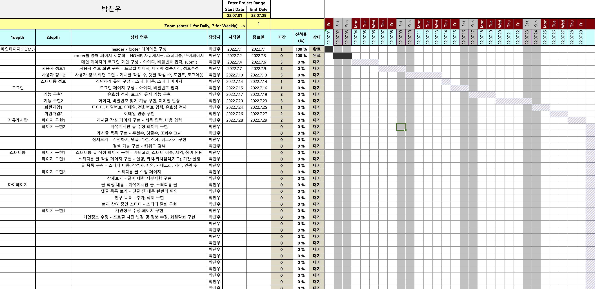

# 요구사항 확인

> 2022-07-05

## [문항1]
## 준비중인 신규 서비스가 Web을 기반을 하는 시스템이라고 할 때 어떠한 Frontend와 Backend 시스 템이 각각 어떤 기술들을 활용하여 구현되어야 하는지 나열하고 각 기술의 용도를 설명하는 다이어그 램을 작성하시오.

 
 

## [문항2]
## 필요한 기능들에 대한 요구사항을 정의하고 그 결과를 MindMap 형태로 제시하시오.

 
 

## [문항3]
## 정의된 요구사항을 Page Depth에 따라 나열하고 필요한 세부 기능들을 설명하는 요구사항 명세서를 WBS와 Gantt Chart가 포함된 형태로 작성하시오

